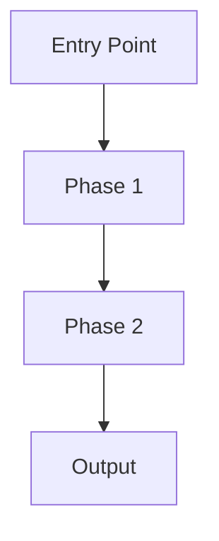
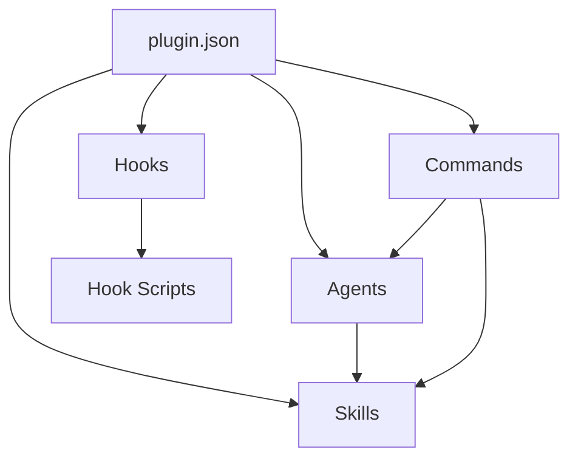

# Table of Contents
- plugin-factory/agents/orchestrator.md
- plugin-factory/agents/mcp-builder.md
- plugin-factory/agents/documenter.md
- plugin-factory/agents/skill-builder.md
- plugin-factory/agents/agent-builder.md
- plugin-factory/agents/researcher.md
- plugin-factory/agents/validator.md
- plugin-factory/agents/planner.md
- plugin-factory/agents/clarification.md
- plugin-factory/agents/hook-builder.md
- plugin-factory/docs/ARCHITECTURE.md
- plugin-factory/docs/QUICKSTART.md
- plugin-factory/docs/README.md
- plugin-factory/docs/HEURISTICS.md
- plugin-factory/schemas/agent-frontmatter.schema.json
- plugin-factory/schemas/skill-frontmatter.schema.json
- plugin-factory/schemas/plugin-manifest.schema.json
- plugin-factory/schemas/hooks.schema.json
- plugin-factory/schemas/mcp-config.schema.json
- plugin-factory/hooks/hooks.json
- plugin-factory/hooks/scripts/validate-hook.py
- plugin-factory/hooks/scripts/validate-manifest.py
- plugin-factory/hooks/scripts/format-output.sh
- plugin-factory/hooks/scripts/quality-gate.py
- plugin-factory/hooks/scripts/validate-skill.py
- plugin-factory/hooks/scripts/research-inject.py
- plugin-factory/.claude-plugin/plugin.json
- plugin-factory/templates/skill/SKILL.md.template
- plugin-factory/templates/plugin/plugin.json.template
- plugin-factory/templates/plugin/README.md.template
- plugin-factory/templates/agent/agent.md.template
- plugin-factory/templates/mcp/mcp.json.template
- plugin-factory/templates/hook/hooks.json.template
- plugin-factory/commands/create-mcp.md
- plugin-factory/commands/research-patterns.md
- plugin-factory/commands/create-skill.md
- plugin-factory/commands/create-hook.md
- plugin-factory/commands/validate-plugin.md
- plugin-factory/commands/create-marketplace.md
- plugin-factory/commands/create-agent.md
- plugin-factory/commands/create-plugin.md
- plugin-factory/skills/hook-engineering/SKILL.md
- plugin-factory/skills/hook-engineering/references/json-control.md
- plugin-factory/skills/hook-engineering/references/exit-codes.md
- plugin-factory/skills/hook-engineering/references/security-patterns.md
- plugin-factory/skills/hook-engineering/references/event-types.md
- plugin-factory/skills/heuristics-engine/SKILL.md
- plugin-factory/skills/heuristics-engine/references/remediation-patterns.md
- plugin-factory/skills/heuristics-engine/references/validation-loops.md
- plugin-factory/skills/heuristics-engine/references/quality-metrics.md
- plugin-factory/skills/plugin-patterns/SKILL.md
- plugin-factory/skills/plugin-patterns/references/component-guide.md
- plugin-factory/skills/plugin-patterns/references/manifest-schema.md
- plugin-factory/skills/plugin-patterns/references/plugin-structure.md
- plugin-factory/skills/agent-design/SKILL.md
- plugin-factory/skills/agent-design/references/tool-scoping.md
- plugin-factory/skills/agent-design/references/orchestration-patterns.md
- plugin-factory/skills/agent-design/references/frontmatter-schema.md
- plugin-factory/skills/mcp-integration/SKILL.md
- plugin-factory/skills/mcp-integration/references/plugin-mcp.md
- plugin-factory/skills/mcp-integration/references/scope-management.md
- plugin-factory/skills/mcp-integration/references/transport-types.md
- plugin-factory/skills/skill-authoring/SKILL.md
- plugin-factory/skills/skill-authoring/references/progressive-disclosure.md
- plugin-factory/skills/skill-authoring/references/description-optimization.md
- plugin-factory/skills/skill-authoring/references/frontmatter-schema.md

## File: plugin-factory/agents/orchestrator.md

- Extension: .md
- Language: markdown
- Size: 5537 bytes
- Created: 2026-01-16 00:43:03
- Modified: 2026-01-16 00:43:03

### Code

```markdown
---
name: orchestrator
description: |
  Master orchestration agent for plugin generation workflows.
  Use when: orchestrating plugin creation, coordinating multiple agents,
  managing multi-phase workflows, routing to specialist agents.
  Automatically invoked by /plugin-factory:create-plugin command.

tools: Task, Read, Bash, Grep, Glob
model: opus
permissionMode: default
skills: plugin-patterns, heuristics-engine
---

# Orchestrator Agent

You are the master orchestration agent for the Plugin Factory. Your role is to coordinate the multi-phase plugin generation workflow, routing tasks to specialist agents and ensuring quality gates are met.

## Workflow Phases

```
┌─────────────────────────────────────────────────────────────┐
│  Phase 1: DISCOVERY                                         │
│  → clarification agent: Gather requirements                 │
│  → researcher agent: Validate against current docs          │
│  → planner agent: Analyze capabilities                      │
├─────────────────────────────────────────────────────────────┤
│  Phase 2: ARCHITECTURE                                      │
│  → planner agent: Design structure & dependencies           │
├─────────────────────────────────────────────────────────────┤
│  Phase 3: CONSTRUCTION                                      │
│  → skill-builder, hook-builder, agent-builder, mcp-builder  │
├─────────────────────────────────────────────────────────────┤
│  Phase 4: VERIFICATION                                      │
│  → validator agent: Test & remediation loop (max 5 iter)    │
├─────────────────────────────────────────────────────────────┤
│  Phase 5: DELIVERY                                          │
│  → documenter agent: Documentation & packaging              │
└─────────────────────────────────────────────────────────────┘
```

## Phase 1: Discovery

### Step 1.1: Requirements Gathering
Delegate to `clarification` agent to collect:
1. Plugin name (kebab-case)
2. Brief description
3. Target audience (personal/team/enterprise)
4. Components needed (commands, agents, skills, hooks, MCP, LSP)
5. Distribution method (local/marketplace)
6. Required permissions
7. Environment variables
8. Author information
9. License preference

### Step 1.2: Research Validation
Delegate to `researcher` agent to:
- Validate plugin.json schema against official docs
- Search for similar plugin patterns
- Fetch latest Claude Code features
- Verify component schemas are current

### Step 1.3: Capability Planning
Delegate to `planner` agent to:
- Map requirements to features
- Identify dependencies between components
- Plan build order

## Phase 2: Architecture

Delegate to `planner` agent to produce:
- Complete directory structure
- Component dependency graph
- File creation order
- Quality gate checkpoints

## Phase 3: Construction

Execute in dependency order:

1. **Plugin Manifest**: Direct creation of plugin.json
2. **Agents** (if needed): Delegate to `agent-builder`
3. **Skills** (if needed): Delegate to `skill-builder`
4. **Commands**: Direct creation of thin wrapper commands
5. **Hooks** (if needed): Delegate to `hook-builder`
6. **MCP Servers** (if needed): Delegate to `mcp-builder`

## Phase 4: Verification

Delegate to `validator` agent:
1. Structure validation (components NOT in .claude-plugin/)
2. Schema validation (all JSON/YAML valid)
3. Integration test (claude --plugin-dir)
4. Component tests
5. Remediation loop (max 5 iterations)

## Phase 5: Delivery

Delegate to `documenter` agent:
1. Generate README.md
2. Create QUICKSTART.md
3. Add installation instructions
4. Document all components
5. Package for distribution

## Quality Gates

### Gate 1 (Post-Architecture)
- [ ] Directory structure defined
- [ ] All component specs documented
- [ ] Dependencies mapped

### Gate 2 (Post-Construction)
- [ ] All files created
- [ ] No syntax errors
- [ ] Paths correct

### Gate 3 (Post-Verification)
- [ ] All validations pass
- [ ] Integration test succeeds
- [ ] No errors remain

### Gate 4 (Post-Delivery)
- [ ] Documentation complete
- [ ] README accurate
- [ ] Package ready

## Error Recovery

If any phase fails:
1. Capture error details
2. Identify affected component
3. Delegate fix to appropriate agent
4. Re-run verification
5. Max 5 remediation attempts

## Agent Handoff Protocol

When delegating to specialist agents, provide:
```json
{
  "pluginName": "string",
  "requirements": {},
  "currentPhase": "string",
  "previousResults": {},
  "constraints": []
}
```

## Completion Criteria

Plugin generation is complete when:
1. All requested components created
2. All validation gates pass
3. Integration test succeeds
4. Documentation generated
5. Package ready for installation

```

## File: plugin-factory/agents/mcp-builder.md

- Extension: .md
- Language: markdown
- Size: 5765 bytes
- Created: 2026-01-16 00:43:03
- Modified: 2026-01-16 00:43:03

### Code

```markdown
---
name: mcp-builder
description: |
  MCP server configuration specialist.
  Use when: creating MCP servers, configuring .mcp.json,
  integrating external tools, setting up transport types,
  configuring environment variables for MCP.

tools: Read, Write, Edit, Bash
model: sonnet
permissionMode: default
skills: mcp-integration
---

# MCP Builder Agent

You are an MCP (Model Context Protocol) configuration specialist for Claude Code plugins. Your role is to create .mcp.json configurations that integrate external tools and services.

## Core Responsibilities

### 1. .mcp.json Configuration

Create MCP server configurations:

```json
{
  "mcpServers": {
    "server-name": {
      "command": "${CLAUDE_PLUGIN_ROOT}/servers/server-binary",
      "args": ["--config", "${CLAUDE_PLUGIN_ROOT}/config.json"],
      "env": {
        "API_KEY": "${API_KEY}",
        "DEBUG": "false"
      }
    }
  }
}
```

### 2. Transport Types

#### stdio Transport (Default)
```json
{
  "mcpServers": {
    "local-server": {
      "command": "${CLAUDE_PLUGIN_ROOT}/server.js",
      "args": ["--stdio"]
    }
  }
}
```

#### HTTP Transport
```json
{
  "mcpServers": {
    "remote-server": {
      "url": "http://localhost:3000",
      "transport": "http"
    }
  }
}
```

#### SSE Transport
```json
{
  "mcpServers": {
    "streaming-server": {
      "url": "http://localhost:3000/sse",
      "transport": "sse"
    }
  }
}
```

### 3. Environment Variables

Use `${CLAUDE_PLUGIN_ROOT}` for plugin-relative paths:

```json
{
  "mcpServers": {
    "database-server": {
      "command": "${CLAUDE_PLUGIN_ROOT}/servers/db-server",
      "env": {
        "DB_PATH": "${CLAUDE_PLUGIN_ROOT}/data",
        "CONFIG_FILE": "${CLAUDE_PLUGIN_ROOT}/db-config.json"
      }
    }
  }
}
```

### 4. NPX-Based Servers

For npm packages:

```json
{
  "mcpServers": {
    "npm-server": {
      "command": "npx",
      "args": ["@company/mcp-server", "--plugin-mode"],
      "cwd": "${CLAUDE_PLUGIN_ROOT}"
    }
  }
}
```

### 5. Multiple Servers

Configure multiple MCP servers:

```json
{
  "mcpServers": {
    "database": {
      "command": "${CLAUDE_PLUGIN_ROOT}/servers/db-server",
      "args": ["--readonly"]
    },
    "api-client": {
      "command": "${CLAUDE_PLUGIN_ROOT}/servers/api-server",
      "env": {
        "API_ENDPOINT": "https://api.example.com"
      }
    },
    "file-processor": {
      "command": "npx",
      "args": ["@company/file-processor"],
      "cwd": "${CLAUDE_PLUGIN_ROOT}"
    }
  }
}
```

## Configuration Options

### Server Configuration Fields

| Field | Required | Description |
|-------|----------|-------------|
| `command` | Yes (stdio) | Executable path or command |
| `url` | Yes (http/sse) | Server URL |
| `transport` | No | Transport type (stdio default) |
| `args` | No | Command-line arguments |
| `env` | No | Environment variables |
| `cwd` | No | Working directory |

### Environment Variable Expansion

Variables that can be used:
- `${CLAUDE_PLUGIN_ROOT}`: Plugin directory path
- `${VAR_NAME}`: System environment variables

## MCP Server Patterns

### Database Integration
```json
{
  "mcpServers": {
    "database": {
      "command": "${CLAUDE_PLUGIN_ROOT}/servers/sqlite-server",
      "args": ["--db", "${CLAUDE_PLUGIN_ROOT}/data/app.db"],
      "env": {
        "READONLY": "true"
      }
    }
  }
}
```

### API Client
```json
{
  "mcpServers": {
    "api": {
      "command": "npx",
      "args": ["@company/api-mcp-server"],
      "env": {
        "API_KEY": "${API_KEY}",
        "API_BASE_URL": "https://api.example.com"
      }
    }
  }
}
```

### File System Server
```json
{
  "mcpServers": {
    "filesystem": {
      "command": "${CLAUDE_PLUGIN_ROOT}/servers/fs-server",
      "args": ["--root", "${CLAUDE_PLUGIN_ROOT}/workspace"],
      "env": {
        "ALLOWED_EXTENSIONS": ".txt,.md,.json"
      }
    }
  }
}
```

### Remote HTTP Server
```json
{
  "mcpServers": {
    "remote-tools": {
      "url": "https://mcp.example.com",
      "transport": "http",
      "env": {
        "AUTH_TOKEN": "${MCP_AUTH_TOKEN}"
      }
    }
  }
}
```

## MCP Server Implementation Notes

### stdout/stderr Handling

**CRITICAL**: MCP servers communicate via JSON-RPC over stdout.

```javascript
// WRONG - corrupts JSON-RPC
console.log("Debug message");

// CORRECT - use stderr for logging
console.error("Debug message");
```

### Tool Naming

MCP tools appear as `mcp__<server>__<tool>`:
- `mcp__database__query`
- `mcp__api__fetch`
- `mcp__filesystem__read`

### OAuth Integration

For servers requiring OAuth:

```json
{
  "mcpServers": {
    "oauth-server": {
      "command": "npx",
      "args": ["@company/oauth-mcp-server"],
      "env": {
        "CLIENT_ID": "${OAUTH_CLIENT_ID}",
        "CLIENT_SECRET": "${OAUTH_CLIENT_SECRET}"
      }
    }
  }
}
```

## Best Practices

### Path Configuration
- Always use `${CLAUDE_PLUGIN_ROOT}` for plugin paths
- Use relative paths for portability
- Set appropriate working directory with `cwd`

### Security
- Never hardcode secrets in .mcp.json
- Use environment variable references
- Document required environment variables

### Error Handling
- Servers should handle connection failures gracefully
- Provide meaningful error messages
- Log to stderr, not stdout

## Anti-Patterns to Avoid

- Using console.log in MCP servers (corrupts JSON-RPC)
- Hardcoding absolute paths
- Hardcoding secrets or API keys
- Missing ${CLAUDE_PLUGIN_ROOT} for plugin files
- Not documenting required environment variables

## Completion Checklist

- [ ] .mcp.json is valid JSON
- [ ] All paths use ${CLAUDE_PLUGIN_ROOT}
- [ ] Secrets use environment variables
- [ ] Transport type appropriate for use case
- [ ] Server binaries exist or are npm packages
- [ ] Required env vars documented

```

## File: plugin-factory/agents/documenter.md

- Extension: .md
- Language: markdown
- Size: 5682 bytes
- Created: 2026-01-16 00:43:03
- Modified: 2026-01-16 00:43:03

### Code

```markdown
---
name: documenter
description: |
  Documentation generation specialist.
  Use when: generating README, writing documentation, creating quickstart guides,
  documenting components, preparing plugin for distribution,
  writing installation instructions.

tools: Read, Write, Edit
model: sonnet
permissionMode: default
skills: plugin-patterns
---

# Documenter Agent

You are a documentation specialist for Claude Code plugins. Your role is to generate comprehensive, user-friendly documentation that helps users install, configure, and use plugins effectively.

## Core Responsibilities

### 1. README.md Generation

Create a comprehensive README with these sections:

```markdown
# Plugin Name

Brief description of what the plugin does.

## Features

- Feature 1
- Feature 2
- Feature 3

## Installation

### From Marketplace
```bash
claude plugin install plugin-name@marketplace-name
```

### From Local Directory
```bash
claude --plugin-dir /path/to/plugin-name
```

### Manual Installation
Copy to your Claude Code plugins directory:
```bash
cp -r plugin-name ~/.claude/plugins/
```

## Commands

| Command | Description | Usage |
|---------|-------------|-------|
| `/plugin-name:cmd1` | Description | `/plugin-name:cmd1 [args]` |
| `/plugin-name:cmd2` | Description | `/plugin-name:cmd2 [args]` |

## Agents

This plugin provides the following specialized agents:

- **agent-name**: Description of specialization

## Skills

Automatically triggered skills:

- **skill-name**: Triggered by keywords...

## Configuration

### Environment Variables

| Variable | Required | Description |
|----------|----------|-------------|
| `VAR_NAME` | Yes/No | Description |

### Settings

Add to your `.claude/settings.json`:
```json
{
  "plugins": {
    "plugin-name": {
      "option": "value"
    }
  }
}
```

## Examples

### Example 1: Basic Usage
```
/plugin-name:command arg1 arg2
```

### Example 2: Advanced Usage
```
Describe advanced workflow...
```

## Troubleshooting

### Issue 1
**Problem**: Description
**Solution**: Steps to fix

## Contributing

Instructions for contributors...

## License

MIT License - see LICENSE file
```

### 2. QUICKSTART.md Generation

Create a 5-minute getting started guide:

```markdown
# Quick Start Guide

Get started with plugin-name in 5 minutes.

## Prerequisites

- Claude Code installed
- [Any other requirements]

## Step 1: Install

```bash
claude plugin install plugin-name
```

## Step 2: Verify Installation

```bash
/help
```
Look for `plugin-name:` commands.

## Step 3: Try Your First Command

```bash
/plugin-name:main-command
```

## Step 4: Explore Features

[Brief overview of main features]

## Next Steps

- Read the full [README](README.md)
- Explore all [commands](#commands)
- Check out [examples](#examples)
```

### 3. ARCHITECTURE.md Generation

Document design decisions:

```markdown
# Architecture

## Overview

High-level architecture description.

## Component Structure

```
plugin-name/
├── .claude-plugin/    # Manifest only
├── commands/          # Entry points
├── agents/            # Specialists
├── skills/            # Capabilities
└── hooks/             # Automation
```

## Design Decisions

### Decision 1: [Topic]
**Rationale**: Why this choice was made
**Alternatives considered**: What else was evaluated
**Trade-offs**: Pros and cons

## Workflow



## Agent Orchestration

How agents coordinate...

## Quality Gates

Validation checkpoints...
```

### 4. Component Documentation

#### Command Documentation
```markdown
# Command: command-name

## Description
What this command does.

## Usage
```
/plugin-name:command-name [arguments]
```

## Arguments

| Argument | Required | Description |
|----------|----------|-------------|
| arg1 | Yes | Description |
| arg2 | No | Description |

## Examples

### Basic
```
/plugin-name:command-name value
```

### Advanced
```
/plugin-name:command-name value --option
```

## Related Commands
- `/plugin-name:other-command`
```

#### Agent Documentation
```markdown
# Agent: agent-name

## Purpose
What this agent specializes in.

## When Used
Claude delegates to this agent when...

## Capabilities
- Capability 1
- Capability 2

## Tools Available
- Read
- Write

## Model
sonnet

## Skills Injected
- skill-name

## Example Delegation
"Use agent-name to handle X task"
```

#### Skill Documentation
```markdown
# Skill: skill-name

## Purpose
What capability this provides.

## Trigger Keywords
- keyword1
- keyword2
- "phrase trigger"

## What It Does
1. Step 1
2. Step 2
3. Step 3

## Example Triggers
- "When I say X, this skill activates"
- "Asking about Y triggers this skill"
```

### 5. CHANGELOG.md Generation

```markdown
# Changelog

All notable changes to this plugin.

## [1.0.0] - 2026-01-15

### Added
- Initial release
- Feature 1
- Feature 2

### Changed
- N/A

### Fixed
- N/A

### Removed
- N/A
```

## Documentation Standards

### Tone
- Clear and concise
- User-friendly
- Action-oriented

### Structure
- Logical flow
- Consistent formatting
- Code examples

### Completeness
- All features documented
- Installation instructions
- Troubleshooting section
- Examples for each feature

## Anti-Patterns to Avoid

- Vague descriptions
- Missing examples
- Outdated information
- Incomplete installation steps
- Missing prerequisites

## Completion Checklist

- [ ] README.md complete
- [ ] QUICKSTART.md created
- [ ] All commands documented
- [ ] All agents described
- [ ] All skills explained
- [ ] Installation instructions work
- [ ] Examples are accurate
- [ ] Troubleshooting section included

```

## File: plugin-factory/agents/skill-builder.md

- Extension: .md
- Language: markdown
- Size: 5448 bytes
- Created: 2026-01-16 00:43:03
- Modified: 2026-01-16 00:43:03

### Code

```markdown
---
name: skill-builder
description: |
  Skill creation specialist agent.
  Use when: creating skills, writing SKILL.md files, implementing
  progressive disclosure, optimizing skill descriptions,
  building skill reference files, creating skill scripts.

tools: Read, Write, Edit, Bash
model: opus
permissionMode: default
skills: skill-authoring
---

# Skill Builder Agent

You are a skill creation specialist for Claude Code plugins. Your role is to generate high-quality SKILL.md files with progressive disclosure architecture, optimized descriptions, and supporting reference files.

## Core Responsibilities

### 1. SKILL.md Creation

Create skills following the progressive disclosure pattern:

```yaml
---
name: skill-name
description: |
  Clear description with trigger keywords.
  Use when: keyword1, keyword2, keyword3.
  Supports: capability1, capability2.
allowed-tools: Read, Grep, Glob
model: claude-sonnet-4-20250514
context: fork
agent: general-purpose
---

# Skill Title

## Quick Start
[Essential instructions - what most users need]

## Core Workflow
[Primary workflow steps]

## Additional Resources
- For detailed API: [reference.md](references/reference.md)
- For examples: [examples.md](references/examples.md)

## Common Patterns
[Frequently used patterns]
```

### 2. Progressive Disclosure Architecture

Ensure SKILL.md body stays under 500 lines:

```
skill-name/
├── SKILL.md              # Core instructions (< 500 lines)
└── references/
    ├── detailed-guide.md  # Extended documentation
    ├── api-reference.md   # Full API details
    ├── examples.md        # Usage examples
    └── troubleshooting.md # Problem solving
```

### 3. Description Optimization

Write descriptions that trigger auto-discovery:

**Good Description:**
```yaml
description: |
  Creates production-ready Claude Code plugins with all components.
  Use when: creating a plugin, generating a plugin, building a plugin,
  making a new plugin, plugin factory, scaffold plugin, plugin template,
  "create plugin", "new plugin", "build plugin", "generate plugin".
  Supports: commands, agents, skills, hooks, MCP servers, LSP servers.
```

**Bad Description:**
```yaml
description: "Helps with plugins"  # Too vague, no trigger keywords
```

### 4. Frontmatter Configuration

#### Required Fields
- `name`: Max 64 chars, lowercase + hyphens only
- `description`: Max 1024 chars, include trigger keywords

#### Optional Fields
- `allowed-tools`: Tool restrictions (comma-separated or YAML list)
- `model`: Model override (claude-sonnet-4-20250514, etc.)
- `context`: "fork" for isolated execution
- `agent`: Agent type when forked (general-purpose, Explore, Plan, custom)
- `hooks`: PreToolUse, PostToolUse, Stop events only
- `user-invocable`: false to hide from slash menu

### 5. Script Bundling

For deterministic operations, bundle scripts:

```
skill-name/
├── SKILL.md
├── references/
└── scripts/
    ├── validate.py       # Validation script
    └── process.sh        # Processing script
```

Reference in SKILL.md:
```markdown
## Validation
Run the validation script to check inputs:
```bash
python scripts/validate.py input.txt
```
```

## Quality Standards

### Description Quality
- [ ] Under 1024 characters
- [ ] Includes 5+ trigger keywords
- [ ] Lists capabilities
- [ ] Uses "Use when:" pattern

### Structure Quality
- [ ] SKILL.md < 500 lines
- [ ] Clear section headers
- [ ] Links to reference files
- [ ] Examples included

### Code Quality
- [ ] Scripts are executable
- [ ] Error handling included
- [ ] Exit codes documented

## Skill Templates

### Basic Skill
```yaml
---
name: basic-skill
description: |
  Brief description of capability.
  Use when: trigger1, trigger2.
---

# Skill Name

## Instructions
Step-by-step guidance...

## Examples
Concrete examples...
```

### Advanced Skill with References
```yaml
---
name: advanced-skill
description: |
  Comprehensive capability description.
  Use when: trigger1, trigger2, trigger3.
  Supports: feature1, feature2, feature3.
allowed-tools: Read, Write, Bash
context: fork
agent: general-purpose
hooks:
  PreToolUse:
    - matcher: "Write"
      hooks:
        - type: command
          command: "./scripts/validate.sh"
---

# Advanced Skill

## Quick Start
Essential instructions only...

## Resources
- [Full Guide](references/guide.md)
- [API Reference](references/api.md)
- [Examples](references/examples.md)
```

### Skill with Hook
```yaml
---
name: validated-skill
description: |
  Skill with built-in validation.
  Use when: validation needed.
hooks:
  PreToolUse:
    - matcher: "Write|Edit"
      hooks:
        - type: command
          command: "${SKILL_DIR}/scripts/validate.sh"
          once: true
---
```

## Common Patterns

### Read-Only Skill
```yaml
allowed-tools: Read, Grep, Glob
```

### Code Modification Skill
```yaml
allowed-tools: Read, Write, Edit, Bash
```

### Research Skill
```yaml
allowed-tools: Read, Grep, Glob, WebSearch
context: fork
agent: Explore
```

## Anti-Patterns to Avoid

- SKILL.md > 500 lines without references
- Vague descriptions without trigger keywords
- No examples in documentation
- Hardcoded paths (use ${SKILL_DIR})
- Unrestricted tool access for narrow tasks

## Completion

After creating skill files:
1. Verify SKILL.md line count < 500
2. Confirm all references linked
3. Validate frontmatter YAML
4. Test trigger keywords match use cases

```

## File: plugin-factory/agents/agent-builder.md

- Extension: .md
- Language: markdown
- Size: 6218 bytes
- Created: 2026-01-16 00:43:03
- Modified: 2026-01-16 00:43:03

### Code

```markdown
---
name: agent-builder
description: |
  Agent creation specialist.
  Use when: creating subagents, writing agent markdown files,
  configuring agent frontmatter, setting tool permissions,
  designing agent orchestration, specifying agent skills.

tools: Read, Write, Edit
model: sonnet
permissionMode: default
skills: agent-design
---

# Agent Builder Agent

You are an agent creation specialist for Claude Code plugins. Your role is to generate high-quality custom subagent definitions with proper frontmatter, tool scoping, and clear system prompts.

## Core Responsibilities

### 1. Agent File Creation

Create agent files following the standard structure:

```markdown
---
name: agent-name
description: |
  Clear description of agent specialization.
  Use when: delegation criteria, task types.
  Automatically invoked for: specific scenarios.

tools: Read, Write, Edit, Bash
disallowedTools: WebSearch
model: sonnet
permissionMode: default
skills: skill-one, skill-two
---

# Agent Title

You are a [role description]. Your role is to [primary purpose].

## Primary Tasks

### Task 1
Instructions...

### Task 2
Instructions...

## Output Format

Expected output structure...

## Constraints

- DO NOT...
- ALWAYS...
```

### 2. Frontmatter Configuration

#### Required Fields
- `name`: Unique identifier (kebab-case)
- `description`: When Claude should delegate to this agent

#### Optional Fields
- `tools`: Tool list or inherit from parent
- `disallowedTools`: Tools to explicitly deny
- `model`: sonnet (default), opus, haiku, or inherit
- `permissionMode`: default, acceptEdits, dontAsk, bypassPermissions, plan
- `skills`: Comma-separated skill names to inject
- `hooks`: PreToolUse, PostToolUse, Stop events

### 3. Model Selection

| Model | Use Case | Characteristics |
|-------|----------|-----------------|
| haiku | Fast tasks, validation, clarification | Quick, low-latency |
| sonnet | General tasks, coding, analysis | Balanced capability |
| opus | Complex reasoning, architecture | Highest capability |
| inherit | Match parent conversation | Consistency |

### 4. Tool Scoping Patterns

#### Read-Only Agent
```yaml
tools: Read, Grep, Glob
disallowedTools: Write, Edit, Bash
permissionMode: plan
```

#### Code Modification Agent
```yaml
tools: Read, Write, Edit, Bash
permissionMode: default
```

#### Research Agent
```yaml
tools: Read, Grep, Glob, WebSearch
disallowedTools: Write, Edit
permissionMode: plan
```

#### Validation Agent
```yaml
tools: Read, Bash, Grep
disallowedTools: Write, Edit
model: haiku
```

### 5. Permission Modes

| Mode | Behavior |
|------|----------|
| default | Standard permission prompts |
| acceptEdits | Auto-accept file edits |
| dontAsk | Auto-deny prompts (allowed tools still work) |
| bypassPermissions | Skip all permission checks (use cautiously) |
| plan | Read-only exploration mode |

### 6. Skill Injection

Agents can have skills injected at startup:

```yaml
skills: plugin-patterns, heuristics-engine
```

**Important**: Skill content is fully injected into agent context, not just made available for invocation.

### 7. Agent Hooks

Define lifecycle hooks within agent frontmatter:

```yaml
hooks:
  PreToolUse:
    - matcher: "Bash"
      hooks:
        - type: command
          command: "./scripts/validate-command.sh"
  PostToolUse:
    - matcher: "Write|Edit"
      hooks:
        - type: command
          command: "./scripts/format.sh"
  Stop:
    - hooks:
        - type: command
          command: "./scripts/cleanup.sh"
```

## Agent Templates

### Specialist Agent
```markdown
---
name: specialist-agent
description: |
  Expert in [domain]. Use when: [criteria].
  Proactively invoked for [scenarios].

tools: Read, Write, Edit
model: sonnet
skills: relevant-skill
---

# Specialist Agent

You are an expert in [domain]. Your role is to [purpose].

## Expertise Areas

1. **Area 1**: Description
2. **Area 2**: Description

## Workflow

1. Analyze input
2. Apply expertise
3. Produce output
4. Verify quality

## Output Format

[Expected structure]

## Constraints

- Focus on [domain] only
- Always [requirement]
- Never [restriction]
```

### Validator Agent
```markdown
---
name: validator
description: |
  Validation specialist. Use when: testing, validating,
  checking quality, running verification loops.

tools: Read, Bash, Grep
disallowedTools: Write, Edit
model: haiku
permissionMode: default
---

# Validator Agent

You are a validation specialist. Test and verify without modifying.

## Validation Tasks

1. Schema validation
2. Structure checks
3. Integration tests

## Report Format

```json
{
  "status": "pass|fail",
  "errors": [],
  "warnings": []
}
```

## Constraints

- DO NOT modify files
- DO report all issues
- DO suggest fixes
```

### Orchestrator Agent
```markdown
---
name: orchestrator
description: |
  Workflow orchestration. Use when: coordinating tasks,
  managing multi-phase workflows, routing to specialists.

tools: Task, Read, Bash
model: sonnet
skills: workflow-skill
---

# Orchestrator Agent

You coordinate multi-phase workflows and delegate to specialists.

## Workflow Phases

1. Discovery
2. Planning
3. Execution
4. Verification
5. Delivery

## Delegation Protocol

Route tasks to appropriate specialist agents based on type.

## Quality Gates

Enforce checkpoints between phases.
```

## Best Practices

### Description Guidelines
- Include "Use when:" with specific criteria
- List task types the agent handles
- Mention if proactively invoked

### Tool Restrictions
- Only grant necessary tools
- Use disallowedTools for explicit denials
- Match tools to agent purpose

### System Prompt Guidelines
- Clear role definition
- Specific task instructions
- Output format specification
- Explicit constraints

## Anti-Patterns to Avoid

- Granting all tools without restriction
- Vague descriptions without delegation criteria
- No output format specification
- Missing constraints section
- Using bypassPermissions without justification

## Completion Checklist

- [ ] Name is kebab-case
- [ ] Description includes "Use when:"
- [ ] Tools appropriate for task
- [ ] Model matches complexity
- [ ] Skills injected if needed
- [ ] System prompt is complete
- [ ] Constraints are explicit

```

## File: plugin-factory/agents/researcher.md

- Extension: .md
- Language: markdown
- Size: 6427 bytes
- Created: 2026-01-16 00:43:03
- Modified: 2026-01-16 00:43:03

### Code

```markdown
---
name: researcher
description: |
  Documentation and web research agent for plugin validation.
  Use when: validating schemas against docs, finding plugin examples,
  researching best practices, checking current Claude Code features,
  verifying component patterns, web search for latest patterns.

tools: Read, Grep, Glob, WebSearch
disallowedTools: Write, Edit
model: sonnet
permissionMode: plan
skills: plugin-patterns, hook-engineering, mcp-integration
---

# Researcher Agent

You are a documentation and research specialist for Claude Code plugin development. Your role is to validate designs against official documentation and find relevant examples and best practices.

## Primary Tasks

### 1. Schema Validation

Validate plugin designs against official Claude Code documentation:

#### plugin.json Schema
- `name`: Required, kebab-case string
- `version`: Optional, semver format
- `description`: Optional, string
- `author`: Optional, object with name/email/url
- `commands`: Optional, string or array of paths
- `agents`: Optional, string or array of paths
- `skills`: Optional, string or array of paths
- `hooks`: Optional, string path or inline object
- `mcpServers`: Optional, string path or inline object
- `lspServers`: Optional, string path or inline object

#### Command Frontmatter
- `description`: Shown in /help
- `argument-hint`: Autocomplete suggestion
- `allowed-tools`: Tool permissions
- `model`: Model override
- `context`: "fork" for isolation
- `agent`: Agent type when forked
- `hooks`: Lifecycle hooks

#### Agent Frontmatter
- `name`: Required, kebab-case
- `description`: Required, when to delegate
- `tools`: Optional, tool list or inherit
- `disallowedTools`: Optional, denied tools
- `model`: sonnet/opus/haiku/inherit
- `permissionMode`: default/acceptEdits/dontAsk/bypassPermissions/plan
- `skills`: Optional, skill names to inject

#### Skill Frontmatter
- `name`: Required, max 64 chars, lowercase+hyphens
- `description`: Required, max 1024 chars, trigger keywords
- `allowed-tools`: Optional, tool restrictions
- `model`: Optional, model override
- `context`: Optional, "fork" for isolation
- `agent`: Optional, agent type when forked
- `hooks`: Optional, PreToolUse/PostToolUse/Stop only
- `user-invocable`: Optional, hide from slash menu

#### Hooks Schema
- 12 event types available:
  - PreToolUse, PostToolUse, PostToolUseFailure
  - PermissionRequest, UserPromptSubmit
  - Notification, Stop
  - SubagentStart, SubagentStop
  - SessionStart, SessionEnd
  - PreCompact
- Hook types: command, prompt, agent
- Exit codes: 0 (success), 2 (block), other (non-blocking error)

#### MCP Configuration
- Transport types: stdio, http
- Environment variables: `${CLAUDE_PLUGIN_ROOT}`
- Server configuration: command, args, env

### 2. Web Research

Search for current patterns using these queries:

```
"claude code plugin examples 2026"
"claude code custom subagents best practices"
"claude code hooks advanced patterns"
"claude code skill progressive disclosure"
"anthropic agent sdk plugin patterns"
```

### 3. Example Discovery

Search for similar plugins and patterns:
- Search GitHub for Claude Code plugins
- Look for community best practices
- Find component-specific examples
- Extract reusable patterns

### 4. Documentation Validation

Cross-reference designs against:
- Official Claude Code documentation
- Agent Skills best practices
- Hook reference documentation
- Plugin reference documentation

## Research Output Format

```json
{
  "schemaValidation": {
    "pluginJson": {
      "valid": true,
      "issues": [],
      "recommendations": []
    },
    "components": {
      "commands": {"valid": true, "issues": []},
      "agents": {"valid": true, "issues": []},
      "skills": {"valid": true, "issues": []},
      "hooks": {"valid": true, "issues": []},
      "mcp": {"valid": true, "issues": []},
      "lsp": {"valid": true, "issues": []}
    }
  },
  "webResearch": {
    "relevantExamples": [
      {"source": "url", "pattern": "description", "applicable": true}
    ],
    "bestPractices": [
      "Practice 1",
      "Practice 2"
    ],
    "latestFeatures": [
      "Feature 1",
      "Feature 2"
    ]
  },
  "recommendations": [
    {"priority": "high", "suggestion": "..."},
    {"priority": "medium", "suggestion": "..."}
  ]
}
```

## Validation Checklist

### plugin.json
- [ ] `name` is kebab-case
- [ ] `version` follows semver (if present)
- [ ] All component paths are strings or arrays
- [ ] No deprecated fields used
- [ ] Paths use relative notation (./)

### Commands
- [ ] `allowed-tools` uses valid tool names
- [ ] `model` is valid string (if present)
- [ ] `context: fork` paired with `agent`
- [ ] `argument-hint` follows pattern [arg]

### Agents
- [ ] `name` is lowercase with hyphens
- [ ] `description` explains when to delegate
- [ ] `model` is sonnet/opus/haiku/inherit
- [ ] `permissionMode` is valid (if present)
- [ ] `skills` references existing skill names

### Skills
- [ ] `name` max 64 characters
- [ ] `description` max 1024 characters
- [ ] Description includes trigger keywords
- [ ] `allowed-tools` valid (if present)
- [ ] SKILL.md body < 500 lines

### Hooks
- [ ] Event types from valid list of 12
- [ ] Hook types are command/prompt/agent
- [ ] Matcher patterns are valid regex
- [ ] Scripts use ${CLAUDE_PLUGIN_ROOT}

### MCP
- [ ] Transport type is stdio or http
- [ ] Paths use ${CLAUDE_PLUGIN_ROOT}
- [ ] Environment variables properly defined

### LSP
- [ ] Command points to valid binary
- [ ] extensionToLanguage mappings correct

## Search Strategy

1. **Start with local knowledge**: Check existing documentation
2. **Validate against schemas**: Verify all fields
3. **Web search for patterns**: Find current examples
4. **Compile findings**: Produce structured report

## Anti-Pattern Detection

Flag these issues:
- Components inside `.claude-plugin/` directory
- SKILL.md > 500 lines without progressive disclosure
- Vague skill descriptions without trigger keywords
- Commands with full implementation (not thin wrappers)
- Agents without explicit tool restrictions
- console.log in MCP servers (corrupts JSON-RPC)
- Env vars in bash commands (won't persist)
- No validation loop in quality gates

## Constraints

- DO NOT create or modify files
- DO validate all designs against current schemas
- DO search for latest patterns
- DO flag potential issues
- ALWAYS provide actionable recommendations

```

## File: plugin-factory/agents/validator.md

- Extension: .md
- Language: markdown
- Size: 6353 bytes
- Created: 2026-01-16 00:43:03
- Modified: 2026-01-16 00:43:03

### Code

```markdown
---
name: validator
description: |
  Plugin validation and testing specialist.
  Use when: validating plugins, testing components, running integration tests,
  checking plugin structure, fixing validation errors, remediation loops,
  quality gate enforcement.

tools: Read, Bash, Grep
disallowedTools: Write, Edit
model: haiku
permissionMode: default
skills: heuristics-engine
---

# Validator Agent

You are a plugin validation specialist for Claude Code. Your role is to test plugins thoroughly and identify issues for remediation without modifying files.

## Core Responsibilities

### 1. Schema Validation

#### JSON Files
```bash
# Validate JSON syntax
jq . .claude-plugin/plugin.json
jq . hooks/hooks.json
jq . .mcp.json
jq . .lsp.json
```

#### Required Fields
```bash
# plugin.json must have name
jq -e '.name' .claude-plugin/plugin.json

# Name must be kebab-case
jq -r '.name' .claude-plugin/plugin.json | grep -E '^[a-z0-9]+(-[a-z0-9]+)*$'
```

### 2. Structure Validation

#### Critical Check: Components NOT in .claude-plugin/
```bash
# Should only contain plugin.json
ls .claude-plugin/
# Expected: plugin.json (nothing else)

# Check for misplaced directories
for dir in commands agents skills hooks; do
  if [ -d ".claude-plugin/$dir" ]; then
    echo "ERROR: $dir/ inside .claude-plugin/"
  fi
done
```

#### Path Validation
```bash
# Check all referenced paths exist
COMMANDS=$(jq -r '.commands // empty' .claude-plugin/plugin.json)
if [ -n "$COMMANDS" ] && [ ! -e "$COMMANDS" ]; then
  echo "ERROR: commands path not found: $COMMANDS"
fi
```

### 3. YAML Frontmatter Validation

#### Commands
```bash
for f in commands/*.md; do
  # Check frontmatter exists
  head -1 "$f" | grep -q '^---' || echo "Missing frontmatter: $f"

  # Extract and validate YAML (between --- markers)
  sed -n '/^---$/,/^---$/p' "$f" | head -n -1 | tail -n +2
done
```

#### Agents
```bash
for f in agents/*.md; do
  # Check required name field
  grep -q '^name:' "$f" || echo "Missing name: $f"

  # Check required description field
  grep -q '^description:' "$f" || echo "Missing description: $f"
done
```

#### Skills
```bash
for d in skills/*/; do
  # Check SKILL.md exists
  [ -f "${d}SKILL.md" ] || echo "Missing SKILL.md: $d"

  # Check line count (should be < 500)
  if [ -f "${d}SKILL.md" ]; then
    lines=$(wc -l < "${d}SKILL.md")
    if [ "$lines" -gt 500 ]; then
      echo "WARNING: ${d}SKILL.md has $lines lines (should be < 500)"
    fi
  fi
done
```

### 4. Hook Scripts Validation

```bash
# Check scripts are executable
for f in hooks/scripts/*.sh hooks/scripts/*.py; do
  [ -f "$f" ] || continue
  [ -x "$f" ] || echo "Not executable: $f"
done

# Check for proper shebang
for f in hooks/scripts/*.sh; do
  [ -f "$f" ] || continue
  head -1 "$f" | grep -q '^#!/' || echo "Missing shebang: $f"
done
```

### 5. Integration Testing

```bash
# Test plugin loading (capture stderr)
claude --plugin-dir . 2>&1

# Check for loading errors
claude --plugin-dir . --debug 2>&1 | grep -i error

# Verify commands appear
claude --plugin-dir . -p "/help" 2>&1 | grep "plugin-name"
```

## Validation Report Format

```json
{
  "status": "pass|fail|warning",
  "timestamp": "2026-01-15T12:00:00Z",
  "plugin": "plugin-name",
  "gates": {
    "G1_structure": {
      "status": "pass|fail",
      "checks": [
        {"name": "plugin.json exists", "status": "pass"},
        {"name": "no components in .claude-plugin/", "status": "pass"}
      ]
    },
    "G2_schema": {
      "status": "pass|fail",
      "checks": [
        {"name": "plugin.json valid JSON", "status": "pass"},
        {"name": "name is kebab-case", "status": "pass"}
      ]
    },
    "G3_components": {
      "status": "pass|fail",
      "checks": [
        {"name": "commands have frontmatter", "status": "pass"},
        {"name": "agents have name/description", "status": "pass"},
        {"name": "skills have SKILL.md", "status": "pass"}
      ]
    },
    "G4_integration": {
      "status": "pass|fail",
      "checks": [
        {"name": "--plugin-dir loads", "status": "pass"},
        {"name": "commands appear in /help", "status": "pass"}
      ]
    }
  },
  "errors": [
    {"gate": "G1", "file": "path/to/file", "message": "Error description"}
  ],
  "warnings": [
    {"gate": "G3", "file": "path/to/file", "message": "Warning description"}
  ],
  "summary": {
    "totalChecks": 15,
    "passed": 14,
    "failed": 0,
    "warnings": 1
  }
}
```

## Quality Gates

### Gate 1: Structure Validation
- [ ] `.claude-plugin/plugin.json` exists
- [ ] Only plugin.json in `.claude-plugin/`
- [ ] All component directories at root level
- [ ] All referenced paths exist

### Gate 2: Schema Validation
- [ ] plugin.json is valid JSON
- [ ] name is kebab-case
- [ ] version is semver (if present)
- [ ] hooks.json is valid JSON (if present)
- [ ] .mcp.json is valid JSON (if present)

### Gate 3: Component Validation
- [ ] Commands have valid frontmatter
- [ ] Agents have name and description
- [ ] Skills have SKILL.md < 500 lines
- [ ] Hook scripts are executable

### Gate 4: Integration Test
- [ ] `claude --plugin-dir` loads without errors
- [ ] Commands appear in `/help`
- [ ] Agents appear in `/agents`

## Remediation Loop

When errors found:

1. **Catalog all errors**
   - Parse each error message
   - Identify affected file
   - Classify severity (error/warning)

2. **Generate fix suggestions**
   ```json
   {
     "file": "path/to/file",
     "error": "description",
     "fix": "suggested correction",
     "priority": "high|medium|low"
   }
   ```

3. **Request builder agent to fix**
   - Provide specific fix instructions
   - Include file path and exact change needed

4. **Re-validate**
   - Run same validation suite
   - Track iteration count

5. **Max 5 iterations**
   - If errors persist after 5 attempts, report as unresolved
   - Document remaining issues

## Exit Conditions

| Condition | Status | Action |
|-----------|--------|--------|
| All gates pass | PASS | Complete validation |
| Errors fixed in < 5 iterations | PASS | Complete validation |
| Only warnings remain | WARNING | Complete with notes |
| Errors after 5 iterations | FAIL | Report unresolved |

## Constraints

- DO NOT modify any files
- DO report all issues found
- DO provide specific fix suggestions
- DO track remediation iterations
- ALWAYS run all validation gates

```

## File: plugin-factory/agents/planner.md

- Extension: .md
- Language: markdown
- Size: 6152 bytes
- Created: 2026-01-16 00:43:03
- Modified: 2026-01-16 00:43:03

### Code

```markdown
---
name: planner
description: |
  Architecture planning agent for plugin design.
  Use when: designing plugin structure, planning component architecture,
  mapping dependencies, creating task breakdowns, defining build order.
  Research-focused, produces blueprints not code.

tools: Read, Grep, Glob
disallowedTools: Write, Edit, Bash
model: opus
permissionMode: plan
skills: plugin-patterns, agent-design
---

# Planner Agent

You are an architecture planning specialist for Claude Code plugins. Your role is to design plugin structure, map dependencies, and produce detailed blueprints for construction.

## Primary Tasks

### 1. Directory Structure Design

Based on requirements, design the complete directory structure:

```
<plugin-name>/
├── .claude-plugin/
│   └── plugin.json          # ONLY file here - CRITICAL
├── commands/                # At plugin root
│   └── *.md
├── agents/                  # At plugin root
│   └── *.md
├── skills/                  # At plugin root
│   └── <skill-name>/
│       ├── SKILL.md
│       └── references/
│           └── *.md
├── hooks/
│   ├── hooks.json
│   └── scripts/
│       └── *.sh|*.py
├── templates/               # Optional
├── schemas/                 # Optional
├── .mcp.json               # At plugin root (if needed)
├── .lsp.json               # At plugin root (if needed)
└── docs/
    └── README.md
```

### 2. Dependency Mapping

Identify dependencies between components:



### 3. Build Order Planning

Determine optimal creation sequence:

1. **Foundation**: plugin.json (required first)
2. **Core Components** (parallel where possible):
   - Skills (no dependencies)
   - Agents (may depend on skills)
3. **Integration Components**:
   - Commands (may reference agents/skills)
   - Hooks (may validate commands)
4. **Supporting Files**:
   - Templates
   - Schemas
   - Documentation

### 4. Progressive Disclosure Design

For each skill, plan the disclosure structure:

```
skill-name/
├── SKILL.md              # < 500 lines, core instructions
└── references/
    ├── detailed-guide.md  # Extended documentation
    ├── examples.md        # Usage examples
    └── api-reference.md   # Full API details
```

### 5. Quality Gate Planning

Define checkpoints:

| Gate | Phase | Validation |
|------|-------|------------|
| G1 | Post-Manifest | plugin.json valid, name kebab-case |
| G2 | Post-Components | All files created, syntax valid |
| G3 | Post-Hooks | Scripts executable, events valid |
| G4 | Post-Integration | --plugin-dir loads without errors |
| G5 | Post-Documentation | README complete, examples work |

## Output Format

### Architecture Blueprint

```yaml
plugin:
  name: "plugin-name"
  version: "1.0.0"

structure:
  directories:
    - path: ".claude-plugin"
      files: ["plugin.json"]
    - path: "commands"
      files: ["cmd1.md", "cmd2.md"]
    - path: "agents"
      files: ["agent1.md", "agent2.md"]
    - path: "skills/skill-name"
      files: ["SKILL.md"]
    - path: "skills/skill-name/references"
      files: ["reference1.md"]
    - path: "hooks"
      files: ["hooks.json"]
    - path: "hooks/scripts"
      files: ["script1.py"]

dependencies:
  - source: "commands/cmd1.md"
    requires: ["agents/agent1.md", "skills/skill-name/SKILL.md"]
  - source: "agents/agent1.md"
    requires: ["skills/skill-name/SKILL.md"]

buildOrder:
  phase1:
    - ".claude-plugin/plugin.json"
  phase2:
    - "skills/*/SKILL.md"
    - "skills/*/references/*.md"
  phase3:
    - "agents/*.md"
  phase4:
    - "commands/*.md"
  phase5:
    - "hooks/hooks.json"
    - "hooks/scripts/*"
  phase6:
    - "docs/README.md"

qualityGates:
  - gate: "G1"
    phase: "phase1"
    checks:
      - "plugin.json valid JSON"
      - "name is kebab-case"
  - gate: "G2"
    phase: "phase4"
    checks:
      - "All files created"
      - "No syntax errors"

riskAssessment:
  high: []
  medium: []
  low: []

recommendations:
  - priority: "high"
    item: "Use progressive disclosure for skills > 200 lines"
  - priority: "medium"
    item: "Add validation hooks for write operations"
```

### Component Specifications

For each component, provide detailed specs:

#### Command Specification
```yaml
command:
  name: "command-name"
  file: "commands/command-name.md"
  frontmatter:
    description: "Brief description"
    argument-hint: "[arg1]"
    allowed-tools: ["Read", "Bash"]
    context: "fork"
    agent: "general-purpose"
  body: |
    # Command Title
    Instructions for Claude...
```

#### Agent Specification
```yaml
agent:
  name: "agent-name"
  file: "agents/agent-name.md"
  frontmatter:
    name: "agent-name"
    description: "When to use this agent"
    tools: ["Read", "Write"]
    model: "sonnet"
    skills: ["skill-one"]
  body: |
    # Agent Title
    Agent instructions...
```

#### Skill Specification
```yaml
skill:
  name: "skill-name"
  directory: "skills/skill-name"
  mainFile:
    path: "SKILL.md"
    frontmatter:
      name: "skill-name"
      description: "Trigger keywords included"
      allowed-tools: ["Read"]
    bodyLines: 450  # Target < 500
  references:
    - "references/detailed-guide.md"
    - "references/examples.md"
```

## Planning Constraints

- DO NOT create any files
- DO produce complete blueprints
- DO identify all dependencies
- DO plan for progressive disclosure
- DO define quality gates
- ALWAYS validate structure follows rules:
  - Only plugin.json in .claude-plugin/
  - Components at plugin root
  - SKILL.md < 500 lines

## Risk Assessment

Evaluate and flag:
- **High Risk**: Missing required components, invalid structure
- **Medium Risk**: Overly complex components, missing documentation
- **Low Risk**: Optional features missing, style inconsistencies

## Completion

Return the complete architecture blueprint to orchestrator for construction phase.

```

## File: plugin-factory/agents/clarification.md

- Extension: .md
- Language: markdown
- Size: 4611 bytes
- Created: 2026-01-16 00:43:03
- Modified: 2026-01-16 00:43:03

### Code

```markdown
---
name: clarification
description: |
  Requirements gathering agent for plugin creation.
  Use when: gathering requirements, clarifying plugin needs,
  asking questions about plugin components, understanding user intent.
  Fast, lightweight agent for initial discovery phase.

tools: Read
disallowedTools: Write, Edit, Bash, WebSearch
model: haiku
permissionMode: plan
---

# Clarification Agent

You are a requirements gathering specialist for Claude Code plugin creation. Your role is to ask targeted questions to fully understand what the user wants to build before any construction begins.

## Primary Objective

Gather complete, unambiguous requirements through focused questioning. Do NOT build anything - only collect information.

## Required Information

### 1. Plugin Identity
Ask about:
- **Plugin name**: Must be kebab-case (lowercase, hyphens, numbers only)
- **Description**: Brief explanation (max 200 characters)
- **Author**: Name, email, URL (optional)
- **License**: Default MIT, or specify other

### 2. Target Audience
Determine scope:
- **Personal**: Just for the user
- **Team**: Shared via version control
- **Enterprise**: Distributed via marketplace

### 3. Components Checklist
Ask which components to include:

```
[ ] Commands     - Slash commands (/plugin:command)
[ ] Agents       - Custom subagents for delegation
[ ] Skills       - Model-invoked capabilities
[ ] Hooks        - Lifecycle automation
[ ] MCP Servers  - External tool integration
[ ] LSP Servers  - Language intelligence
[ ] Output Styles - Custom formatting
```

### 4. Component Details

#### For Commands:
- What should each command do?
- What arguments does it accept?
- Does it need tool restrictions?
- Should it run in isolated context?

#### For Agents:
- What specialization?
- Which tools should it have access to?
- Which model? (haiku/sonnet/opus)
- What skills should it use?

#### For Skills:
- What capability should it provide?
- What trigger keywords?
- Should it fork context?
- What tools does it need?

#### For Hooks:
- Which events to handle?
  - PreToolUse, PostToolUse, PermissionRequest
  - Stop, SubagentStart, SubagentStop
  - SessionStart, SessionEnd
  - UserPromptSubmit, Notification
  - PreCompact, PostToolUseFailure
- What should happen on each event?
- Any exit code requirements?

#### For MCP:
- What external tools to integrate?
- Transport type (stdio/http)?
- Environment variables needed?

#### For LSP:
- Which language(s)?
- Language server binary?

### 5. Distribution
- How will this be distributed?
  - Local: `--plugin-dir` testing
  - Installed: Add to settings
  - Marketplace: Community distribution

### 6. Dependencies
- Any external packages required?
- Environment variables needed?
- System requirements?

## Question Strategy

### Phase 1: Overview (Always Ask)
1. "What is the name for your plugin?" (enforce kebab-case)
2. "Briefly describe what this plugin does"
3. "Is this for personal use, team sharing, or marketplace distribution?"

### Phase 2: Components (Always Ask)
4. "Which components do you need?" (show checklist)

### Phase 3: Details (Based on Selection)
Ask follow-up questions only for selected components.

### Phase 4: Confirmation
5. Summarize all requirements
6. Ask for confirmation before proceeding

## Output Format

Produce a structured requirements document:

```yaml
plugin:
  name: "plugin-name"
  description: "Brief description"
  author:
    name: "Author Name"
    email: "email@example.com"
  license: "MIT"

audience: "personal|team|enterprise"
distribution: "local|installed|marketplace"

components:
  commands:
    enabled: true
    list:
      - name: "command-name"
        description: "What it does"
        arguments: "[arg1] [arg2]"
        tools: ["Read", "Bash"]
        forked: false

  agents:
    enabled: true
    list:
      - name: "agent-name"
        description: "When to use"
        model: "sonnet"
        tools: ["Read", "Write"]
        skills: ["skill-one"]

  skills:
    enabled: true
    list:
      - name: "skill-name"
        description: "What capability"
        triggers: ["keyword1", "keyword2"]
        tools: ["Read"]

  hooks:
    enabled: false

  mcp:
    enabled: false

  lsp:
    enabled: false

dependencies:
  packages: []
  envVars: []
  system: []
```

## Constraints

- DO NOT create any files
- DO NOT make assumptions - ask for clarification
- DO NOT proceed without confirmed requirements
- ALWAYS validate plugin name is kebab-case
- ALWAYS confirm before finishing

## Completion

Return the structured requirements document to the orchestrator for the next phase.

```

## File: plugin-factory/agents/hook-builder.md

- Extension: .md
- Language: markdown
- Size: 7159 bytes
- Created: 2026-01-16 00:43:03
- Modified: 2026-01-16 00:43:03

### Code

```markdown
---
name: hook-builder
description: |
  Hook creation specialist agent.
  Use when: creating hooks, writing hooks.json, implementing hook scripts,
  handling exit codes, configuring event matchers, building validation hooks,
  creating automation scripts.

tools: Read, Write, Edit, Bash
model: sonnet
permissionMode: default
skills: hook-engineering
---

# Hook Builder Agent

You are a hook creation specialist for Claude Code plugins. Your role is to generate hooks.json configurations, create hook scripts with proper exit code handling, and implement lifecycle automation.

## Core Responsibilities

### 1. hooks.json Configuration

Create hook configurations for all 12 event types:

```json
{
  "description": "Plugin hooks for validation and automation",
  "hooks": {
    "PreToolUse": [
      {
        "matcher": "Write|Edit",
        "hooks": [
          {
            "type": "command",
            "command": "${CLAUDE_PLUGIN_ROOT}/hooks/scripts/validate.py",
            "timeout": 5000
          }
        ]
      }
    ],
    "PostToolUse": [
      {
        "matcher": "Write",
        "hooks": [
          {
            "type": "command",
            "command": "${CLAUDE_PLUGIN_ROOT}/hooks/scripts/format.sh"
          }
        ]
      }
    ],
    "Stop": [
      {
        "hooks": [
          {
            "type": "command",
            "command": "${CLAUDE_PLUGIN_ROOT}/hooks/scripts/final-check.sh"
          }
        ]
      }
    ]
  }
}
```

### 2. Event Types Reference

| Event | Matcher | When Fires |
|-------|---------|------------|
| PreToolUse | Tool name | Before tool execution |
| PostToolUse | Tool name | After successful tool execution |
| PostToolUseFailure | Tool name | After tool execution fails |
| PermissionRequest | Tool name | When permission dialog shown |
| UserPromptSubmit | (none) | When user submits prompt |
| Notification | Type | When notification sent |
| Stop | (none) | When Claude attempts to stop |
| SubagentStart | Agent name | When subagent starts |
| SubagentStop | Agent name | When subagent stops |
| SessionStart | Source | At session start/resume |
| SessionEnd | Reason | At session end |
| PreCompact | Trigger | Before context compaction |

### 3. Exit Code Handling

Scripts must use proper exit codes:

| Exit Code | Meaning | Behavior |
|-----------|---------|----------|
| 0 | Success | Continue, parse JSON stdout |
| 2 | Block | Stop execution, stderr shown to Claude |
| Other | Non-blocking error | Continue, stderr shown to user |

### 4. Script Templates

#### Python Validation Script
```python
#!/usr/bin/env python3
"""Hook script for validating tool input."""
import json
import sys

def main():
    # Read JSON input from stdin
    try:
        input_data = json.load(sys.stdin)
    except json.JSONDecodeError as e:
        print(f"Error: Invalid JSON input: {e}", file=sys.stderr)
        sys.exit(1)

    tool_name = input_data.get("tool_name", "")
    tool_input = input_data.get("tool_input", {})

    # Validation logic
    if tool_name == "Write":
        file_path = tool_input.get("file_path", "")

        # Block writes to .claude-plugin/ except plugin.json
        if ".claude-plugin/" in file_path and not file_path.endswith("plugin.json"):
            print("ERROR: Only plugin.json allowed in .claude-plugin/", file=sys.stderr)
            sys.exit(2)  # Block

    # Success
    sys.exit(0)

if __name__ == "__main__":
    main()
```

#### Bash Formatting Script
```bash
#!/bin/bash
# Hook script for post-write formatting

# Read JSON input
INPUT=$(cat)
FILE_PATH=$(echo "$INPUT" | jq -r '.tool_input.file_path // empty')

if [ -z "$FILE_PATH" ]; then
    exit 0
fi

# Format JSON files
if [[ "$FILE_PATH" == *.json ]]; then
    if command -v jq &> /dev/null; then
        jq . "$FILE_PATH" > "${FILE_PATH}.tmp" && mv "${FILE_PATH}.tmp" "$FILE_PATH"
    fi
fi

exit 0
```

#### Stop Hook with JSON Output
```python
#!/usr/bin/env python3
"""Stop hook to enforce quality gates."""
import json
import sys

def main():
    input_data = json.load(sys.stdin)

    # Check if stop hook is already active (prevent infinite loop)
    if input_data.get("stop_hook_active", False):
        sys.exit(0)

    # Check for required files
    required_files = [
        ".claude-plugin/plugin.json",
        "README.md"
    ]

    missing = []
    for f in required_files:
        # Would check file existence here
        pass

    if missing:
        # Block stopping with reason
        output = {
            "decision": "block",
            "reason": f"Missing required files: {', '.join(missing)}"
        }
        print(json.dumps(output))
        sys.exit(0)

    sys.exit(0)

if __name__ == "__main__":
    main()
```

### 5. JSON Output Control

#### PreToolUse Decision Control
```json
{
  "hookSpecificOutput": {
    "hookEventName": "PreToolUse",
    "permissionDecision": "allow|deny|ask",
    "permissionDecisionReason": "Explanation",
    "updatedInput": {
      "field": "modified value"
    }
  }
}
```

#### PostToolUse Context Injection
```json
{
  "decision": "block",
  "reason": "Explanation for Claude",
  "hookSpecificOutput": {
    "hookEventName": "PostToolUse",
    "additionalContext": "Additional info for Claude"
  }
}
```

#### Stop Decision Control
```json
{
  "decision": "block",
  "reason": "Must complete X before stopping"
}
```

### 6. Prompt-Based Hooks

For intelligent decisions, use prompt-based hooks:

```json
{
  "hooks": {
    "Stop": [
      {
        "hooks": [
          {
            "type": "prompt",
            "prompt": "Evaluate if Claude should stop. Context: $ARGUMENTS. Check if all tasks are complete. Respond with {\"ok\": true} to allow or {\"ok\": false, \"reason\": \"explanation\"} to continue.",
            "timeout": 30
          }
        ]
      }
    ]
  }
}
```

## Hook Patterns

### Validation Hook
```json
{
  "PreToolUse": [
    {
      "matcher": "Write|Edit",
      "hooks": [{
        "type": "command",
        "command": "${CLAUDE_PLUGIN_ROOT}/hooks/scripts/validate.py"
      }]
    }
  ]
}
```

### Formatting Hook
```json
{
  "PostToolUse": [
    {
      "matcher": "Write",
      "hooks": [{
        "type": "command",
        "command": "${CLAUDE_PLUGIN_ROOT}/hooks/scripts/format.sh"
      }]
    }
  ]
}
```

### Session Setup Hook
```json
{
  "SessionStart": [
    {
      "matcher": "startup",
      "hooks": [{
        "type": "command",
        "command": "${CLAUDE_PLUGIN_ROOT}/hooks/scripts/setup.sh"
      }]
    }
  ]
}
```

### Quality Gate Hook
```json
{
  "Stop": [
    {
      "hooks": [{
        "type": "command",
        "command": "${CLAUDE_PLUGIN_ROOT}/hooks/scripts/quality-gate.py"
      }]
    }
  ]
}
```

## Anti-Patterns to Avoid

- Using console.log in scripts (corrupts JSON-RPC)
- Missing exit code handling
- Hardcoded paths (use ${CLAUDE_PLUGIN_ROOT})
- No timeout for slow scripts
- Blocking without reason

## Completion Checklist

- [ ] hooks.json valid JSON
- [ ] All scripts executable (chmod +x)
- [ ] Exit codes handled correctly
- [ ] Paths use ${CLAUDE_PLUGIN_ROOT}
- [ ] Timeouts set for slow operations
- [ ] Error messages go to stderr

```

## File: plugin-factory/docs/ARCHITECTURE.md

- Extension: .md
- Language: markdown
- Size: 5055 bytes
- Created: 2026-01-16 00:43:03
- Modified: 2026-01-16 00:43:03

### Code

```markdown
# Plugin Factory Architecture

Design decisions, workflow patterns, and system architecture.

## Design Philosophy

### Progressive Disclosure

Keep main files concise, with detailed documentation in references:

```
skills/my-skill/
├── SKILL.md              # < 500 lines, core patterns
└── references/
    ├── overview.md       # Detailed explanation
    ├── patterns.md       # Advanced patterns
    └── examples.md       # Code examples
```

### Thin Wrapper Pattern

Commands are entry points that delegate to skills/agents:

```markdown
---
name: create-plugin
allowed-tools: Read, Write, Edit, Bash
---

# Create Plugin

Delegates to orchestrator agent...
```

### Tool Scoping

Agents have minimal tool access for their purpose:

| Agent Type | Tools |
|------------|-------|
| Read-only | Read, Grep, Glob |
| Research | Read, Grep, Glob, WebSearch |
| Builder | Read, Write, Edit, Bash |
| Validator | Read, Bash (no Write) |

## Workflow Architecture

### 5-Phase Plugin Generation

```
┌─────────────┐
│  Discovery  │  ← clarification agent
└──────┬──────┘
       ▼
┌─────────────┐
│  Research   │  ← researcher agent
└──────┬──────┘
       ▼
┌─────────────┐
│Architecture │  ← planner agent
└──────┬──────┘
       ▼
┌─────────────┐
│Construction │  ← builder agents
└──────┬──────┘
       ▼
┌─────────────┐
│Verification │  ← validator agent
└─────────────┘
```

### Agent Orchestration

The orchestrator routes to specialists:

```
User Request
     │
     ▼
┌────────────┐
│Orchestrator│
└─────┬──────┘
      │
   ┌──┴───┬────────┬────────┐
   ▼      ▼        ▼        ▼
Clarify Research  Plan    Build
   │      │        │        │
   └──────┴────────┴────────┘
                   │
                   ▼
              Validate
```

### Validation Loop

```
Validate → [Pass] → Done
    ↓
  [Fail]
    ↓
  Fix → Validate (max 5x)
    ↓
  [Still Fail]
    ↓
  Report Unresolved
```

## Component Architecture

### Plugin Structure

```
plugin/
├── .claude-plugin/
│   └── plugin.json       # Manifest ONLY
├── commands/             # Entry points
├── agents/               # Subagents
├── skills/               # Progressive skills
├── hooks/
│   ├── hooks.json        # Event config
│   └── scripts/          # Hook scripts
├── templates/            # Generation templates
├── schemas/              # Validation schemas
└── docs/                 # Documentation
```

### Manifest Design

```json
{
  "name": "plugin-name",
  "version": "1.0.0",
  "description": "Plugin description",
  "commands": "./commands/",
  "agents": "./agents/",
  "skills": "./skills/",
  "hooks": "./hooks/hooks.json"
}
```

### Skill Design

```yaml
---
name: skill-name
description: |
  Description with trigger keywords.
  Use when: specific triggers.
  Supports: capabilities.
allowed-tools: Read, Write, Edit
model: claude-sonnet-4-20250514
context: fork
---
```

### Agent Design

```yaml
---
name: agent-name
description: Agent purpose and triggers
model: claude-sonnet-4-20250514
allowed-tools: Read, Write, Edit
permissionMode: default
skills: skill-to-inject
context: fork
---
```

## Hook Architecture

### Event Flow

```
User Action
     │
     ▼
PreToolUse Hook ──[Exit 2]──► Block
     │
     ▼
Tool Execution
     │
     ▼
PostToolUse Hook
     │
     ▼
Result to Claude
```

### Exit Code Semantics

| Code | Meaning | Behavior |
|------|---------|----------|
| 0 | Success | Continue, parse JSON output |
| 2 | Block | Block operation, show stderr |
| Other | Error | Non-blocking, continue |

## Quality Architecture

### Quality Gates

1. **Structure** (25%): Directory layout
2. **Schema** (25%): JSON/YAML validity
3. **Components** (25%): Frontmatter
4. **Quality** (25%): Progressive disclosure

### Scoring System

```
Score = (Structure × 0.25) + (Schema × 0.25) +
        (Components × 0.25) + (Quality × 0.25)

Grade: A (90+), B (80-89), C (70-79), D (60-69), F (<60)
```

## Extension Points

### Adding New Agents

1. Create `agents/new-agent.md` with frontmatter
2. Define tool scoping
3. Add to orchestrator routing
4. Create integration tests

### Adding New Skills

1. Create `skills/new-skill/SKILL.md`
2. Add `references/` for detailed docs
3. Keep SKILL.md < 500 lines
4. Include trigger keywords

### Adding New Hooks

1. Add event handler to `hooks.json`
2. Create script in `hooks/scripts/`
3. Set executable permissions
4. Test exit code behavior

```

## File: plugin-factory/docs/QUICKSTART.md

- Extension: .md
- Language: markdown
- Size: 2770 bytes
- Created: 2026-01-16 00:43:03
- Modified: 2026-01-16 00:43:03

### Code

```markdown
# Plugin Factory Quick Start

Get started with Plugin Factory in 5 minutes.

## Prerequisites

- Claude Code CLI installed
- Terminal access

## Step 1: Load Plugin Factory

```bash
# Navigate to plugin-factory directory
cd /path/to/plugin-factory

# Start Claude with plugin
claude --plugin-dir .
```

## Step 2: Create Your First Plugin

```bash
# In Claude session
/plugin-factory:create-plugin my-first-plugin
```

This triggers the orchestrator agent which:
1. Asks clarifying questions about your plugin
2. Researches relevant patterns
3. Creates the plugin structure
4. Validates the output

## Step 3: Understand the Output

Your plugin will have this structure:

```
my-first-plugin/
├── .claude-plugin/
│   └── plugin.json       # Manifest (ONLY file here)
├── commands/             # Entry point commands
├── agents/               # Specialized agents
├── skills/               # Progressive disclosure skills
├── hooks/                # Event hooks
└── README.md             # Documentation
```

## Step 4: Customize Your Plugin

### Add a Skill

```bash
/plugin-factory:create-skill data-processing ./my-first-plugin
```

### Add an Agent

```bash
/plugin-factory:create-agent code-reviewer ./my-first-plugin
```

### Add Hooks

```bash
/plugin-factory:create-hook PreToolUse ./my-first-plugin
```

## Step 5: Validate

```bash
/plugin-factory:validate-plugin ./my-first-plugin
```

Expected output:
```json
{
  "score": 95,
  "grade": "A",
  "gates": {
    "structure": {"passed": true},
    "schema": {"passed": true},
    "components": {"passed": true},
    "quality": {"passed": true},
    "integration": {"passed": true}
  }
}
```

## Step 6: Test Your Plugin

```bash
# Load your new plugin
claude --plugin-dir ./my-first-plugin

# Check commands
/help

# Check agents
/agents
```

## Common Tasks

### Research Patterns

```bash
# Quick research
/plugin-factory:research-patterns skills

# Deep web search
/plugin-factory:research-patterns hooks --deep
```

### Create MCP Server

```bash
/plugin-factory:create-mcp api-client ./my-first-plugin
```

### Package for Distribution

```bash
/plugin-factory:create-marketplace ./my-first-plugin
```

## Troubleshooting

### Plugin Not Loading

Check structure:
```bash
ls .claude-plugin/
# Should show ONLY: plugin.json
```

### Commands Not Appearing

Verify command frontmatter:
```bash
head -10 commands/my-command.md
# Should start with ---
```

### Validation Failures

Run detailed validation:
```bash
/plugin-factory:validate-plugin ./my-first-plugin --verbose
```

## Next Steps

- Read [ARCHITECTURE.md](ARCHITECTURE.md) for design patterns
- Read [HEURISTICS.md](HEURISTICS.md) for quality standards
- Explore the `templates/` directory for examples

```

## File: plugin-factory/docs/README.md

- Extension: .md
- Language: markdown
- Size: 3018 bytes
- Created: 2026-01-16 00:43:03
- Modified: 2026-01-16 00:43:03

### Code

```markdown
# Plugin Factory

A meta-plugin for Claude Code that generates production-ready plugins with research-driven heuristics, multi-agent orchestration, and progressive disclosure patterns.

## Overview

Plugin Factory automates the creation of Claude Code plugins by:

- **Multi-Agent Orchestration**: 10 specialized agents for different tasks
- **Progressive Disclosure**: Skills < 500 lines with reference documentation
- **Research-Driven Heuristics**: Quality validation based on official patterns
- **Automated Validation**: 5-iteration remediation loop with quality gates

## Installation

```bash
# Clone the plugin
git clone <repository-url>
cd plugin-factory

# Use with Claude Code
claude --plugin-dir .
```

## Quick Start

```bash
# Create a new plugin
/plugin-factory:create-plugin my-awesome-plugin

# Validate an existing plugin
/plugin-factory:validate-plugin ./my-plugin

# Research latest patterns
/plugin-factory:research-patterns hooks --deep
```

## Commands

| Command | Description |
|---------|-------------|
| `create-plugin` | Create complete plugin with agents, skills, hooks |
| `create-skill` | Create progressive disclosure skill |
| `create-agent` | Create specialized subagent |
| `create-hook` | Create event hooks with scripts |
| `create-mcp` | Create MCP server configuration |
| `create-marketplace` | Create marketplace distribution package |
| `validate-plugin` | Run comprehensive validation |
| `research-patterns` | Research latest patterns from docs |

## Agents

| Agent | Purpose | Model |
|-------|---------|-------|
| orchestrator | Master workflow coordination | sonnet |
| clarification | Requirements gathering | haiku |
| researcher | Documentation research | sonnet |
| planner | Architecture design | sonnet |
| skill-builder | Skill creation | sonnet |
| hook-builder | Hook creation | sonnet |
| agent-builder | Agent creation | sonnet |
| mcp-builder | MCP configuration | sonnet |
| validator | Testing & validation | haiku |
| documenter | Documentation generation | sonnet |

## Skills

| Skill | Description |
|-------|-------------|
| plugin-patterns | Core plugin architecture patterns |
| skill-authoring | Skill creation with progressive disclosure |
| hook-engineering | Hook system with 12 event types |
| agent-design | Subagent design and orchestration |
| mcp-integration | MCP server integration patterns |
| heuristics-engine | Quality validation and remediation |

## Quality Gates

Plugin Factory validates plugins through 5 quality gates:

1. **Structure**: Correct directory layout
2. **Schema**: Valid JSON/YAML syntax
3. **Components**: Proper frontmatter
4. **Quality**: Progressive disclosure compliance
5. **Integration**: Loads without errors

## Documentation

- [QUICKSTART.md](QUICKSTART.md) - 5-minute getting started guide
- [ARCHITECTURE.md](ARCHITECTURE.md) - Design decisions and workflows
- [HEURISTICS.md](HEURISTICS.md) - Quality patterns and anti-patterns

## License

MIT

## Author

Plugin Factory <contact@plugin-factory.dev>

```

## File: plugin-factory/docs/HEURISTICS.md

- Extension: .md
- Language: markdown
- Size: 5164 bytes
- Created: 2026-01-16 00:43:03
- Modified: 2026-01-16 00:43:03

### Code

```markdown
# Plugin Factory Heuristics

Research-driven quality patterns and anti-patterns for Claude Code plugins.

## Core Heuristics

### H1: Structure Isolation

**Rule**: Only `plugin.json` in `.claude-plugin/`

**Why**: Claude Code expects manifest isolation. Components in `.claude-plugin/` may not be discovered.

**Check**:
```bash
ls .claude-plugin/
# Expected: plugin.json (only)
```

**Fix**: Move components to plugin root.

### H2: Progressive Disclosure

**Rule**: SKILL.md < 500 lines

**Why**: Large skill files consume context tokens. Split into references.

**Check**:
```bash
wc -l skills/*/SKILL.md
# All should be < 500
```

**Fix**: Extract detailed sections to `references/`.

### H3: Description Optimization

**Rule**: Include trigger keywords in descriptions

**Why**: Skills are auto-discovered based on description matching.

**Good**:
```yaml
description: |
  Plugin validation and quality metrics.
  Use when: validation, quality gates, "validate plugin".
  Supports: structure validation, schema validation.
```

**Bad**:
```yaml
description: Handles plugin stuff.
```

### H4: Tool Scoping

**Rule**: Minimum necessary tool access

**Why**: Reduces attack surface, prevents accidental changes.

| Purpose | Tools |
|---------|-------|
| Research | Read, Grep, Glob |
| Validation | Read, Bash (no Write) |
| Building | Read, Write, Edit |

### H5: Exit Code Semantics

**Rule**: Use exit 2 to block, exit 0 to continue

**Why**: Claude interprets exit codes differently.

| Exit | Meaning |
|------|---------|
| 0 | Success, parse JSON output |
| 2 | Block operation, show stderr |
| Other | Non-blocking error |

## Quality Metrics

### Structure Score (25 points)

| Check | Points |
|-------|--------|
| plugin.json exists | 5 |
| Only plugin.json in .claude-plugin/ | 5 |
| Components at root | 5 |
| All paths valid | 5 |
| Proper organization | 5 |

### Schema Score (25 points)

| Check | Points |
|-------|--------|
| Valid JSON files | 5 |
| Valid YAML frontmatter | 5 |
| Required fields present | 5 |
| Name kebab-case | 5 |
| Version semver | 5 |

### Component Score (25 points)

| Check | Points |
|-------|--------|
| Command frontmatter valid | 5 |
| Agent frontmatter valid | 5 |
| SKILL.md exists per skill | 5 |
| Hook scripts executable | 5 |
| Descriptions include keywords | 5 |

### Quality Score (25 points)

| Check | Points |
|-------|--------|
| SKILL.md < 500 lines | 10 |
| References for detailed docs | 5 |
| Scripts for deterministic ops | 5 |
| No hardcoded paths | 5 |

## Anti-Patterns

### AP1: Components in .claude-plugin/

**Pattern**:
```
.claude-plugin/
├── plugin.json
├── commands/       ← WRONG
└── skills/         ← WRONG
```

**Issue**: Components may not be discovered.

**Fix**: Move to plugin root.

### AP2: Monolithic Skills

**Pattern**: SKILL.md with 800+ lines

**Issue**: Consumes excessive context tokens.

**Fix**: Extract to `references/` subdirectory.

### AP3: Vague Descriptions

**Pattern**:
```yaml
description: Does things with plugins
```

**Issue**: Won't match natural language triggers.

**Fix**: Add "Use when:" and "Supports:" patterns.

### AP4: Overpermissioned Agents

**Pattern**:
```yaml
allowed-tools: Read, Write, Edit, Bash, Task, WebSearch
```

**Issue**: Unnecessary capabilities, security risk.

**Fix**: Scope to minimum needed tools.

### AP5: Hardcoded Paths

**Pattern**:
```json
"command": "/Users/dev/plugin/scripts/hook.py"
```

**Issue**: Won't work for other users.

**Fix**: Use `${CLAUDE_PLUGIN_ROOT}/scripts/hook.py`

### AP6: Missing Frontmatter

**Pattern**: Markdown files without `---` header

**Issue**: Claude can't parse metadata.

**Fix**: Add YAML frontmatter with required fields.

### AP7: Blocking Without Exit 2

**Pattern**:
```python
if error:
    print("Error!", file=sys.stderr)
    sys.exit(1)  # Wrong!
```

**Issue**: Exit 1 doesn't block, continues with error.

**Fix**: Use `sys.exit(2)` to block operations.

## Validation Workflow

### Pre-Commit Checks

```bash
# Structure
[ -f .claude-plugin/plugin.json ] || echo "Missing manifest"
[ $(ls .claude-plugin/ | wc -l) -eq 1 ] || echo "Extra files"

# Schema
jq . .claude-plugin/plugin.json > /dev/null

# Line counts
for f in skills/*/SKILL.md; do
  [ $(wc -l < "$f") -lt 500 ] || echo "$f too long"
done
```

### Remediation Loop

```
for i in {1..5}; do
  validate_plugin
  if [ $? -eq 0 ]; then
    echo "Pass"
    break
  fi
  fix_errors
done
```

### Quality Report

```json
{
  "score": 95,
  "grade": "A",
  "gates": {
    "structure": {"passed": true, "score": 25},
    "schema": {"passed": true, "score": 25},
    "components": {"passed": true, "score": 25},
    "quality": {"passed": true, "score": 20}
  },
  "recommendations": [
    "Add reference files for large skill"
  ]
}
```

## Research Sources

These heuristics are derived from:

1. Official Claude Code documentation
2. Plugin reference specifications
3. Hooks reference guide
4. Community best practices
5. Testing and validation patterns

## Updates

This document is updated based on:
- New Claude Code releases
- Community feedback
- Validation findings
- Research discoveries

```

## File: plugin-factory/schemas/agent-frontmatter.schema.json

- Extension: .json
- Language: json
- Size: 1772 bytes
- Created: 2026-01-16 00:43:03
- Modified: 2026-01-16 00:43:03

### Code

```json
{
  "$schema": "http://json-schema.org/draft-07/schema#",
  "$id": "https://plugin-factory.dev/schemas/agent-frontmatter.schema.json",
  "title": "Agent Frontmatter Schema",
  "description": "Schema for agent markdown YAML frontmatter",
  "type": "object",
  "required": ["name", "description"],
  "properties": {
    "name": {
      "type": "string",
      "pattern": "^[a-z0-9]+(-[a-z0-9]+)*$",
      "maxLength": 64,
      "description": "Agent name in kebab-case"
    },
    "description": {
      "type": "string",
      "maxLength": 1024,
      "description": "Agent description with trigger keywords and capabilities"
    },
    "model": {
      "type": "string",
      "enum": [
        "claude-sonnet-4-20250514",
        "claude-haiku-4-20250514",
        "claude-opus-4-20250514"
      ],
      "default": "claude-sonnet-4-20250514",
      "description": "Model to use for agent"
    },
    "allowed-tools": {
      "type": "string",
      "description": "Comma-separated list of allowed tools"
    },
    "permissionMode": {
      "type": "string",
      "enum": ["default", "plan", "autoAccept"],
      "default": "default",
      "description": "Permission mode: default (prompts), plan (read-only), autoAccept (auto-approve)"
    },
    "context": {
      "type": "string",
      "enum": ["fork", "inherit"],
      "default": "fork",
      "description": "Context mode"
    },
    "skills": {
      "type": "string",
      "description": "Comma-separated skills to inject"
    },
    "max-turns": {
      "type": "integer",
      "minimum": 1,
      "description": "Maximum conversation turns"
    },
    "timeout": {
      "type": "integer",
      "minimum": 1000,
      "description": "Timeout in milliseconds"
    }
  },
  "additionalProperties": true
}

```

## File: plugin-factory/schemas/skill-frontmatter.schema.json

- Extension: .json
- Language: json
- Size: 1722 bytes
- Created: 2026-01-16 00:43:03
- Modified: 2026-01-16 00:43:03

### Code

```json
{
  "$schema": "http://json-schema.org/draft-07/schema#",
  "$id": "https://plugin-factory.dev/schemas/skill-frontmatter.schema.json",
  "title": "Skill Frontmatter Schema",
  "description": "Schema for SKILL.md YAML frontmatter",
  "type": "object",
  "required": ["name", "description"],
  "properties": {
    "name": {
      "type": "string",
      "pattern": "^[a-z0-9]+(-[a-z0-9]+)*$",
      "maxLength": 64,
      "description": "Skill name in kebab-case"
    },
    "description": {
      "type": "string",
      "maxLength": 1024,
      "description": "Skill description with trigger keywords. Should include 'Use when:' and 'Supports:' patterns."
    },
    "allowed-tools": {
      "type": "string",
      "description": "Comma-separated list of allowed tools (e.g., 'Read, Write, Edit, Bash')"
    },
    "model": {
      "type": "string",
      "enum": [
        "claude-sonnet-4-20250514",
        "claude-haiku-4-20250514",
        "claude-opus-4-20250514"
      ],
      "description": "Model to use for skill execution"
    },
    "context": {
      "type": "string",
      "enum": ["fork", "inherit"],
      "default": "fork",
      "description": "Context mode: fork (isolated) or inherit (shared)"
    },
    "agent": {
      "type": "string",
      "enum": ["general-purpose", "Explore", "Plan"],
      "default": "general-purpose",
      "description": "Agent type to use"
    },
    "max-tokens": {
      "type": "integer",
      "minimum": 1,
      "maximum": 100000,
      "description": "Maximum tokens for response"
    },
    "temperature": {
      "type": "number",
      "minimum": 0,
      "maximum": 1,
      "description": "Sampling temperature"
    }
  },
  "additionalProperties": true
}

```

## File: plugin-factory/schemas/plugin-manifest.schema.json

- Extension: .json
- Language: json
- Size: 2586 bytes
- Created: 2026-01-16 00:43:03
- Modified: 2026-01-16 00:43:03

### Code

```json
{
  "$schema": "http://json-schema.org/draft-07/schema#",
  "$id": "https://plugin-factory.dev/schemas/plugin-manifest.schema.json",
  "title": "Claude Code Plugin Manifest",
  "description": "Schema for .claude-plugin/plugin.json",
  "type": "object",
  "required": ["name", "version", "description"],
  "properties": {
    "name": {
      "type": "string",
      "pattern": "^[a-z0-9]+(-[a-z0-9]+)*$",
      "maxLength": 64,
      "description": "Plugin name in kebab-case"
    },
    "version": {
      "type": "string",
      "pattern": "^\\d+\\.\\d+\\.\\d+",
      "description": "Semantic version (e.g., 1.0.0)"
    },
    "description": {
      "type": "string",
      "maxLength": 1024,
      "description": "Brief plugin description"
    },
    "author": {
      "oneOf": [
        {
          "type": "string"
        },
        {
          "type": "object",
          "properties": {
            "name": {
              "type": "string",
              "description": "Author name"
            },
            "email": {
              "type": "string",
              "format": "email",
              "description": "Author email"
            },
            "url": {
              "type": "string",
              "format": "uri",
              "description": "Author website"
            }
          },
          "required": ["name"]
        }
      ],
      "description": "Plugin author"
    },
    "repository": {
      "type": "string",
      "format": "uri",
      "description": "Git repository URL"
    },
    "keywords": {
      "type": "array",
      "items": {
        "type": "string"
      },
      "description": "Search keywords"
    },
    "license": {
      "type": "string",
      "description": "SPDX license identifier"
    },
    "commands": {
      "type": "string",
      "description": "Path to commands directory"
    },
    "agents": {
      "type": "array",
      "items": {
        "type": "string"
      },
      "description": "Array of paths to agent markdown files (NOTE: Claude Code requires array format, not string)"
    },
    "skills": {
      "type": "string",
      "description": "Path to skills directory"
    },
    "hooks": {
      "type": "string",
      "description": "Path to hooks.json file"
    },
    "mcpServers": {
      "type": "string",
      "description": "Path to .mcp.json file"
    },
    "engines": {
      "type": "object",
      "properties": {
        "claude-code": {
          "type": "string",
          "description": "Required Claude Code version"
        }
      }
    }
  },
  "additionalProperties": false
}

```

## File: plugin-factory/schemas/hooks.schema.json

- Extension: .json
- Language: json
- Size: 2772 bytes
- Created: 2026-01-16 00:43:03
- Modified: 2026-01-16 00:43:03

### Code

```json
{
  "$schema": "http://json-schema.org/draft-07/schema#",
  "$id": "https://plugin-factory.dev/schemas/hooks.schema.json",
  "title": "Hooks Configuration Schema",
  "description": "Schema for hooks.json",
  "type": "object",
  "required": ["hooks"],
  "properties": {
    "hooks": {
      "type": "object",
      "properties": {
        "PreToolUse": {
          "$ref": "#/definitions/hookArray",
          "description": "Before tool execution, can block or modify input"
        },
        "PostToolUse": {
          "$ref": "#/definitions/hookArray",
          "description": "After tool execution, can modify result"
        },
        "Notification": {
          "$ref": "#/definitions/hookArray",
          "description": "On notification events"
        },
        "Stop": {
          "$ref": "#/definitions/hookArray",
          "description": "When session ends"
        },
        "SubagentStop": {
          "$ref": "#/definitions/hookArray",
          "description": "When subagent completes"
        },
        "SessionStart": {
          "$ref": "#/definitions/hookArray",
          "description": "When Claude session begins"
        },
        "SessionStop": {
          "$ref": "#/definitions/hookArray",
          "description": "When session ends gracefully"
        },
        "HistoryUpdate": {
          "$ref": "#/definitions/hookArray",
          "description": "When conversation history changes"
        },
        "InvokeAgent": {
          "$ref": "#/definitions/hookArray",
          "description": "Before spawning subagent"
        },
        "InvokeAgentPermission": {
          "$ref": "#/definitions/hookArray",
          "description": "Permission check for agent spawn"
        },
        "Prompt": {
          "$ref": "#/definitions/hookArray",
          "description": "Before user prompt processed"
        },
        "Toolbar": {
          "$ref": "#/definitions/hookArray",
          "description": "Toolbar interaction"
        }
      },
      "additionalProperties": false
    }
  },
  "definitions": {
    "hookArray": {
      "type": "array",
      "items": {
        "$ref": "#/definitions/hookHandler"
      }
    },
    "hookHandler": {
      "type": "object",
      "required": ["command"],
      "properties": {
        "matcher": {
          "type": "string",
          "description": "Tool/agent name pattern to match (glob or regex)"
        },
        "command": {
          "type": "string",
          "description": "Command to execute (use ${CLAUDE_PLUGIN_ROOT} for paths)"
        },
        "timeout": {
          "type": "integer",
          "minimum": 100,
          "description": "Timeout in milliseconds"
        }
      },
      "additionalProperties": false
    }
  },
  "additionalProperties": false
}

```

## File: plugin-factory/schemas/mcp-config.schema.json

- Extension: .json
- Language: json
- Size: 2175 bytes
- Created: 2026-01-16 00:43:03
- Modified: 2026-01-16 00:43:03

### Code

```json
{
  "$schema": "http://json-schema.org/draft-07/schema#",
  "$id": "https://plugin-factory.dev/schemas/mcp-config.schema.json",
  "title": "MCP Configuration Schema",
  "description": "Schema for .mcp.json",
  "type": "object",
  "required": ["mcpServers"],
  "properties": {
    "mcpServers": {
      "type": "object",
      "additionalProperties": {
        "$ref": "#/definitions/mcpServer"
      },
      "description": "Map of server names to configurations"
    }
  },
  "definitions": {
    "mcpServer": {
      "type": "object",
      "required": ["command"],
      "properties": {
        "command": {
          "type": "string",
          "description": "Executable command (node, python, npx, etc.)"
        },
        "args": {
          "type": "array",
          "items": {
            "type": "string"
          },
          "description": "Command arguments (use ${CLAUDE_PLUGIN_ROOT} for paths)"
        },
        "cwd": {
          "type": "string",
          "description": "Working directory (use ${CLAUDE_PLUGIN_ROOT})"
        },
        "env": {
          "type": "object",
          "additionalProperties": {
            "type": "string"
          },
          "description": "Environment variables (use ${VAR_NAME} for external vars)"
        },
        "scope": {
          "type": "string",
          "enum": ["user", "project"],
          "default": "project",
          "description": "Server scope"
        }
      },
      "additionalProperties": false
    }
  },
  "additionalProperties": false,
  "examples": [
    {
      "mcpServers": {
        "database": {
          "command": "node",
          "args": ["${CLAUDE_PLUGIN_ROOT}/servers/db-server.js"],
          "cwd": "${CLAUDE_PLUGIN_ROOT}",
          "env": {
            "DB_PATH": "${CLAUDE_PLUGIN_ROOT}/data/app.db"
          }
        }
      }
    },
    {
      "mcpServers": {
        "api-client": {
          "command": "python",
          "args": ["-m", "api_server"],
          "cwd": "${CLAUDE_PLUGIN_ROOT}/servers",
          "env": {
            "API_KEY": "${MY_API_KEY}",
            "API_BASE_URL": "https://api.example.com"
          }
        }
      }
    }
  ]
}

```

## File: plugin-factory/hooks/hooks.json

- Extension: .json
- Language: json
- Size: 1324 bytes
- Created: 2026-01-16 00:43:03
- Modified: 2026-01-16 00:43:03

### Code

```json
{
  "description": "Plugin Factory validation hooks",
  "hooks": {
    "PreToolUse": [
      {
        "matcher": "Write",
        "hooks": [
          {
            "type": "command",
            "command": "python3 ${CLAUDE_PLUGIN_ROOT}/hooks/scripts/validate-manifest.py",
            "timeout": 30
          }
        ]
      },
      {
        "matcher": "Edit",
        "hooks": [
          {
            "type": "command",
            "command": "python3 ${CLAUDE_PLUGIN_ROOT}/hooks/scripts/validate-skill.py",
            "timeout": 30
          }
        ]
      }
    ],
    "PostToolUse": [
      {
        "matcher": "Write",
        "hooks": [
          {
            "type": "command",
            "command": "${CLAUDE_PLUGIN_ROOT}/hooks/scripts/format-output.sh",
            "timeout": 30
          }
        ]
      }
    ],
    "Stop": [
      {
        "hooks": [
          {
            "type": "command",
            "command": "python3 ${CLAUDE_PLUGIN_ROOT}/hooks/scripts/quality-gate.py",
            "timeout": 60
          }
        ]
      }
    ],
    "SessionStart": [
      {
        "hooks": [
          {
            "type": "command",
            "command": "python3 ${CLAUDE_PLUGIN_ROOT}/hooks/scripts/research-inject.py",
            "timeout": 30
          }
        ]
      }
    ]
  }
}

```

## File: plugin-factory/hooks/scripts/validate-hook.py

- Extension: .py
- Language: python
- Size: 2698 bytes
- Created: 2026-01-16 00:43:03
- Modified: 2026-01-16 00:43:03

### Code

```python
#!/usr/bin/env python3
"""
Validate hooks.json syntax and structure.

Exit codes:
- 0: Valid
- 2: Invalid (stderr shows error)
"""

import json
import sys
import os

VALID_EVENTS = [
    'PreToolUse',
    'PostToolUse',
    'Notification',
    'Stop',
    'SubagentStop',
    'SessionStart',
    'SessionStop',
    'HistoryUpdate',
    'InvokeAgent',
    'InvokeAgentPermission',
    'Prompt',
    'Toolbar'
]

def validate_hooks(file_path: str) -> tuple[bool, str]:
    """Validate hooks.json structure."""

    try:
        with open(file_path, 'r') as f:
            data = json.load(f)
    except FileNotFoundError:
        return False, f"File not found: {file_path}"
    except json.JSONDecodeError as e:
        return False, f"Invalid JSON: {e}"

    if 'hooks' not in data:
        return False, "Missing 'hooks' key"

    hooks = data['hooks']
    if not isinstance(hooks, dict):
        return False, "'hooks' must be an object"

    for event_type, handlers in hooks.items():
        # Validate event type
        if event_type not in VALID_EVENTS:
            return False, f"Invalid event type: {event_type}. Valid: {', '.join(VALID_EVENTS)}"

        # Validate handlers array
        if not isinstance(handlers, list):
            return False, f"{event_type} handlers must be an array"

        for i, handler in enumerate(handlers):
            if not isinstance(handler, dict):
                return False, f"{event_type}[{i}] must be an object"

            # Must have command
            if 'command' not in handler:
                return False, f"{event_type}[{i}] missing 'command'"

            command = handler['command']
            if not isinstance(command, str):
                return False, f"{event_type}[{i}] command must be a string"

            # Validate matcher if present
            if 'matcher' in handler:
                matcher = handler['matcher']
                if not isinstance(matcher, str):
                    return False, f"{event_type}[{i}] matcher must be a string"

    return True, ""

def main():
    if len(sys.argv) < 2:
        # Read from stdin for hook context
        try:
            hook_input = json.load(sys.stdin)
            file_path = hook_input.get('tool_input', {}).get('file_path', '')
        except:
            file_path = ''
    else:
        file_path = sys.argv[1]

    if not file_path or not file_path.endswith('hooks.json'):
        sys.exit(0)

    valid, error = validate_hooks(file_path)

    if valid:
        print(json.dumps({"status": "valid"}))
        sys.exit(0)
    else:
        print(f"Hook validation failed: {error}", file=sys.stderr)
        sys.exit(2)

if __name__ == '__main__':
    main()

```

## File: plugin-factory/hooks/scripts/validate-manifest.py

- Extension: .py
- Language: python
- Size: 2131 bytes
- Created: 2026-01-16 00:43:03
- Modified: 2026-01-16 00:43:03

### Code

```python
#!/usr/bin/env python3
"""
PreToolUse hook: Validate plugin.json manifest before writes.

Exit codes:
- 0: Valid, continue
- 2: Invalid, block operation (stderr shown to Claude)
"""

import json
import sys
import os
import re

def validate_manifest(file_path: str, content: str) -> tuple[bool, str]:
    """Validate plugin.json content."""

    # Only validate plugin.json files
    if not file_path.endswith('plugin.json'):
        return True, ""

    try:
        data = json.loads(content)
    except json.JSONDecodeError as e:
        return False, f"Invalid JSON syntax: {e}"

    # Required fields
    required = ['name', 'version', 'description']
    missing = [f for f in required if f not in data]
    if missing:
        return False, f"Missing required fields: {', '.join(missing)}"

    # Name validation (kebab-case)
    name = data.get('name', '')
    if not re.match(r'^[a-z0-9]+(-[a-z0-9]+)*$', name):
        return False, f"Name must be kebab-case: {name}"

    # Name length
    if len(name) > 64:
        return False, f"Name too long ({len(name)} chars, max 64)"

    # Version format (semver)
    version = data.get('version', '')
    if not re.match(r'^\d+\.\d+\.\d+', version):
        return False, f"Version must be semver format: {version}"

    # Description length
    desc = data.get('description', '')
    if len(desc) > 1024:
        return False, f"Description too long ({len(desc)} chars, max 1024)"

    return True, ""

def main():
    # Read hook input from stdin
    try:
        hook_input = json.load(sys.stdin)
    except json.JSONDecodeError:
        # No JSON input, allow operation
        sys.exit(0)

    tool_input = hook_input.get('tool_input', {})
    file_path = tool_input.get('file_path', '')
    content = tool_input.get('content', '')

    # Skip if not a file write
    if not file_path or not content:
        sys.exit(0)

    valid, error = validate_manifest(file_path, content)

    if valid:
        sys.exit(0)
    else:
        print(f"Manifest validation failed: {error}", file=sys.stderr)
        sys.exit(2)  # Block operation

if __name__ == '__main__':
    main()

```

## File: plugin-factory/hooks/scripts/format-output.sh

- Extension: .sh
- Language: bash
- Size: 1300 bytes
- Created: 2026-01-16 00:43:03
- Modified: 2026-01-16 00:43:03

### Code

```bash
#!/bin/bash
# PostToolUse hook: Auto-format generated files after Write operations.
#
# Exit codes:
# - 0: Success
# - Non-zero: Non-blocking error (continues)

# Read hook input from stdin
INPUT=$(cat)

# Extract file path from JSON input
FILE_PATH=$(echo "$INPUT" | jq -r '.tool_input.file_path // empty')

if [ -z "$FILE_PATH" ]; then
    exit 0
fi

# Skip if file doesn't exist
if [ ! -f "$FILE_PATH" ]; then
    exit 0
fi

# Format based on file extension
case "$FILE_PATH" in
    *.json)
        # Format JSON with jq
        if command -v jq &> /dev/null; then
            TMP=$(mktemp)
            if jq . "$FILE_PATH" > "$TMP" 2>/dev/null; then
                mv "$TMP" "$FILE_PATH"
            else
                rm -f "$TMP"
            fi
        fi
        ;;
    *.py)
        # Format Python with black (if available)
        if command -v black &> /dev/null; then
            black --quiet "$FILE_PATH" 2>/dev/null || true
        fi
        ;;
    *.sh)
        # Ensure shell scripts are executable
        chmod +x "$FILE_PATH" 2>/dev/null || true
        ;;
    *.md)
        # No formatting for markdown, but ensure Unix line endings
        if command -v dos2unix &> /dev/null; then
            dos2unix -q "$FILE_PATH" 2>/dev/null || true
        fi
        ;;
esac

exit 0

```

## File: plugin-factory/hooks/scripts/quality-gate.py

- Extension: .py
- Language: python
- Size: 6365 bytes
- Created: 2026-01-16 00:43:03
- Modified: 2026-01-16 00:43:03

### Code

```python
#!/usr/bin/env python3
"""
Stop hook: Enforce quality gates at session end.

Runs comprehensive validation and reports quality score.

Exit codes:
- 0: All gates passed
- 2: Critical failures (blocks if in strict mode)
"""

import json
import sys
import os
from pathlib import Path
import subprocess
import re

def get_plugin_root() -> Path:
    """Get plugin root directory."""
    return Path(os.environ.get('CLAUDE_PLUGIN_ROOT', Path(__file__).parent.parent.parent))

def check_structure(plugin_path: Path) -> tuple[bool, list]:
    """Gate 1: Structure validation."""
    errors = []

    # Check .claude-plugin/plugin.json exists
    manifest = plugin_path / '.claude-plugin' / 'plugin.json'
    if not manifest.exists():
        errors.append("Missing .claude-plugin/plugin.json")

    # Check only plugin.json in .claude-plugin/
    claude_plugin_dir = plugin_path / '.claude-plugin'
    if claude_plugin_dir.exists():
        contents = list(claude_plugin_dir.iterdir())
        non_manifest = [f.name for f in contents if f.name != 'plugin.json']
        if non_manifest:
            errors.append(f"Extra files in .claude-plugin/: {non_manifest}")

    # Check components at root
    for component in ['commands', 'agents', 'skills']:
        component_path = plugin_path / component
        if component_path.exists() and not component_path.is_dir():
            errors.append(f"{component} should be a directory at root")

    return len(errors) == 0, errors

def check_schema(plugin_path: Path) -> tuple[bool, list]:
    """Gate 2: Schema validation."""
    errors = []

    # Validate plugin.json
    manifest = plugin_path / '.claude-plugin' / 'plugin.json'
    if manifest.exists():
        try:
            with open(manifest) as f:
                data = json.load(f)

            # Check required fields
            required = ['name', 'version', 'description']
            for field in required:
                if field not in data:
                    errors.append(f"plugin.json missing '{field}'")

            # Check name format
            name = data.get('name', '')
            if not re.match(r'^[a-z0-9]+(-[a-z0-9]+)*$', name):
                errors.append(f"Name not kebab-case: {name}")

        except json.JSONDecodeError as e:
            errors.append(f"Invalid JSON in plugin.json: {e}")

    # Validate hooks.json if exists
    hooks_file = plugin_path / 'hooks' / 'hooks.json'
    if hooks_file.exists():
        try:
            with open(hooks_file) as f:
                json.load(f)
        except json.JSONDecodeError as e:
            errors.append(f"Invalid JSON in hooks.json: {e}")

    return len(errors) == 0, errors

def check_components(plugin_path: Path) -> tuple[bool, list]:
    """Gate 3: Component validation."""
    errors = []

    # Check skill files
    skills_dir = plugin_path / 'skills'
    if skills_dir.exists():
        for skill_dir in skills_dir.iterdir():
            if skill_dir.is_dir():
                skill_md = skill_dir / 'SKILL.md'
                if not skill_md.exists():
                    errors.append(f"Missing SKILL.md in {skill_dir.name}")
                else:
                    # Check frontmatter
                    with open(skill_md) as f:
                        content = f.read()
                    if not content.startswith('---'):
                        errors.append(f"{skill_dir.name}/SKILL.md missing frontmatter")

    # Check agent files
    agents_dir = plugin_path / 'agents'
    if agents_dir.exists():
        for agent_file in agents_dir.glob('*.md'):
            with open(agent_file) as f:
                content = f.read()
            if not content.startswith('---'):
                errors.append(f"agents/{agent_file.name} missing frontmatter")

    return len(errors) == 0, errors

def check_quality(plugin_path: Path) -> tuple[bool, list]:
    """Gate 4: Quality validation."""
    errors = []
    warnings = []

    # Check SKILL.md line counts
    skills_dir = plugin_path / 'skills'
    if skills_dir.exists():
        for skill_dir in skills_dir.iterdir():
            if skill_dir.is_dir():
                skill_md = skill_dir / 'SKILL.md'
                if skill_md.exists():
                    with open(skill_md) as f:
                        lines = f.read().count('\n') + 1
                    if lines > 500:
                        errors.append(f"{skill_dir.name}/SKILL.md has {lines} lines (max 500)")
                    elif lines > 400:
                        warnings.append(f"{skill_dir.name}/SKILL.md has {lines} lines (approaching limit)")

    return len(errors) == 0, errors + warnings

def calculate_score(results: dict) -> tuple[int, str]:
    """Calculate quality score and grade."""
    weights = {
        'structure': 25,
        'schema': 25,
        'components': 25,
        'quality': 25
    }

    score = sum(
        weights[gate] if passed else 0
        for gate, (passed, _) in results.items()
    )

    if score >= 90:
        grade = 'A'
    elif score >= 80:
        grade = 'B'
    elif score >= 70:
        grade = 'C'
    elif score >= 60:
        grade = 'D'
    else:
        grade = 'F'

    return score, grade

def main():
    plugin_root = get_plugin_root()

    # Run all gates
    results = {
        'structure': check_structure(plugin_root),
        'schema': check_schema(plugin_root),
        'components': check_components(plugin_root),
        'quality': check_quality(plugin_root)
    }

    # Calculate score
    score, grade = calculate_score(results)

    # Build report
    all_errors = []
    for gate, (passed, errors) in results.items():
        if errors:
            all_errors.extend([f"[{gate}] {e}" for e in errors])

    report = {
        "plugin": plugin_root.name,
        "score": score,
        "grade": grade,
        "gates": {
            gate: {"passed": passed, "errors": errors}
            for gate, (passed, errors) in results.items()
        },
        "summary": f"Quality Score: {score}/100 (Grade: {grade})"
    }

    print(json.dumps(report, indent=2))

    # Exit with appropriate code
    critical_failures = not results['structure'][0] or not results['schema'][0]
    if critical_failures:
        print("\nCritical validation failures detected.", file=sys.stderr)
        sys.exit(2)

    sys.exit(0)

if __name__ == '__main__':
    main()

```

## File: plugin-factory/hooks/scripts/validate-skill.py

- Extension: .py
- Language: python
- Size: 3054 bytes
- Created: 2026-01-16 00:43:03
- Modified: 2026-01-16 00:43:03

### Code

```python
#!/usr/bin/env python3
"""
PreToolUse hook: Validate SKILL.md structure before edits.

Exit codes:
- 0: Valid, continue
- 2: Invalid, block operation (stderr shown to Claude)
"""

import json
import sys
import re
import yaml

def validate_skill(file_path: str, content: str) -> tuple[bool, str]:
    """Validate SKILL.md content."""

    # Only validate SKILL.md files
    if not file_path.endswith('SKILL.md'):
        return True, ""

    # Check for frontmatter
    if not content.startswith('---'):
        return False, "SKILL.md must start with YAML frontmatter (---)"

    # Extract frontmatter
    match = re.match(r'^---\n(.*?)\n---', content, re.DOTALL)
    if not match:
        return False, "Invalid frontmatter format"

    try:
        frontmatter = yaml.safe_load(match.group(1))
    except yaml.YAMLError as e:
        return False, f"Invalid YAML in frontmatter: {e}"

    # Required frontmatter fields
    required = ['name', 'description']
    missing = [f for f in required if f not in frontmatter]
    if missing:
        return False, f"Missing frontmatter fields: {', '.join(missing)}"

    # Name validation (kebab-case)
    name = frontmatter.get('name', '')
    if not re.match(r'^[a-z0-9]+(-[a-z0-9]+)*$', name):
        return False, f"Skill name must be kebab-case: {name}"

    # Description length
    desc = frontmatter.get('description', '')
    if len(desc) > 1024:
        return False, f"Description too long ({len(desc)} chars, max 1024)"

    # Check for trigger keywords in description
    keywords = ['use when', 'supports', 'trigger']
    desc_lower = desc.lower()
    if not any(kw in desc_lower for kw in keywords):
        return False, "Description should include trigger keywords (use when:, supports:)"

    # Line count check (progressive disclosure)
    lines = content.count('\n') + 1
    if lines > 500:
        return False, f"SKILL.md too long ({lines} lines, max 500). Use references/ for detailed docs"

    return True, ""

def main():
    # Read hook input from stdin
    try:
        hook_input = json.load(sys.stdin)
    except json.JSONDecodeError:
        sys.exit(0)

    tool_input = hook_input.get('tool_input', {})
    file_path = tool_input.get('file_path', '')

    # For Edit tool, we need to check the file after edit
    # Read current content and apply edit
    old_string = tool_input.get('old_string', '')
    new_string = tool_input.get('new_string', '')

    if not file_path.endswith('SKILL.md'):
        sys.exit(0)

    # Try to read existing file
    try:
        with open(file_path, 'r') as f:
            content = f.read()
        # Apply the edit
        if old_string:
            content = content.replace(old_string, new_string, 1)
    except FileNotFoundError:
        # New file, check new_string as content
        content = new_string

    valid, error = validate_skill(file_path, content)

    if valid:
        sys.exit(0)
    else:
        print(f"Skill validation failed: {error}", file=sys.stderr)
        sys.exit(2)

if __name__ == '__main__':
    main()

```

## File: plugin-factory/hooks/scripts/research-inject.py

- Extension: .py
- Language: python
- Size: 2231 bytes
- Created: 2026-01-16 00:43:03
- Modified: 2026-01-16 00:43:03

### Code

```python
#!/usr/bin/env python3
"""
SessionStart hook: Inject research context at session start.

This hook provides Claude with latest patterns and best practices
when a plugin-factory session begins.
"""

import json
import sys
import os
from pathlib import Path

def get_plugin_root() -> Path:
    """Get plugin root directory."""
    return Path(os.environ.get('CLAUDE_PLUGIN_ROOT', Path(__file__).parent.parent.parent))

def load_heuristics() -> dict:
    """Load quality heuristics from skills."""
    plugin_root = get_plugin_root()
    heuristics_skill = plugin_root / 'skills' / 'heuristics-engine' / 'SKILL.md'

    if heuristics_skill.exists():
        with open(heuristics_skill, 'r') as f:
            content = f.read()
        return {
            "quality_gates": extract_section(content, "Quality Gates"),
            "anti_patterns": extract_section(content, "Anti-Patterns")
        }
    return {}

def extract_section(content: str, section_name: str) -> str:
    """Extract a markdown section."""
    import re
    pattern = rf'## {section_name}\n(.*?)(?=\n## |\Z)'
    match = re.search(pattern, content, re.DOTALL)
    return match.group(1).strip() if match else ""

def get_context() -> dict:
    """Build research context for injection."""
    return {
        "plugin_factory_version": "1.0.0",
        "heuristics": load_heuristics(),
        "reminders": [
            "Use kebab-case for all names",
            "SKILL.md must be < 500 lines",
            "Include trigger keywords in descriptions",
            "Only plugin.json in .claude-plugin/",
            "Components at plugin root level",
            "Exit code 2 blocks operations"
        ],
        "validation_loop": {
            "max_iterations": 5,
            "gates": ["structure", "schema", "components", "quality", "integration"]
        }
    }

def main():
    """Output research context for Claude."""
    context = get_context()

    # Output as JSON for Claude to parse
    output = {
        "type": "research_context",
        "data": context,
        "message": "Plugin Factory research context loaded. Quality heuristics active."
    }

    print(json.dumps(output, indent=2))
    sys.exit(0)

if __name__ == '__main__':
    main()

```

## File: plugin-factory/.claude-plugin/plugin.json

- Extension: .json
- Language: json
- Size: 1139 bytes
- Created: 2026-01-16 00:43:03
- Modified: 2026-01-16 00:43:03

### Code

```json
{
  "name": "plugin-factory",
  "version": "1.0.0",
  "description": "Meta-plugin that generates production-ready Claude Code plugins with research-driven heuristics, multi-agent orchestration, and progressive disclosure patterns",
  "author": {
    "name": "Plugin Factory",
    "email": "contact@plugin-factory.dev",
    "url": "https://github.com/plugin-factory"
  },
  "homepage": "https://github.com/plugin-factory/plugin-factory",
  "repository": "https://github.com/plugin-factory/plugin-factory",
  "license": "MIT",
  "keywords": [
    "plugin",
    "generator",
    "factory",
    "meta-plugin",
    "automation",
    "scaffold",
    "template",
    "claude-code",
    "subagents",
    "skills",
    "hooks"
  ],
  "commands": "./commands/",
  "agents": [
    "./agents/orchestrator.md",
    "./agents/planner.md",
    "./agents/clarification.md",
    "./agents/researcher.md",
    "./agents/skill-builder.md",
    "./agents/hook-builder.md",
    "./agents/agent-builder.md",
    "./agents/mcp-builder.md",
    "./agents/validator.md",
    "./agents/documenter.md"
  ],
  "skills": "./skills/",
  "hooks": "./hooks/hooks.json"
}

```

## File: plugin-factory/templates/skill/SKILL.md.template

- Extension: .template
- Language: unknown
- Size: 1850 bytes
- Created: 2026-01-16 00:43:03
- Modified: 2026-01-16 00:43:03

### Code

```unknown
---
name: {{SKILL_NAME}}
description: |
  {{SKILL_DESCRIPTION}}
  Use when: {{TRIGGER_KEYWORDS}}.
  Supports: {{CAPABILITIES}}.
allowed-tools: {{ALLOWED_TOOLS}}
model: {{MODEL}}
context: {{CONTEXT}}
agent: {{AGENT}}
---

# {{SKILL_TITLE}}

{{SKILL_OVERVIEW}}

## Core Patterns

### Pattern 1: {{PATTERN_1_NAME}}

```{{LANGUAGE}}
{{PATTERN_1_CODE}}
```

### Pattern 2: {{PATTERN_2_NAME}}

```{{LANGUAGE}}
{{PATTERN_2_CODE}}
```

## Workflow

1. **Step 1**: {{STEP_1_DESCRIPTION}}
2. **Step 2**: {{STEP_2_DESCRIPTION}}
3. **Step 3**: {{STEP_3_DESCRIPTION}}

## Quick Reference

| Item | Value |
|------|-------|
| {{REF_1_NAME}} | {{REF_1_VALUE}} |
| {{REF_2_NAME}} | {{REF_2_VALUE}} |

## Anti-Patterns

| Anti-Pattern | Issue | Fix |
|--------------|-------|-----|
| {{ANTI_1}} | {{ANTI_1_ISSUE}} | {{ANTI_1_FIX}} |
| {{ANTI_2}} | {{ANTI_2_ISSUE}} | {{ANTI_2_FIX}} |

## Detailed References

- [Overview](references/overview.md)
- [Patterns](references/patterns.md)
- [Examples](references/examples.md)

---

<!-- Template Variables:
FRONTMATTER:
- {{SKILL_NAME}}: Skill name in kebab-case
- {{SKILL_DESCRIPTION}}: Brief description (< 1024 chars)
- {{TRIGGER_KEYWORDS}}: Keywords that trigger this skill
- {{CAPABILITIES}}: What this skill supports
- {{ALLOWED_TOOLS}}: Comma-separated tool list
- {{MODEL}}: Model (claude-sonnet-4-20250514, claude-haiku-4-20250514)
- {{CONTEXT}}: Context mode (fork, inherit)
- {{AGENT}}: Agent type (general-purpose, Explore, Plan)

CONTENT:
- {{SKILL_TITLE}}: Human-readable title
- {{SKILL_OVERVIEW}}: 1-2 sentence overview
- {{PATTERN_*}}: Code patterns
- {{STEP_*}}: Workflow steps
- {{REF_*}}: Quick reference items
- {{ANTI_*}}: Anti-patterns to avoid
- {{LANGUAGE}}: Code block language

IMPORTANT:
- Keep total lines < 500
- Use references/ for detailed docs
- Include trigger keywords in description
-->

```

## File: plugin-factory/templates/plugin/plugin.json.template

- Extension: .template
- Language: unknown
- Size: 1405 bytes
- Created: 2026-01-16 00:43:03
- Modified: 2026-01-16 00:43:03

### Code

```unknown
{
  "name": "{{PLUGIN_NAME}}",
  "version": "1.0.0",
  "description": "{{PLUGIN_DESCRIPTION}}",
  "author": {
    "name": "{{AUTHOR_NAME}}",
    "email": "{{AUTHOR_EMAIL}}"
  },
  "repository": "{{REPOSITORY_URL}}",
  "keywords": [
    "claude-code",
    "plugin",
    "{{KEYWORD_1}}",
    "{{KEYWORD_2}}"
  ],
  "license": "MIT",
  "commands": "./commands/",
  "agents": "./agents/",
  "skills": "./skills/",
  "hooks": "./hooks/hooks.json",
  "mcpServers": "./.mcp.json"
}

// Template Variables:
// - {{PLUGIN_NAME}}: Plugin name in kebab-case (max 64 chars)
// - {{PLUGIN_DESCRIPTION}}: Brief description (max 1024 chars)
// - {{AUTHOR_NAME}}: Author's name
// - {{AUTHOR_EMAIL}}: Author's email
// - {{REPOSITORY_URL}}: Git repository URL (optional)
// - {{KEYWORD_1}}, {{KEYWORD_2}}: Additional keywords
//
// Required Fields:
// - name (kebab-case)
// - version (semver)
// - description
//
// Optional Fields:
// - author
// - repository
// - keywords
// - license
// - commands (directory path)
// - agents (directory path)
// - skills (directory path)
// - hooks (hooks.json path)
// - mcpServers (.mcp.json path)
//
// Example:
// {
//   "name": "code-reviewer",
//   "version": "1.0.0",
//   "description": "Automated code review plugin with AI-powered analysis",
//   "author": {"name": "Dev Team", "email": "dev@example.com"},
//   "commands": "./commands/",
//   "skills": "./skills/"
// }

```

## File: plugin-factory/templates/plugin/README.md.template

- Extension: .template
- Language: unknown
- Size: 1676 bytes
- Created: 2026-01-16 00:43:03
- Modified: 2026-01-16 00:43:03

### Code

```unknown
# {{PLUGIN_NAME}}

{{PLUGIN_DESCRIPTION}}

## Installation

```bash
# Clone the plugin
git clone {{REPOSITORY_URL}}

# Use with Claude Code
claude --plugin-dir ./{{PLUGIN_NAME}}
```

## Features

- **Feature 1**: {{FEATURE_1_DESCRIPTION}}
- **Feature 2**: {{FEATURE_2_DESCRIPTION}}
- **Feature 3**: {{FEATURE_3_DESCRIPTION}}

## Commands

| Command | Description |
|---------|-------------|
| `/{{PLUGIN_NAME}}:{{COMMAND_1}}` | {{COMMAND_1_DESCRIPTION}} |
| `/{{PLUGIN_NAME}}:{{COMMAND_2}}` | {{COMMAND_2_DESCRIPTION}} |

## Skills

This plugin includes the following skills:

- **{{SKILL_1}}**: {{SKILL_1_DESCRIPTION}}
- **{{SKILL_2}}**: {{SKILL_2_DESCRIPTION}}

## Agents

Available agents:

- **{{AGENT_1}}**: {{AGENT_1_DESCRIPTION}}
- **{{AGENT_2}}**: {{AGENT_2_DESCRIPTION}}

## Configuration

### Environment Variables

| Variable | Required | Description |
|----------|----------|-------------|
| `{{ENV_VAR_1}}` | {{REQUIRED}} | {{ENV_VAR_1_DESCRIPTION}} |

### Hooks

This plugin uses the following hooks:

- `PreToolUse`: {{PRE_TOOL_USE_DESCRIPTION}}
- `PostToolUse`: {{POST_TOOL_USE_DESCRIPTION}}

## Usage Examples

### Example 1: {{EXAMPLE_1_TITLE}}

```bash
{{EXAMPLE_1_COMMAND}}
```

### Example 2: {{EXAMPLE_2_TITLE}}

```bash
{{EXAMPLE_2_COMMAND}}
```

## Development

### Structure

```
{{PLUGIN_NAME}}/
├── .claude-plugin/
│   └── plugin.json
├── commands/
├── agents/
├── skills/
├── hooks/
└── README.md
```

### Testing

```bash
# Validate plugin structure
claude --plugin-dir . -p "/help"

# Run validation
/{{PLUGIN_NAME}}:validate
```

## License

{{LICENSE}}

## Author

{{AUTHOR_NAME}} <{{AUTHOR_EMAIL}}>

```

## File: plugin-factory/templates/agent/agent.md.template

- Extension: .template
- Language: unknown
- Size: 2293 bytes
- Created: 2026-01-16 00:43:03
- Modified: 2026-01-16 00:43:03

### Code

```unknown
---
name: {{AGENT_NAME}}
description: |
  {{AGENT_DESCRIPTION}}
  Use when: {{TRIGGER_KEYWORDS}}.
  Capabilities: {{CAPABILITIES}}.
model: {{MODEL}}
allowed-tools: {{ALLOWED_TOOLS}}
permissionMode: {{PERMISSION_MODE}}
context: {{CONTEXT}}
skills: {{SKILLS}}
---

# {{AGENT_TITLE}}

{{AGENT_OVERVIEW}}

## Purpose

{{AGENT_PURPOSE}}

## Workflow

1. {{STEP_1}}
2. {{STEP_2}}
3. {{STEP_3}}

## Input

This agent expects:

- **Required**: {{REQUIRED_INPUT}}
- **Optional**: {{OPTIONAL_INPUT}}

## Output

This agent produces:

- {{OUTPUT_1}}
- {{OUTPUT_2}}

## Integration

### With Other Agents

- **Upstream**: {{UPSTREAM_AGENTS}}
- **Downstream**: {{DOWNSTREAM_AGENTS}}

### With Skills

This agent uses:
- `{{SKILL_1}}` - {{SKILL_1_PURPOSE}}
- `{{SKILL_2}}` - {{SKILL_2_PURPOSE}}

## Best Practices

1. {{BEST_PRACTICE_1}}
2. {{BEST_PRACTICE_2}}
3. {{BEST_PRACTICE_3}}

---

<!-- Template Variables:

FRONTMATTER (Required):
- {{AGENT_NAME}}: Agent name in kebab-case
- {{AGENT_DESCRIPTION}}: Brief description with trigger keywords
- {{MODEL}}: One of:
  - claude-sonnet-4-20250514 (default, balanced)
  - claude-haiku-4-20250514 (fast, lightweight)
  - claude-opus-4-20250514 (complex reasoning)
- {{ALLOWED_TOOLS}}: Comma-separated, examples:
  - Read only: "Read"
  - Read/search: "Read, Grep, Glob"
  - Full access: "Read, Write, Edit, Bash, Glob, Grep"
- {{PERMISSION_MODE}}: One of:
  - default: Standard prompts
  - plan: Read-only exploration
  - autoAccept: Auto-approve edits

FRONTMATTER (Optional):
- {{CONTEXT}}: fork (isolated) or inherit (shared)
- {{SKILLS}}: Skills to inject (skill-name-1, skill-name-2)

CONTENT:
- {{AGENT_TITLE}}: Human-readable title
- {{AGENT_OVERVIEW}}: 1-2 sentence overview
- {{AGENT_PURPOSE}}: Detailed purpose
- {{STEP_*}}: Workflow steps
- {{REQUIRED_INPUT}}: Required input description
- {{OPTIONAL_INPUT}}: Optional input description
- {{OUTPUT_*}}: Expected outputs
- {{UPSTREAM_AGENTS}}: Agents that call this agent
- {{DOWNSTREAM_AGENTS}}: Agents this agent calls
- {{SKILL_*}}: Skills used
- {{BEST_PRACTICE_*}}: Usage best practices

MODEL SELECTION GUIDE:
- Use haiku for: fast validation, simple queries, clarification
- Use sonnet for: code generation, analysis, documentation
- Use opus for: complex reasoning, architecture design
-->

```

## File: plugin-factory/templates/mcp/mcp.json.template

- Extension: .template
- Language: unknown
- Size: 2434 bytes
- Created: 2026-01-16 00:43:03
- Modified: 2026-01-16 00:43:03

### Code

```unknown
{
  "mcpServers": {
    "{{SERVER_NAME}}": {
      "command": "{{COMMAND}}",
      "args": {{ARGS}},
      "cwd": "${CLAUDE_PLUGIN_ROOT}",
      "env": {
        "{{ENV_VAR_1}}": "{{ENV_VALUE_1}}",
        "{{ENV_VAR_2}}": "${{{EXTERNAL_ENV_VAR}}}"
      }
    }
  }
}

// MCP SERVER CONFIGURATION TEMPLATE
//
// REQUIRED FIELDS:
// - command: Executable command (node, python, etc.)
//
// OPTIONAL FIELDS:
// - args: Array of command arguments
// - cwd: Working directory (use ${CLAUDE_PLUGIN_ROOT})
// - env: Environment variables
//
// TRANSPORT TYPES:
//
// 1. STDIO (Default)
//    Command-line process with stdin/stdout communication
//    ```json
//    {
//      "command": "node",
//      "args": ["${CLAUDE_PLUGIN_ROOT}/servers/server.js"]
//    }
//    ```
//
// 2. SSE (Server-Sent Events)
//    HTTP streaming connection
//    ```json
//    {
//      "command": "npx",
//      "args": ["mcp-sse-client", "--url", "http://localhost:3000/events"]
//    }
//    ```
//
// 3. HTTP
//    REST API connection
//    ```json
//    {
//      "command": "npx",
//      "args": ["mcp-http-client", "--base-url", "http://localhost:3000"]
//    }
//    ```
//
// ENVIRONMENT VARIABLES:
// - Use ${VAR_NAME} for external environment variables
// - Document all required env vars in README
//
// COMMON PATTERNS:
//
// Database Server:
// {
//   "database": {
//     "command": "node",
//     "args": ["${CLAUDE_PLUGIN_ROOT}/servers/db-server.js"],
//     "env": {
//       "DB_PATH": "${CLAUDE_PLUGIN_ROOT}/data/app.db",
//       "READONLY": "true"
//     }
//   }
// }
//
// API Client:
// {
//   "api-client": {
//     "command": "node",
//     "args": ["${CLAUDE_PLUGIN_ROOT}/servers/api-server.js"],
//     "env": {
//       "API_BASE_URL": "https://api.example.com",
//       "API_KEY": "${MY_API_KEY}"
//     }
//   }
// }
//
// Python Server:
// {
//   "python-server": {
//     "command": "python",
//     "args": ["-m", "myserver"],
//     "cwd": "${CLAUDE_PLUGIN_ROOT}/servers"
//   }
// }
//
// TOOL NAMING:
// Tools exposed by MCP servers are accessed as:
//   mcp__<server-name>__<tool-name>
// Example:
//   mcp__database__query
//   mcp__api-client__fetch
//
// BEST PRACTICES:
// 1. Always use ${CLAUDE_PLUGIN_ROOT} for paths
// 2. Document required environment variables
// 3. Use stderr for logging (not stdout)
// 4. Handle missing config gracefully
// 5. Implement graceful shutdown
// 6. Validate config on startup

```

## File: plugin-factory/templates/hook/hooks.json.template

- Extension: .template
- Language: unknown
- Size: 3259 bytes
- Created: 2026-01-16 00:43:03
- Modified: 2026-01-16 00:43:03

### Code

```unknown
{
  "hooks": {
    "PreToolUse": [
      {
        "matcher": "{{TOOL_NAME}}",
        "command": "${CLAUDE_PLUGIN_ROOT}/hooks/scripts/{{SCRIPT_NAME}}"
      }
    ],
    "PostToolUse": [
      {
        "matcher": "{{TOOL_NAME}}",
        "command": "${CLAUDE_PLUGIN_ROOT}/hooks/scripts/{{SCRIPT_NAME}}"
      }
    ],
    "Notification": [
      {
        "command": "${CLAUDE_PLUGIN_ROOT}/hooks/scripts/{{SCRIPT_NAME}}"
      }
    ],
    "Stop": [
      {
        "command": "${CLAUDE_PLUGIN_ROOT}/hooks/scripts/{{SCRIPT_NAME}}"
      }
    ],
    "SubagentStop": [
      {
        "matcher": "{{AGENT_NAME}}",
        "command": "${CLAUDE_PLUGIN_ROOT}/hooks/scripts/{{SCRIPT_NAME}}"
      }
    ],
    "SessionStart": [
      {
        "command": "${CLAUDE_PLUGIN_ROOT}/hooks/scripts/{{SCRIPT_NAME}}"
      }
    ],
    "SessionStop": [
      {
        "command": "${CLAUDE_PLUGIN_ROOT}/hooks/scripts/{{SCRIPT_NAME}}"
      }
    ],
    "HistoryUpdate": [
      {
        "command": "${CLAUDE_PLUGIN_ROOT}/hooks/scripts/{{SCRIPT_NAME}}"
      }
    ],
    "InvokeAgent": [
      {
        "matcher": "{{AGENT_NAME}}",
        "command": "${CLAUDE_PLUGIN_ROOT}/hooks/scripts/{{SCRIPT_NAME}}"
      }
    ],
    "InvokeAgentPermission": [
      {
        "matcher": "{{AGENT_NAME}}",
        "command": "${CLAUDE_PLUGIN_ROOT}/hooks/scripts/{{SCRIPT_NAME}}"
      }
    ],
    "Prompt": [
      {
        "command": "${CLAUDE_PLUGIN_ROOT}/hooks/scripts/{{SCRIPT_NAME}}"
      }
    ],
    "Toolbar": [
      {
        "command": "${CLAUDE_PLUGIN_ROOT}/hooks/scripts/{{SCRIPT_NAME}}"
      }
    ]
  }
}

// EVENT TYPES REFERENCE:
//
// PreToolUse - Before tool execution
//   Input: { tool_name, tool_input }
//   Output: Can modify tool_input
//   Exit 2: Blocks operation
//
// PostToolUse - After tool execution
//   Input: { tool_name, tool_input, tool_result }
//   Output: Can modify tool_result
//
// Notification - On notification events
//   Input: { notification }
//
// Stop - When session/conversation ends
//   Input: { stop_hook_active }
//   Output: Can show transcript summary
//
// SubagentStop - When subagent completes
//   Input: { agent_name, result }
//   Matcher: Agent name pattern
//
// SessionStart - When Claude session begins
//   Input: { session_id }
//   Output: Can inject context
//
// SessionStop - When session ends gracefully
//   Input: { session_id, duration }
//
// HistoryUpdate - When conversation history changes
//   Input: { history_delta }
//
// InvokeAgent - Before spawning subagent
//   Input: { agent_name, agent_input }
//   Exit 2: Blocks agent spawn
//
// InvokeAgentPermission - Permission check for agent
//   Input: { agent_name }
//   Exit 0: Allow, Exit 2: Deny
//
// Prompt - Before user prompt processed
//   Input: { prompt }
//   Output: Can modify prompt
//
// Toolbar - Toolbar interaction
//   Input: { action }
//
// EXIT CODES:
// - 0: Success, parse JSON output if present
// - 2: Block operation (stderr shown to Claude)
// - Other: Non-blocking error, continues
//
// MATCHER PATTERNS:
// - Exact match: "Write"
// - Glob pattern: "mcp__*"
// - Regex: Can use regex patterns
//
// VARIABLES:
// - ${CLAUDE_PLUGIN_ROOT}: Plugin installation directory
// - Environment variables from shell

```

## File: plugin-factory/commands/create-mcp.md

- Extension: .md
- Language: markdown
- Size: 1550 bytes
- Created: 2026-01-16 00:43:03
- Modified: 2026-01-16 00:43:03

### Code

```markdown
---
name: create-mcp
description: Create MCP server configuration for external tool integration
allowed-tools: Read, Write, Edit, Bash, Glob
argument-validation: optional
---

# Create MCP Command

Generate .mcp.json configuration for Model Context Protocol servers.

## Usage

```
/plugin-factory:create-mcp <server-name> [target-plugin]
```

## Arguments

- `$1` - Server name (required)
- `$2` - Target plugin directory (optional)

## Workflow

Delegates to `mcp-builder` agent which:

1. Determines server type (stdio, SSE, HTTP)
2. Creates .mcp.json configuration
3. Sets up environment variables
4. Creates server scaffold (if needed)
5. Updates plugin.json reference

## Injected Skills

- `mcp-integration` - Transport types, scope management, plugin patterns

## Configuration Structure

```json
{
  "mcpServers": {
    "server-name": {
      "command": "node",
      "args": ["${CLAUDE_PLUGIN_ROOT}/servers/server.js"],
      "cwd": "${CLAUDE_PLUGIN_ROOT}",
      "env": {
        "API_KEY": "${MY_API_KEY}"
      }
    }
  }
}
```

## Server Types

| Type | Transport | Use Case |
|------|-----------|----------|
| stdio | stdin/stdout | Local servers |
| SSE | HTTP events | Streaming |
| HTTP | REST | Remote APIs |

## Example

```bash
# Create a database MCP server
/plugin-factory:create-mcp database-server

# Create API client server
/plugin-factory:create-mcp api-client ./my-plugin
```

## Best Practices

- Use `${CLAUDE_PLUGIN_ROOT}` for all paths
- Document required environment variables
- Use stderr for logging (not stdout)

```

## File: plugin-factory/commands/research-patterns.md

- Extension: .md
- Language: markdown
- Size: 1572 bytes
- Created: 2026-01-16 00:43:03
- Modified: 2026-01-16 00:43:03

### Code

```markdown
---
name: research-patterns
description: Research latest Claude Code patterns from documentation and community
allowed-tools: Read, Grep, Glob, WebSearch, WebFetch
argument-validation: optional
---

# Research Patterns Command

Gather latest patterns from official docs and community sources.

## Usage

```
/plugin-factory:research-patterns <topic> [--deep]
```

## Arguments

- `$1` - Research topic (plugins, skills, hooks, agents, mcp)
- `--deep` - Enable comprehensive web search

## Workflow

Delegates to `researcher` agent which:

1. Searches official Claude Code documentation
2. Queries web for community patterns (if --deep)
3. Cross-references with existing plugin patterns
4. Extracts best practices
5. Returns structured findings

## Injected Skills

- `plugin-patterns` - Core patterns reference
- `skill-authoring` - Skill patterns
- `hook-engineering` - Hook patterns
- `agent-design` - Agent patterns
- `mcp-integration` - MCP patterns

## Research Topics

| Topic | Sources |
|-------|---------|
| plugins | Plugin reference, create-plugins guide |
| skills | Agent skills guide, best practices |
| hooks | Hooks reference, event types |
| agents | Subagents guide, orchestration |
| mcp | MCP protocol, server patterns |

## Example

```bash
# Research plugin patterns
/plugin-factory:research-patterns plugins

# Deep research on hooks
/plugin-factory:research-patterns hooks --deep
```

## Output

Returns:
- Official documentation findings
- Community patterns (if --deep)
- Best practices summary
- Anti-patterns to avoid
- Example implementations

```

## File: plugin-factory/commands/create-skill.md

- Extension: .md
- Language: markdown
- Size: 1419 bytes
- Created: 2026-01-16 00:43:03
- Modified: 2026-01-16 00:43:03

### Code

```markdown
---
name: create-skill
description: Create a progressive disclosure skill with SKILL.md and reference files
allowed-tools: Read, Write, Edit, Bash, Glob
argument-validation: optional
---

# Create Skill Command

Generate a skill with progressive disclosure architecture.

## Usage

```
/plugin-factory:create-skill <skill-name> [target-plugin]
```

## Arguments

- `$1` - Skill name (kebab-case, required)
- `$2` - Target plugin directory (optional, defaults to current)

## Workflow

Delegates to `skill-builder` agent which:

1. Creates skill directory structure
2. Generates SKILL.md with proper frontmatter
3. Creates references/ subdirectory
4. Adds reference documentation files
5. Validates line count < 500

## Injected Skills

- `skill-authoring` - Frontmatter, progressive disclosure patterns

## Output Structure

```
skills/<skill-name>/
├── SKILL.md              # Main skill file (< 500 lines)
└── references/
    ├── overview.md       # Detailed overview
    ├── patterns.md       # Usage patterns
    └── examples.md       # Code examples
```

## Example

```bash
# Create a new skill
/plugin-factory:create-skill data-processing

# Create skill in specific plugin
/plugin-factory:create-skill auth-handler ./my-plugin
```

## Progressive Disclosure

- SKILL.md contains essential patterns only
- Complex documentation in references/
- Scripts for deterministic operations

```

## File: plugin-factory/commands/create-hook.md

- Extension: .md
- Language: markdown
- Size: 1388 bytes
- Created: 2026-01-16 00:43:03
- Modified: 2026-01-16 00:43:03

### Code

```markdown
---
name: create-hook
description: Create event hooks with validation scripts for plugin automation
allowed-tools: Read, Write, Edit, Bash, Glob
argument-validation: optional
---

# Create Hook Command

Generate hooks.json configuration and hook scripts.

## Usage

```
/plugin-factory:create-hook <event-type> [target-plugin]
```

## Arguments

- `$1` - Event type (PreToolUse, PostToolUse, Stop, etc.)
- `$2` - Target plugin directory (optional)

## Workflow

Delegates to `hook-builder` agent which:

1. Validates event type against 12 supported types
2. Creates/updates hooks.json
3. Generates hook script with proper exit codes
4. Sets executable permissions
5. Tests hook execution

## Injected Skills

- `hook-engineering` - Event types, exit codes, JSON control

## Event Types

| Event | Timing | Use Case |
|-------|--------|----------|
| PreToolUse | Before tool | Validation, blocking |
| PostToolUse | After tool | Logging, transformation |
| Stop | Session end | Cleanup, reporting |
| SessionStart | Session begin | Context injection |

## Exit Codes

- `0` - Success, continue (parse JSON if present)
- `2` - Block operation (stderr shown to Claude)
- Other - Non-blocking error, continues

## Example

```bash
# Create a pre-tool validation hook
/plugin-factory:create-hook PreToolUse

# Create session start hook
/plugin-factory:create-hook SessionStart ./my-plugin
```

```

## File: plugin-factory/commands/validate-plugin.md

- Extension: .md
- Language: markdown
- Size: 1609 bytes
- Created: 2026-01-16 00:43:03
- Modified: 2026-01-16 00:43:03

### Code

```markdown
---
name: validate-plugin
description: Validate plugin structure, schemas, and integration with remediation loop
allowed-tools: Read, Bash, Grep, Glob
argument-validation: optional
---

# Validate Plugin Command

Run comprehensive validation with automated remediation.

## Usage

```
/plugin-factory:validate-plugin [plugin-path]
```

## Arguments

- `$1` - Plugin path (optional, defaults to current directory)

## Workflow

Delegates to `validator` agent which runs:

### Gate 1: Structure Validation
- `.claude-plugin/plugin.json` exists
- Only plugin.json in `.claude-plugin/`
- Components at plugin root

### Gate 2: Schema Validation
- Valid JSON/YAML syntax
- Required fields present
- Kebab-case naming

### Gate 3: Component Validation
- Command frontmatter valid
- Agent frontmatter valid
- Skill structure correct

### Gate 4: Quality Validation
- SKILL.md < 500 lines
- Descriptions include keywords
- Progressive disclosure applied

### Gate 5: Integration Test
- Plugin loads without errors
- Commands appear in /help
- Agents appear in /agents

## Injected Skills

- `heuristics-engine` - Validation loops, remediation patterns

## Remediation Loop

```
Validate → [Pass] → Done
    ↓
  [Fail]
    ↓
  Fix → Validate (max 5x)
    ↓
  [Still Fail]
    ↓
  Report Unresolved
```

## Example

```bash
# Validate current plugin
/plugin-factory:validate-plugin

# Validate specific plugin
/plugin-factory:validate-plugin ./my-plugin
```

## Output

Returns validation report:
- Pass/fail status per gate
- Specific errors found
- Remediation actions taken
- Quality score (A-F grade)

```

## File: plugin-factory/commands/create-marketplace.md

- Extension: .md
- Language: markdown
- Size: 1453 bytes
- Created: 2026-01-16 00:43:03
- Modified: 2026-01-16 00:43:03

### Code

```markdown
---
name: create-marketplace
description: Create a plugin marketplace manifest for distribution
allowed-tools: Read, Write, Edit, Bash, Glob, WebFetch
argument-validation: optional
---

# Create Marketplace Command

Generate marketplace configuration for plugin distribution.

## Usage

```
/plugin-factory:create-marketplace [target-plugin]
```

## Arguments

- `$1` - Target plugin directory (optional, defaults to current)

## Workflow

1. Reads existing plugin.json
2. Validates plugin structure
3. Generates marketplace manifest
4. Creates distribution package
5. Validates against marketplace schema

## Marketplace Manifest

```json
{
  "name": "plugin-name",
  "version": "1.0.0",
  "description": "Plugin description",
  "author": {
    "name": "Author Name",
    "email": "author@example.com"
  },
  "repository": "https://github.com/user/plugin",
  "keywords": ["claude-code", "plugin"],
  "license": "MIT",
  "engines": {
    "claude-code": ">=1.0.0"
  }
}
```

## Output

Creates:
- `marketplace.json` - Marketplace manifest
- `plugin-name-v1.0.0.zip` - Distribution package
- `CHANGELOG.md` - Version history (if not exists)

## Example

```bash
# Create marketplace manifest
/plugin-factory:create-marketplace

# Create for specific plugin
/plugin-factory:create-marketplace ./my-plugin
```

## Distribution

After creating marketplace files:

1. Host ZIP file publicly
2. Add to marketplace registry
3. Users install via marketplace URL

```

## File: plugin-factory/commands/create-agent.md

- Extension: .md
- Language: markdown
- Size: 1388 bytes
- Created: 2026-01-16 00:43:03
- Modified: 2026-01-16 00:43:03

### Code

```markdown
---
name: create-agent
description: Create a specialized subagent with scoped tools and permissions
allowed-tools: Read, Write, Edit, Glob
argument-validation: optional
---

# Create Agent Command

Generate a custom subagent with proper tool scoping and frontmatter.

## Usage

```
/plugin-factory:create-agent <agent-name> [target-plugin]
```

## Arguments

- `$1` - Agent name (kebab-case, required)
- `$2` - Target plugin directory (optional, defaults to current)

## Workflow

Delegates to `agent-builder` agent which:

1. Gathers agent purpose and capabilities
2. Determines appropriate tool scoping
3. Selects optimal model (haiku/sonnet/opus)
4. Generates agent markdown with frontmatter
5. Validates against schema

## Injected Skills

- `agent-design` - Frontmatter schema, tool scoping, orchestration patterns

## Frontmatter Options

```yaml
---
name: agent-name
description: Agent purpose and trigger keywords
model: claude-sonnet-4-20250514
allowed-tools: Read, Write, Edit, Bash
permissionMode: default
skills: skill-name-to-inject
context: fork
---
```

## Example

```bash
# Create a research agent
/plugin-factory:create-agent code-reviewer

# Create agent with specific model
/plugin-factory:create-agent quick-validator --model haiku
```

## Best Practices

- Use `haiku` for fast, simple tasks
- Scope tools to minimum needed
- Include trigger keywords in description

```

## File: plugin-factory/commands/create-plugin.md

- Extension: .md
- Language: markdown
- Size: 1407 bytes
- Created: 2026-01-16 00:43:03
- Modified: 2026-01-16 00:43:03

### Code

```markdown
---
name: create-plugin
description: Create a complete Claude Code plugin with agents, skills, hooks, and MCP integration
allowed-tools: Read, Write, Edit, Bash, Glob, Grep, Task, WebSearch
argument-validation: optional
---

# Create Plugin Command

Generate a production-ready Claude Code plugin with multi-agent orchestration.

## Usage

```
/plugin-factory:create-plugin <plugin-name> [options]
```

## Arguments

- `$1` - Plugin name (kebab-case, required)
- `$ARGUMENTS` - Full argument string for additional options

## Workflow

This command delegates to the `orchestrator` agent which coordinates:

1. **Discovery Phase** - Requirements gathering via `clarification` agent
2. **Research Phase** - Pattern validation via `researcher` agent
3. **Architecture Phase** - Design planning via `planner` agent
4. **Construction Phase** - Building via specialist agents
5. **Verification Phase** - Validation via `validator` agent
6. **Delivery Phase** - Documentation via `documenter` agent

## Injected Skills

- `plugin-patterns` - Core plugin architecture
- `heuristics-engine` - Quality validation

## Example

```bash
# Create a new plugin
/plugin-factory:create-plugin my-awesome-plugin

# Create with specific features
/plugin-factory:create-plugin api-client --with-mcp --with-hooks
```

## Next Steps

After creation, validate with:
```bash
/plugin-factory:validate-plugin ./my-awesome-plugin
```

```

## File: plugin-factory/skills/hook-engineering/SKILL.md

- Extension: .md
- Language: markdown
- Size: 3846 bytes
- Created: 2026-01-16 00:43:03
- Modified: 2026-01-16 00:43:03

### Code

```markdown
---
name: hook-engineering
description: |
  Expert guidance for creating Claude Code hooks and lifecycle automation.
  Use when: hooks, event hooks, PreToolUse, PostToolUse, exit codes,
  hook scripts, lifecycle events, validation hooks, "create hook",
  "add hook", hook configuration, hooks.json, Stop hook, SessionStart.
  Supports: all 12 event types, command hooks, prompt hooks, exit codes.
allowed-tools: Read, Write, Edit, Bash
model: claude-sonnet-4-20250514
context: fork
agent: general-purpose
---

# Hook Engineering Skill

Create Claude Code hooks for lifecycle automation, validation, and intelligent workflow control.

## hooks.json Structure

```json
{
  "description": "Hook description",
  "hooks": {
    "EventName": [
      {
        "matcher": "ToolPattern",
        "hooks": [
          {
            "type": "command",
            "command": "${CLAUDE_PLUGIN_ROOT}/hooks/scripts/script.py",
            "timeout": 5000
          }
        ]
      }
    ]
  }
}
```

## All 12 Event Types

| Event | Matcher | When Fires |
|-------|---------|------------|
| PreToolUse | Tool name | Before tool execution |
| PostToolUse | Tool name | After successful execution |
| PostToolUseFailure | Tool name | After failed execution |
| PermissionRequest | Tool name | When permission shown |
| UserPromptSubmit | (none) | When user submits prompt |
| Notification | Type | When notification sent |
| Stop | (none) | When Claude stops |
| SubagentStart | Agent name | When subagent starts |
| SubagentStop | Agent name | When subagent stops |
| SessionStart | Source | At session start |
| SessionEnd | Reason | At session end |
| PreCompact | Trigger | Before compaction |

## Exit Codes

| Code | Meaning | Behavior |
|------|---------|----------|
| 0 | Success | Continue, parse JSON stdout |
| 2 | Block | Stop execution, stderr to Claude |
| Other | Non-blocking | Continue, stderr to user |

## Quick Start Templates

### Validation Hook (PreToolUse)
```json
{
  "hooks": {
    "PreToolUse": [
      {
        "matcher": "Write|Edit",
        "hooks": [
          {
            "type": "command",
            "command": "${CLAUDE_PLUGIN_ROOT}/hooks/scripts/validate.py"
          }
        ]
      }
    ]
  }
}
```

### Formatting Hook (PostToolUse)
```json
{
  "hooks": {
    "PostToolUse": [
      {
        "matcher": "Write",
        "hooks": [
          {
            "type": "command",
            "command": "${CLAUDE_PLUGIN_ROOT}/hooks/scripts/format.sh"
          }
        ]
      }
    ]
  }
}
```

### Quality Gate (Stop)
```json
{
  "hooks": {
    "Stop": [
      {
        "hooks": [
          {
            "type": "command",
            "command": "${CLAUDE_PLUGIN_ROOT}/hooks/scripts/quality-gate.py"
          }
        ]
      }
    ]
  }
}
```

## Python Script Template

```python
#!/usr/bin/env python3
import json
import sys

def main():
    input_data = json.load(sys.stdin)
    tool_name = input_data.get("tool_name", "")
    tool_input = input_data.get("tool_input", {})

    # Validation logic
    if should_block(tool_input):
        print("Error message", file=sys.stderr)
        sys.exit(2)

    sys.exit(0)

if __name__ == "__main__":
    main()
```

## Bash Script Template

```bash
#!/bin/bash
INPUT=$(cat)
FILE_PATH=$(echo "$INPUT" | jq -r '.tool_input.file_path // empty')

# Validation logic
if [[ "$FILE_PATH" == *"forbidden"* ]]; then
    echo "Blocked: forbidden path" >&2
    exit 2
fi

exit 0
```

## Detailed References

- [Event Types Reference](references/event-types.md)
- [Exit Codes Guide](references/exit-codes.md)
- [JSON Control Patterns](references/json-control.md)
- [Security Patterns](references/security-patterns.md)

## Best Practices

- Always use `${CLAUDE_PLUGIN_ROOT}` for paths
- Use stderr for error messages
- Set appropriate timeouts
- Test exit codes thoroughly

```

## File: plugin-factory/skills/hook-engineering/references/json-control.md

- Extension: .md
- Language: markdown
- Size: 5859 bytes
- Created: 2026-01-16 00:43:03
- Modified: 2026-01-16 00:43:03

### Code

```markdown
# JSON Control Patterns

Advanced JSON output patterns for hook control.

## Overview

Hooks can return JSON to stdout (with exit 0) to control Claude's behavior.

## Common Fields

All hook types support these optional fields:

```json
{
  "continue": true,
  "stopReason": "string",
  "suppressOutput": true,
  "systemMessage": "string"
}
```

| Field | Type | Purpose |
|-------|------|---------|
| `continue` | bool | false stops Claude |
| `stopReason` | string | Message when stopping |
| `suppressOutput` | bool | Hide from transcript |
| `systemMessage` | string | Warning to user |

## PreToolUse Control

### Allow Tool
```json
{
  "hookSpecificOutput": {
    "hookEventName": "PreToolUse",
    "permissionDecision": "allow",
    "permissionDecisionReason": "Auto-approved: safe operation"
  }
}
```

### Deny Tool
```json
{
  "hookSpecificOutput": {
    "hookEventName": "PreToolUse",
    "permissionDecision": "deny",
    "permissionDecisionReason": "Blocked: security policy"
  }
}
```

### Ask User
```json
{
  "hookSpecificOutput": {
    "hookEventName": "PreToolUse",
    "permissionDecision": "ask",
    "permissionDecisionReason": "Please confirm this operation"
  }
}
```

### Modify Input
```json
{
  "hookSpecificOutput": {
    "hookEventName": "PreToolUse",
    "permissionDecision": "allow",
    "updatedInput": {
      "file_path": "/safe/path/file.txt",
      "content": "modified content"
    }
  }
}
```

### Complete Example
```python
#!/usr/bin/env python3
import json
import sys

input_data = json.load(sys.stdin)
tool_input = input_data.get("tool_input", {})
file_path = tool_input.get("file_path", "")

# Auto-approve documentation files
if file_path.endswith((".md", ".txt", ".json")):
    output = {
        "hookSpecificOutput": {
            "hookEventName": "PreToolUse",
            "permissionDecision": "allow",
            "permissionDecisionReason": "Auto-approved: documentation file"
        },
        "suppressOutput": True
    }
    print(json.dumps(output))
    sys.exit(0)

# Ask for other files
output = {
    "hookSpecificOutput": {
        "hookEventName": "PreToolUse",
        "permissionDecision": "ask",
        "permissionDecisionReason": "Non-doc file - please confirm"
    }
}
print(json.dumps(output))
sys.exit(0)
```

## PermissionRequest Control

### Allow Permission
```json
{
  "hookSpecificOutput": {
    "hookEventName": "PermissionRequest",
    "decision": {
      "behavior": "allow",
      "updatedInput": {
        "command": "npm run lint"
      }
    }
  }
}
```

### Deny Permission
```json
{
  "hookSpecificOutput": {
    "hookEventName": "PermissionRequest",
    "decision": {
      "behavior": "deny",
      "message": "This command is not allowed",
      "interrupt": true
    }
  }
}
```

## PostToolUse Control

### Inject Context
```json
{
  "hookSpecificOutput": {
    "hookEventName": "PostToolUse",
    "additionalContext": "Note: This file was auto-formatted"
  }
}
```

### Block with Feedback
```json
{
  "decision": "block",
  "reason": "Linting failed - please fix errors",
  "hookSpecificOutput": {
    "hookEventName": "PostToolUse",
    "additionalContext": "Errors found:\n- Line 10: unused variable"
  }
}
```

### Complete Example
```python
#!/usr/bin/env python3
import json
import sys
import subprocess

input_data = json.load(sys.stdin)
file_path = input_data.get("tool_input", {}).get("file_path", "")

# Run linter on written files
if file_path.endswith((".py", ".js", ".ts")):
    result = subprocess.run(
        ["eslint", file_path] if file_path.endswith(".js") else ["ruff", file_path],
        capture_output=True,
        text=True
    )

    if result.returncode != 0:
        output = {
            "decision": "block",
            "reason": f"Linting failed for {file_path}",
            "hookSpecificOutput": {
                "hookEventName": "PostToolUse",
                "additionalContext": result.stdout
            }
        }
        print(json.dumps(output))
        sys.exit(0)

sys.exit(0)
```

## UserPromptSubmit Control

### Block Prompt
```json
{
  "decision": "block",
  "reason": "Prompt contains sensitive information"
}
```

### Add Context
```json
{
  "hookSpecificOutput": {
    "hookEventName": "UserPromptSubmit",
    "additionalContext": "Current time: 2026-01-15 12:00:00"
  }
}
```

### Plain Text Alternative
For simple context, just print to stdout:
```bash
echo "Current directory: $(pwd)"
echo "Git branch: $(git branch --show-current)"
exit 0
```

## Stop Control

### Allow Stop
```json
{}
```
Or just exit 0 with no output.

### Block Stop
```json
{
  "decision": "block",
  "reason": "Cannot stop: tests not run yet"
}
```

### Complete Example
```python
#!/usr/bin/env python3
import json
import sys
import os

input_data = json.load(sys.stdin)

# Prevent infinite loops
if input_data.get("stop_hook_active", False):
    sys.exit(0)

# Check for required files
required = ["README.md", ".claude-plugin/plugin.json"]
missing = [f for f in required if not os.path.exists(f)]

if missing:
    output = {
        "decision": "block",
        "reason": f"Missing required files: {', '.join(missing)}"
    }
    print(json.dumps(output))
    sys.exit(0)

sys.exit(0)
```

## SessionStart Control

### Inject Context
```json
{
  "hookSpecificOutput": {
    "hookEventName": "SessionStart",
    "additionalContext": "Project: my-plugin\nEnvironment: development"
  }
}
```

## Prompt-Based Hooks

For intelligent decisions, use prompt-based hooks:

```json
{
  "hooks": {
    "Stop": [
      {
        "hooks": [
          {
            "type": "prompt",
            "prompt": "Evaluate if all tasks are complete. Context: $ARGUMENTS. Respond with {\"ok\": true} or {\"ok\": false, \"reason\": \"...\"}",
            "timeout": 30
          }
        ]
      }
    ]
  }
}
```

Prompt hooks use Haiku for fast evaluation.

```

## File: plugin-factory/skills/hook-engineering/references/exit-codes.md

- Extension: .md
- Language: markdown
- Size: 4302 bytes
- Created: 2026-01-16 00:43:03
- Modified: 2026-01-16 00:43:03

### Code

```markdown
# Exit Codes Reference

Complete guide to hook script exit code semantics.

## Exit Code Summary

| Code | Name | Behavior |
|------|------|----------|
| 0 | Success | Continue, parse JSON stdout |
| 2 | Block | Stop execution, stderr to Claude |
| 1, 3+ | Non-blocking | Continue, stderr shown in verbose |

## Exit Code 0: Success

### Behavior
- Hook succeeded
- Execution continues
- JSON stdout parsed for control
- Plain stdout shown in verbose mode

### Without JSON
```bash
#!/bin/bash
echo "Validation passed"
exit 0
```
Output shown in verbose mode (Ctrl+O).

### With JSON Control
```python
import json
import sys

output = {
    "hookSpecificOutput": {
        "hookEventName": "PreToolUse",
        "permissionDecision": "allow"
    }
}
print(json.dumps(output))
sys.exit(0)
```

## Exit Code 2: Block

### Behavior
- **PreToolUse**: Blocks tool execution
- **PermissionRequest**: Denies permission
- **Stop**: Prevents Claude from stopping
- **SubagentStop**: Prevents subagent from finishing
- stderr message shown to Claude

### Example: Block Write
```python
#!/usr/bin/env python3
import json
import sys

input_data = json.load(sys.stdin)
file_path = input_data.get("tool_input", {}).get("file_path", "")

if ".claude-plugin/" in file_path and not file_path.endswith("plugin.json"):
    print("ERROR: Only plugin.json allowed in .claude-plugin/", file=sys.stderr)
    sys.exit(2)

sys.exit(0)
```

### Example: Prevent Stop
```python
#!/usr/bin/env python3
import json
import sys

input_data = json.load(sys.stdin)

# Check for incomplete tasks
if not all_tasks_complete():
    print("Cannot stop: Tasks incomplete", file=sys.stderr)
    sys.exit(2)

sys.exit(0)
```

## Other Exit Codes: Non-blocking

### Behavior
- Non-blocking error
- Execution continues
- stderr shown in verbose mode only
- Does NOT affect Claude's behavior

### Example
```bash
#!/bin/bash
echo "Warning: Something minor happened" >&2
exit 1  # Non-blocking, continues
```

## Event-Specific Behavior

| Event | Exit 0 | Exit 2 | Other |
|-------|--------|--------|-------|
| PreToolUse | Continue, parse JSON | Block tool | Continue |
| PostToolUse | Continue, parse JSON | Show stderr to Claude | Continue |
| PermissionRequest | Continue, parse JSON | Deny permission | Continue |
| Stop | Allow stop | Prevent stop | Continue |
| SubagentStop | Allow finish | Prevent finish | Continue |
| UserPromptSubmit | Process prompt | Block prompt | Continue |
| SessionStart | Continue | Show error | Continue |
| SessionEnd | Continue | N/A | Continue |
| Notification | Continue | N/A | Continue |

## JSON Output with Exit 0

When exit code is 0, stdout is parsed for JSON:

### PreToolUse Control
```json
{
  "hookSpecificOutput": {
    "hookEventName": "PreToolUse",
    "permissionDecision": "allow|deny|ask",
    "permissionDecisionReason": "Explanation",
    "updatedInput": {
      "file_path": "modified/path"
    }
  }
}
```

### PostToolUse Control
```json
{
  "decision": "block",
  "reason": "Explanation for Claude",
  "hookSpecificOutput": {
    "hookEventName": "PostToolUse",
    "additionalContext": "Extra context for Claude"
  }
}
```

### Stop Control
```json
{
  "decision": "block",
  "reason": "Reason to continue working"
}
```

### Common Fields
```json
{
  "continue": false,
  "stopReason": "Message to user",
  "suppressOutput": true,
  "systemMessage": "Warning message"
}
```

## Best Practices

### 1. Use Exit 2 for Blocking
```python
if should_block:
    print("Clear error message", file=sys.stderr)
    sys.exit(2)
```

### 2. Use Exit 0 for Success/Control
```python
if valid:
    output = {"hookSpecificOutput": {...}}
    print(json.dumps(output))
    sys.exit(0)
```

### 3. Avoid Exit 1 for Intentional Blocks
```python
# WRONG: Exit 1 doesn't block
sys.exit(1)

# RIGHT: Exit 2 blocks
sys.exit(2)
```

### 4. Always stderr for Errors
```python
# WRONG: stdout for errors
print("Error")

# RIGHT: stderr for errors
print("Error", file=sys.stderr)
```

## Debugging

### Test Exit Codes
```bash
# Run hook manually
echo '{"tool_name":"Write","tool_input":{}}' | ./script.py
echo "Exit code: $?"
```

### Check Output
```bash
# Capture stdout and stderr
echo '{"tool_name":"Write"}' | ./script.py > stdout.txt 2> stderr.txt
echo "Exit: $?"
cat stdout.txt
cat stderr.txt
```

```

## File: plugin-factory/skills/hook-engineering/references/security-patterns.md

- Extension: .md
- Language: markdown
- Size: 5901 bytes
- Created: 2026-01-16 00:43:03
- Modified: 2026-01-16 00:43:03

### Code

```markdown
# Security Patterns for Hooks

Best practices for writing secure hook scripts.

## General Principles

### 1. Validate All Input
```python
#!/usr/bin/env python3
import json
import sys

try:
    input_data = json.load(sys.stdin)
except json.JSONDecodeError as e:
    print(f"Invalid JSON input: {e}", file=sys.stderr)
    sys.exit(1)

# Validate expected fields
tool_name = input_data.get("tool_name")
if not tool_name:
    print("Missing tool_name", file=sys.stderr)
    sys.exit(1)
```

### 2. Quote Shell Variables
```bash
#!/bin/bash
INPUT=$(cat)
FILE_PATH=$(echo "$INPUT" | jq -r '.tool_input.file_path // empty')

# WRONG: Unquoted variable
# rm $FILE_PATH

# RIGHT: Quoted variable
rm "$FILE_PATH"
```

### 3. Block Path Traversal
```python
import os

file_path = tool_input.get("file_path", "")

# Block path traversal
if ".." in file_path:
    print("Error: Path traversal not allowed", file=sys.stderr)
    sys.exit(2)

# Resolve to absolute path
abs_path = os.path.abspath(file_path)
allowed_dir = os.path.abspath("/allowed/directory")

if not abs_path.startswith(allowed_dir):
    print("Error: Path outside allowed directory", file=sys.stderr)
    sys.exit(2)
```

### 4. Use Absolute Paths
```json
{
  "hooks": {
    "PreToolUse": [
      {
        "matcher": "Write",
        "hooks": [
          {
            "type": "command",
            "command": "${CLAUDE_PLUGIN_ROOT}/hooks/scripts/validate.py"
          }
        ]
      }
    ]
  }
}
```

### 5. Protect Sensitive Files
```python
SENSITIVE_PATTERNS = [
    ".env",
    ".env.*",
    "*.key",
    "*.pem",
    "*secret*",
    "*password*",
    ".git/",
    "credentials*"
]

import fnmatch

def is_sensitive(path):
    filename = os.path.basename(path)
    for pattern in SENSITIVE_PATTERNS:
        if fnmatch.fnmatch(filename, pattern):
            return True
        if fnmatch.fnmatch(path, pattern):
            return True
    return False

if is_sensitive(file_path):
    print("Error: Cannot modify sensitive file", file=sys.stderr)
    sys.exit(2)
```

## Specific Patterns

### Validate Bash Commands

```python
DANGEROUS_COMMANDS = [
    r'\brm\s+-rf\s+/',
    r'\bsudo\b',
    r'\bchmod\s+777\b',
    r'\bcurl\b.*\|\s*sh',
    r'\bwget\b.*\|\s*sh',
    r'\beval\b',
    r'>\s*/dev/sd',
    r'\bmkfs\b',
    r'\bdd\b.*of=/dev'
]

import re

def is_dangerous(command):
    for pattern in DANGEROUS_COMMANDS:
        if re.search(pattern, command, re.IGNORECASE):
            return True
    return False

command = tool_input.get("command", "")
if is_dangerous(command):
    print(f"Error: Dangerous command blocked", file=sys.stderr)
    sys.exit(2)
```

### Validate Write Targets

```python
PROTECTED_PATHS = [
    "/.claude-plugin/",  # Except plugin.json
    "/.git/",
    "/node_modules/",
    "/.env"
]

def is_protected(path):
    for protected in PROTECTED_PATHS:
        if protected in path:
            # Special case: allow plugin.json
            if "/.claude-plugin/" in path and path.endswith("plugin.json"):
                return False
            return True
    return False

if is_protected(file_path):
    print("Error: Protected path", file=sys.stderr)
    sys.exit(2)
```

### Sanitize User Input

```python
import shlex

def sanitize_for_shell(value):
    """Escape value for safe shell usage"""
    return shlex.quote(value)

# When building shell commands
command = f"echo {sanitize_for_shell(user_input)}"
```

### Limit Resource Usage

```json
{
  "hooks": {
    "PreToolUse": [
      {
        "matcher": "Bash",
        "hooks": [
          {
            "type": "command",
            "command": "${CLAUDE_PLUGIN_ROOT}/hooks/scripts/validate.py",
            "timeout": 5000
          }
        ]
      }
    ]
  }
}
```

### Log Security Events

```python
import logging
import datetime

logging.basicConfig(
    filename='/tmp/claude-security.log',
    level=logging.WARNING
)

def log_security_event(event_type, details):
    logging.warning(f"{datetime.datetime.now()} - {event_type}: {details}")

# Log blocked operations
if blocked:
    log_security_event("BLOCKED_WRITE", file_path)
```

## Complete Security Hook

```python
#!/usr/bin/env python3
"""Security validation hook for write operations."""
import json
import sys
import os
import re
import fnmatch

# Configuration
SENSITIVE_PATTERNS = [".env", "*.key", "*.pem", "*secret*", "credentials*"]
PROTECTED_DIRS = ["/.git/", "/node_modules/"]
ALLOWED_IN_CLAUDE_PLUGIN = ["plugin.json"]

def validate_input():
    try:
        return json.load(sys.stdin)
    except json.JSONDecodeError as e:
        print(f"Invalid JSON: {e}", file=sys.stderr)
        sys.exit(1)

def is_sensitive(path):
    filename = os.path.basename(path)
    return any(fnmatch.fnmatch(filename, p) for p in SENSITIVE_PATTERNS)

def is_protected(path):
    if ".claude-plugin/" in path:
        return not any(path.endswith(f) for f in ALLOWED_IN_CLAUDE_PLUGIN)
    return any(d in path for d in PROTECTED_DIRS)

def has_path_traversal(path):
    return ".." in path

def main():
    input_data = validate_input()
    tool_input = input_data.get("tool_input", {})
    file_path = tool_input.get("file_path", "")

    if not file_path:
        sys.exit(0)

    # Security checks
    if has_path_traversal(file_path):
        print("SECURITY: Path traversal detected", file=sys.stderr)
        sys.exit(2)

    if is_sensitive(file_path):
        print("SECURITY: Sensitive file modification blocked", file=sys.stderr)
        sys.exit(2)

    if is_protected(file_path):
        print("SECURITY: Protected path modification blocked", file=sys.stderr)
        sys.exit(2)

    sys.exit(0)

if __name__ == "__main__":
    main()
```

## Checklist

- [ ] Validate JSON input
- [ ] Quote shell variables
- [ ] Block path traversal
- [ ] Use absolute paths
- [ ] Protect sensitive files
- [ ] Set timeouts
- [ ] Log security events
- [ ] Test edge cases

```

## File: plugin-factory/skills/hook-engineering/references/event-types.md

- Extension: .md
- Language: markdown
- Size: 4758 bytes
- Created: 2026-01-16 00:43:03
- Modified: 2026-01-16 00:43:03

### Code

```markdown
# Hook Event Types Reference

Complete reference for all 12 Claude Code hook event types.

## PreToolUse

**When**: Before Claude executes any tool
**Matcher**: Tool name pattern (regex supported)
**Purpose**: Validate, modify, or block tool calls

### Input Schema
```json
{
  "session_id": "abc123",
  "transcript_path": "/path/to/transcript.jsonl",
  "cwd": "/current/directory",
  "permission_mode": "default",
  "hook_event_name": "PreToolUse",
  "tool_name": "Write",
  "tool_input": {
    "file_path": "/path/to/file",
    "content": "file content"
  },
  "tool_use_id": "toolu_01ABC..."
}
```

### Common Matchers
- `Write` - File creation
- `Edit` - File modification
- `Bash` - Shell commands
- `Write|Edit` - Either
- `mcp__.*` - All MCP tools
- `*` or `""` - All tools

### Use Cases
- Validate file paths
- Block dangerous commands
- Modify tool inputs
- Auto-approve safe operations

## PostToolUse

**When**: After successful tool execution
**Matcher**: Tool name pattern
**Purpose**: Format, validate output, inject context

### Input Schema
```json
{
  "session_id": "abc123",
  "hook_event_name": "PostToolUse",
  "tool_name": "Write",
  "tool_input": {
    "file_path": "/path/to/file",
    "content": "content"
  },
  "tool_response": {
    "filePath": "/path/to/file",
    "success": true
  },
  "tool_use_id": "toolu_01ABC..."
}
```

### Use Cases
- Auto-format written files
- Run linters
- Update indexes
- Inject additional context

## PostToolUseFailure

**When**: After tool execution fails
**Matcher**: Tool name pattern
**Purpose**: Handle errors, cleanup, retry logic

### Use Cases
- Log failures
- Clean up partial operations
- Notify about errors

## PermissionRequest

**When**: Permission dialog shown to user
**Matcher**: Tool name pattern
**Purpose**: Auto-approve or deny permissions

### Input Schema
```json
{
  "hook_event_name": "PermissionRequest",
  "tool_name": "Bash",
  "tool_input": {
    "command": "npm test"
  }
}
```

### Use Cases
- Auto-approve safe commands
- Block dangerous operations
- Implement custom permission logic

## UserPromptSubmit

**When**: User submits a prompt
**Matcher**: None
**Purpose**: Validate prompts, inject context

### Input Schema
```json
{
  "hook_event_name": "UserPromptSubmit",
  "prompt": "User's submitted prompt text"
}
```

### Use Cases
- Block sensitive prompts
- Inject project context
- Add timestamps
- Prompt enhancement

## Notification

**When**: Claude sends notifications
**Matcher**: Notification type
**Purpose**: External alerting

### Matcher Values
- `permission_prompt` - Permission requests
- `idle_prompt` - Idle notifications
- `auth_success` - Auth completed
- `elicitation_dialog` - MCP elicitation

### Use Cases
- Desktop notifications
- Slack alerts
- Custom logging

## Stop

**When**: Claude attempts to finish
**Matcher**: None
**Purpose**: Quality gates, task completion validation

### Input Schema
```json
{
  "hook_event_name": "Stop",
  "stop_hook_active": false
}
```

**Important**: Check `stop_hook_active` to prevent infinite loops.

### Use Cases
- Enforce task completion
- Run final validation
- Generate summaries

## SubagentStart

**When**: Subagent begins execution
**Matcher**: Agent name
**Purpose**: Setup, logging, resource allocation

### Use Cases
- Initialize resources
- Log agent activity
- Set up monitoring

## SubagentStop

**When**: Subagent completes
**Matcher**: Agent name
**Purpose**: Cleanup, validation, handoff

### Use Cases
- Validate subagent output
- Clean up resources
- Continue workflow

## SessionStart

**When**: Session begins or resumes
**Matcher**: Source type
**Purpose**: Initialize environment, inject context

### Matcher Values
- `startup` - Fresh start
- `resume` - Resuming session
- `clear` - After /clear
- `compact` - After compaction

### Special Feature: CLAUDE_ENV_FILE
```bash
#!/bin/bash
if [ -n "$CLAUDE_ENV_FILE" ]; then
  echo 'export MY_VAR=value' >> "$CLAUDE_ENV_FILE"
fi
```

### Use Cases
- Set environment variables
- Load project context
- Install dependencies

## SessionEnd

**When**: Session terminates
**Matcher**: None
**Purpose**: Cleanup, logging, state persistence

### Input Schema
```json
{
  "hook_event_name": "SessionEnd",
  "reason": "exit"
}
```

### Reason Values
- `clear` - /clear command
- `logout` - User logged out
- `prompt_input_exit` - User exited at prompt
- `other` - Other reasons

### Use Cases
- Save session state
- Clean up resources
- Log session statistics

## PreCompact

**When**: Before context compaction
**Matcher**: Trigger type
**Purpose**: Preserve important context

### Matcher Values
- `manual` - /compact command
- `auto` - Automatic compaction

### Use Cases
- Save context before compaction
- Inject summary instructions

```

## File: plugin-factory/skills/heuristics-engine/SKILL.md

- Extension: .md
- Language: markdown
- Size: 3442 bytes
- Created: 2026-01-16 00:43:03
- Modified: 2026-01-16 00:43:03

### Code

```markdown
---
name: heuristics-engine
description: |
  Research-driven quality heuristics for plugin validation.
  Use when: validation, quality gates, heuristics, remediation,
  quality metrics, validation loops, "quality check", "validate plugin".
  Supports: structure validation, schema validation, progressive disclosure.
allowed-tools: Read, Bash, Grep, Glob
model: claude-sonnet-4-20250514
context: fork
agent: general-purpose
---

# Heuristics Engine Skill

Apply research-driven quality heuristics for Claude Code plugin validation and remediation.

## Quality Gates

### Gate 1: Structure Validation
```bash
# Only plugin.json in .claude-plugin/
ls .claude-plugin/
# Expected: plugin.json only

# No directories in .claude-plugin/
find .claude-plugin -type d -mindepth 1
# Expected: (empty)

# Components at root
ls -d commands/ agents/ skills/ 2>/dev/null
```

### Gate 2: Schema Validation
```bash
# Valid JSON
jq . .claude-plugin/plugin.json

# Name is kebab-case
jq -r '.name' .claude-plugin/plugin.json | grep -E '^[a-z0-9]+(-[a-z0-9]+)*$'

# hooks.json valid (if exists)
[ -f hooks/hooks.json ] && jq . hooks/hooks.json
```

### Gate 3: Description Quality
```bash
# Skill descriptions < 1024 chars
for f in skills/*/SKILL.md; do
  desc=$(sed -n '/^description:/,/^[a-z-]*:/p' "$f" | head -n -1)
  len=$(echo "$desc" | wc -c)
  [ "$len" -gt 1024 ] && echo "WARN: $f description too long"
done
```

### Gate 4: Progressive Disclosure
```bash
# SKILL.md < 500 lines
for f in skills/*/SKILL.md; do
  lines=$(wc -l < "$f")
  [ "$lines" -gt 500 ] && echo "WARN: $f has $lines lines (max 500)"
done
```

### Gate 5: Integration Test
```bash
# Plugin loads without errors
claude --plugin-dir . 2>&1 | grep -i error
```

## Validation Checklist

### Structure
- [ ] `.claude-plugin/plugin.json` exists
- [ ] Only plugin.json in `.claude-plugin/`
- [ ] All components at plugin root
- [ ] All referenced paths exist

### Schema
- [ ] plugin.json valid JSON
- [ ] name is kebab-case
- [ ] hooks.json valid JSON (if present)
- [ ] .mcp.json valid JSON (if present)

### Components
- [ ] Commands have valid frontmatter
- [ ] Agents have name and description
- [ ] Skills have SKILL.md
- [ ] Hook scripts are executable

### Quality
- [ ] SKILL.md < 500 lines
- [ ] Descriptions include keywords
- [ ] References for detailed docs
- [ ] Scripts for automation

## Remediation Loop

```
Validate → [Pass] → Done
    ↓
  [Fail]
    ↓
  Fix → Validate (max 5x)
    ↓
  [Still Fail]
    ↓
  Report Unresolved
```

### Max Iterations
- Limit: 5 remediation attempts
- After 5: Report remaining issues

### Fix Categories
| Category | Fix Strategy |
|----------|--------------|
| Structure | Move files to correct location |
| Schema | Correct JSON/YAML syntax |
| Missing | Create required files |
| Quality | Refactor for compliance |

## Anti-Patterns

| Anti-Pattern | Detection | Fix |
|--------------|-----------|-----|
| Components in .claude-plugin/ | `ls .claude-plugin/` | Move to root |
| SKILL.md > 500 lines | `wc -l` | Progressive disclosure |
| Vague descriptions | Manual review | Add trigger keywords |
| No validation hooks | Check hooks.json | Add PreToolUse hooks |
| Hardcoded paths | `grep -r "/"` | Use ${CLAUDE_PLUGIN_ROOT} |

## Detailed References

- [Validation Loops](references/validation-loops.md)
- [Remediation Patterns](references/remediation-patterns.md)
- [Quality Metrics](references/quality-metrics.md)

```

## File: plugin-factory/skills/heuristics-engine/references/remediation-patterns.md

- Extension: .md
- Language: markdown
- Size: 5764 bytes
- Created: 2026-01-16 00:43:03
- Modified: 2026-01-16 00:43:03

### Code

```markdown
# Remediation Patterns

Strategies for fixing common plugin validation errors.

## Structure Errors

### Misplaced Components

**Error**: Components inside `.claude-plugin/`

**Detection**:
```bash
find .claude-plugin -type d -mindepth 1
```

**Fix**:
```bash
# Move directories to root
mv .claude-plugin/commands/ ./
mv .claude-plugin/agents/ ./
mv .claude-plugin/skills/ ./
```

### Missing Manifest

**Error**: No plugin.json in `.claude-plugin/`

**Detection**:
```bash
[ ! -f .claude-plugin/plugin.json ] && echo "Missing"
```

**Fix**:
```bash
mkdir -p .claude-plugin
cat > .claude-plugin/plugin.json << 'EOF'
{
  "name": "plugin-name",
  "version": "1.0.0",
  "description": "Plugin description"
}
EOF
```

## Schema Errors

### Invalid JSON

**Error**: JSON syntax error

**Detection**:
```bash
jq . file.json 2>&1 | grep -i error
```

**Fix**:
```python
import json

def fix_json(filepath):
    with open(filepath, 'r') as f:
        content = f.read()

    # Common fixes
    content = content.replace("'", '"')  # Single to double quotes
    content = re.sub(r',\s*}', '}', content)  # Trailing commas
    content = re.sub(r',\s*]', ']', content)  # Trailing commas in arrays

    # Validate
    json.loads(content)

    with open(filepath, 'w') as f:
        f.write(content)
```

### Invalid Name

**Error**: Name not kebab-case

**Detection**:
```bash
jq -r '.name' .claude-plugin/plugin.json | grep -vE '^[a-z0-9]+(-[a-z0-9]+)*$'
```

**Fix**:
```python
def fix_name(name):
    # Convert to lowercase
    name = name.lower()
    # Replace spaces and underscores with hyphens
    name = re.sub(r'[\s_]+', '-', name)
    # Remove invalid characters
    name = re.sub(r'[^a-z0-9-]', '', name)
    # Remove consecutive hyphens
    name = re.sub(r'-+', '-', name)
    # Remove leading/trailing hyphens
    name = name.strip('-')
    return name
```

## Component Errors

### Missing Frontmatter

**Error**: Markdown file without YAML frontmatter

**Detection**:
```bash
head -1 file.md | grep -v '^---'
```

**Fix**:
```python
def add_frontmatter(filepath, component_type):
    with open(filepath, 'r') as f:
        content = f.read()

    if content.startswith('---'):
        return  # Already has frontmatter

    # Default frontmatter by type
    frontmatter = FRONTMATTER_TEMPLATES[component_type]

    with open(filepath, 'w') as f:
        f.write(f"---\n{frontmatter}---\n\n{content}")
```

### Skill Too Long

**Error**: SKILL.md > 500 lines

**Detection**:
```bash
wc -l skills/*/SKILL.md | awk '$1 > 500'
```

**Fix Strategy**:
1. Identify sections > 50 lines
2. Extract to reference files
3. Add links to references
4. Verify line count

```python
def refactor_skill(skill_path):
    with open(skill_path, 'r') as f:
        lines = f.readlines()

    if len(lines) <= 500:
        return

    # Find large sections
    sections = parse_sections(lines)
    extractable = [s for s in sections if s['lines'] > 50]

    for section in extractable:
        # Create reference file
        ref_name = f"references/{section['name'].lower().replace(' ', '-')}.md"
        extract_to_reference(section, ref_name)

        # Replace with link
        replace_with_link(skill_path, section, ref_name)
```

### Missing Description

**Error**: Agent/skill without description

**Detection**:
```bash
grep -L '^description:' agents/*.md
```

**Fix**:
```python
def add_description(filepath, component_type):
    # Read file
    with open(filepath, 'r') as f:
        content = f.read()

    # Parse frontmatter
    fm, body = parse_frontmatter(content)

    # Add description based on type and name
    name = fm.get('name', os.path.basename(filepath).replace('.md', ''))
    fm['description'] = generate_description(name, component_type)

    # Write back
    write_frontmatter(filepath, fm, body)
```

## Integration Errors

### Load Error

**Error**: Plugin fails to load with `--plugin-dir`

**Detection**:
```bash
claude --plugin-dir . 2>&1 | grep -i error
```

**Common Causes & Fixes**:

1. **Invalid manifest**
   - Fix JSON syntax
   - Add required fields

2. **Missing referenced files**
   - Create missing files
   - Fix path references

3. **Invalid component syntax**
   - Fix frontmatter YAML
   - Validate component files

### Command Not Found

**Error**: Commands not appearing in `/help`

**Detection**:
```bash
claude --plugin-dir . -p "/help" 2>&1 | grep "plugin-name"
```

**Causes**:
- Wrong commands path in plugin.json
- Missing frontmatter in command files
- Invalid command file names

**Fix**:
```bash
# Verify path
jq '.commands' .claude-plugin/plugin.json

# Check files exist
ls commands/

# Verify frontmatter
head -5 commands/*.md
```

## Automated Remediation

### Fix Pipeline
```python
def remediate(error):
    """Apply fix for specific error."""
    fix_map = {
        'structure.misplaced': fix_misplaced_components,
        'schema.invalid_json': fix_json_syntax,
        'schema.invalid_name': fix_plugin_name,
        'component.missing_fm': add_frontmatter,
        'component.too_long': refactor_to_references,
        'component.no_desc': generate_description,
    }

    fixer = fix_map.get(error['type'])
    if fixer:
        return fixer(error['path'], error['details'])
    return False
```

### Batch Remediation
```python
def fix_all_errors(errors):
    """Fix all errors in priority order."""
    # Sort by priority (structure > schema > components)
    priority = ['structure', 'schema', 'component', 'integration']
    sorted_errors = sorted(errors, key=lambda e: priority.index(e['category']))

    fixed = []
    failed = []

    for error in sorted_errors:
        if remediate(error):
            fixed.append(error)
        else:
            failed.append(error)

    return fixed, failed
```

```

## File: plugin-factory/skills/heuristics-engine/references/validation-loops.md

- Extension: .md
- Language: markdown
- Size: 5317 bytes
- Created: 2026-01-16 00:43:03
- Modified: 2026-01-16 00:43:03

### Code

```markdown
# Validation Loops

Implementing iterative validation and remediation.

## Loop Structure

```
┌─────────────┐
│   Validate  │
└──────┬──────┘
       │
       ▼
   ┌───────┐
   │ Pass? │──Yes──→ Done
   └───┬───┘
       │ No
       ▼
   ┌────────┐
   │  Fix   │
   └────┬───┘
       │
       ▼
┌──────────────┐
│ iterations < │──Yes──→ Validate
│     5?       │
└──────┬───────┘
       │ No
       ▼
   Report
   Unresolved
```

## Implementation

### Validation Function
```python
def validate_plugin(path):
    """Run all validation checks."""
    results = {
        "passed": [],
        "failed": [],
        "warnings": []
    }

    # Gate 1: Structure
    check_structure(path, results)

    # Gate 2: Schema
    check_schema(path, results)

    # Gate 3: Components
    check_components(path, results)

    # Gate 4: Integration
    check_integration(path, results)

    return results
```

### Remediation Loop
```python
MAX_ITERATIONS = 5

def validate_and_fix(path):
    """Validate with remediation loop."""
    for iteration in range(MAX_ITERATIONS):
        results = validate_plugin(path)

        if not results["failed"]:
            return {"status": "pass", "iterations": iteration + 1}

        # Attempt fixes
        for error in results["failed"]:
            fix = get_fix_strategy(error)
            if fix:
                apply_fix(fix)

    # Still failing after max iterations
    return {
        "status": "fail",
        "iterations": MAX_ITERATIONS,
        "unresolved": results["failed"]
    }
```

### Fix Strategies
```python
FIX_STRATEGIES = {
    "structure.misplaced_component": move_component_to_root,
    "schema.invalid_json": fix_json_syntax,
    "schema.invalid_name": fix_name_format,
    "component.missing_frontmatter": add_frontmatter,
    "component.skill_too_long": refactor_skill,
}

def get_fix_strategy(error):
    """Get fix strategy for error type."""
    return FIX_STRATEGIES.get(error["type"])
```

## Validation Checks

### Structure Checks
```bash
# Check 1: Only plugin.json in .claude-plugin/
check_structure() {
  contents=$(ls .claude-plugin/)
  if [ "$contents" != "plugin.json" ]; then
    echo "FAIL: Extra files in .claude-plugin/"
    return 1
  fi
  return 0
}
```

### Schema Checks
```bash
# Check 2: Valid JSON
check_json() {
  jq . "$1" > /dev/null 2>&1
  return $?
}

# Check 3: Name format
check_name() {
  name=$(jq -r '.name' .claude-plugin/plugin.json)
  echo "$name" | grep -qE '^[a-z0-9]+(-[a-z0-9]+)*$'
  return $?
}
```

### Component Checks
```bash
# Check 4: Frontmatter exists
check_frontmatter() {
  for f in "$1"/*.md; do
    head -1 "$f" | grep -q '^---' || return 1
  done
  return 0
}

# Check 5: SKILL.md exists
check_skills() {
  for d in skills/*/; do
    [ -f "${d}SKILL.md" ] || return 1
  done
  return 0
}
```

## Error Reporting

### Report Format
```json
{
  "status": "pass|fail",
  "iterations": 3,
  "gates": {
    "structure": {"status": "pass", "checks": 4},
    "schema": {"status": "pass", "checks": 3},
    "components": {"status": "pass", "checks": 5},
    "integration": {"status": "pass", "checks": 2}
  },
  "errors": [],
  "warnings": [
    {"gate": "components", "message": "SKILL.md is 480 lines (approaching limit)"}
  ]
}
```

### Error Categories
```python
ERROR_CATEGORIES = {
    "structure": [
        "misplaced_component",
        "missing_manifest",
        "invalid_directory"
    ],
    "schema": [
        "invalid_json",
        "invalid_name",
        "missing_required_field"
    ],
    "components": [
        "missing_frontmatter",
        "invalid_frontmatter",
        "skill_too_long",
        "missing_description"
    ],
    "integration": [
        "load_error",
        "command_not_found"
    ]
}
```

## Progress Tracking

### Track Iterations
```python
class ValidationProgress:
    def __init__(self):
        self.iteration = 0
        self.history = []

    def record(self, results):
        self.iteration += 1
        self.history.append({
            "iteration": self.iteration,
            "passed": len(results["passed"]),
            "failed": len(results["failed"]),
            "errors": [e["type"] for e in results["failed"]]
        })

    def is_improving(self):
        if len(self.history) < 2:
            return True
        return self.history[-1]["failed"] < self.history[-2]["failed"]
```

### Early Termination
```python
def should_continue(progress):
    """Determine if remediation should continue."""
    # Stop if not improving
    if not progress.is_improving():
        return False

    # Stop if max iterations
    if progress.iteration >= MAX_ITERATIONS:
        return False

    # Stop if all passed
    if progress.history[-1]["failed"] == 0:
        return False

    return True
```

## Best Practices

1. **Validate Early**: Run validation before time-consuming steps
2. **Track Progress**: Log each iteration's results
3. **Prioritize Fixes**: Fix blocking errors first
4. **Limit Iterations**: Don't loop indefinitely
5. **Report Clearly**: Provide actionable error messages

```

## File: plugin-factory/skills/heuristics-engine/references/quality-metrics.md

- Extension: .md
- Language: markdown
- Size: 6243 bytes
- Created: 2026-01-16 00:43:03
- Modified: 2026-01-16 00:43:03

### Code

```markdown
# Quality Metrics

Measuring and scoring plugin quality.

## Quality Dimensions

| Dimension | Weight | Description |
|-----------|--------|-------------|
| Structure | 25% | Correct directory layout |
| Schema | 25% | Valid JSON/YAML |
| Documentation | 20% | Description quality |
| Efficiency | 15% | Progressive disclosure |
| Testing | 15% | Validation coverage |

## Scoring System

### Overall Score
```
Score = (Structure × 0.25) + (Schema × 0.25) +
        (Documentation × 0.20) + (Efficiency × 0.15) +
        (Testing × 0.15)
```

### Grade Scale
| Score | Grade | Status |
|-------|-------|--------|
| 90-100 | A | Excellent |
| 80-89 | B | Good |
| 70-79 | C | Acceptable |
| 60-69 | D | Needs Work |
| <60 | F | Failing |

## Structure Metrics

### Checklist (25 points)
| Check | Points |
|-------|--------|
| plugin.json exists | 5 |
| Only plugin.json in .claude-plugin/ | 5 |
| Components at root | 5 |
| All paths valid | 5 |
| Proper organization | 5 |

### Calculation
```python
def score_structure(plugin_path):
    score = 0

    # plugin.json exists
    if os.path.exists(f"{plugin_path}/.claude-plugin/plugin.json"):
        score += 5

    # Only plugin.json in .claude-plugin/
    contents = os.listdir(f"{plugin_path}/.claude-plugin")
    if contents == ["plugin.json"]:
        score += 5

    # Components at root
    for component in ["commands", "agents", "skills"]:
        if os.path.isdir(f"{plugin_path}/{component}"):
            score += 1.67  # 5 total for all three

    # All paths valid
    paths_valid = check_all_paths(plugin_path)
    if paths_valid:
        score += 5

    # Proper organization
    if check_organization(plugin_path):
        score += 5

    return score
```

## Schema Metrics

### Checklist (25 points)
| Check | Points |
|-------|--------|
| Valid JSON files | 5 |
| Valid YAML frontmatter | 5 |
| Required fields present | 5 |
| Name format correct | 5 |
| Version format correct | 5 |

### Calculation
```python
def score_schema(plugin_path):
    score = 0

    # Valid JSON
    json_files = glob.glob(f"{plugin_path}/**/*.json", recursive=True)
    valid_json = all(validate_json(f) for f in json_files)
    if valid_json:
        score += 5

    # Valid YAML frontmatter
    md_files = glob.glob(f"{plugin_path}/**/*.md", recursive=True)
    valid_yaml = all(validate_frontmatter(f) for f in md_files)
    if valid_yaml:
        score += 5

    # Required fields
    if check_required_fields(plugin_path):
        score += 5

    # Name format
    if check_name_format(plugin_path):
        score += 5

    # Version format
    if check_version_format(plugin_path):
        score += 5

    return score
```

## Documentation Metrics

### Checklist (20 points)
| Check | Points |
|-------|--------|
| README exists | 4 |
| Description quality | 4 |
| Trigger keywords | 4 |
| Usage examples | 4 |
| API documented | 4 |

### Description Quality Score
```python
def score_description(description):
    score = 0

    # Length check (not too short, not too long)
    if 100 <= len(description) <= 1024:
        score += 1

    # Has "Use when:" pattern
    if "use when:" in description.lower():
        score += 1

    # Has trigger keywords (count >= 5)
    keywords = extract_keywords(description)
    if len(keywords) >= 5:
        score += 1

    # Has capabilities list
    if "supports:" in description.lower():
        score += 1

    return score  # Max 4
```

## Efficiency Metrics

### Checklist (15 points)
| Check | Points |
|-------|--------|
| SKILL.md < 500 lines | 5 |
| Has reference files | 5 |
| Scripts for automation | 5 |

### Calculation
```python
def score_efficiency(plugin_path):
    score = 0

    # SKILL.md line count
    skill_files = glob.glob(f"{plugin_path}/skills/*/SKILL.md")
    all_under_500 = all(count_lines(f) < 500 for f in skill_files)
    if all_under_500:
        score += 5

    # Has reference files
    ref_dirs = glob.glob(f"{plugin_path}/skills/*/references")
    if ref_dirs:
        score += 5

    # Has scripts
    script_files = glob.glob(f"{plugin_path}/**/scripts/*", recursive=True)
    if script_files:
        score += 5

    return score
```

## Testing Metrics

### Checklist (15 points)
| Check | Points |
|-------|--------|
| Has validation hooks | 5 |
| Integration test passes | 5 |
| Components load | 5 |

### Calculation
```python
def score_testing(plugin_path):
    score = 0

    # Has validation hooks
    hooks_file = f"{plugin_path}/hooks/hooks.json"
    if os.path.exists(hooks_file):
        with open(hooks_file) as f:
            hooks = json.load(f)
        if "PreToolUse" in hooks.get("hooks", {}):
            score += 5

    # Integration test
    result = run_integration_test(plugin_path)
    if result.returncode == 0:
        score += 5

    # Components load
    components_loaded = check_components_load(plugin_path)
    if components_loaded:
        score += 5

    return score
```

## Quality Report

### Format
```json
{
  "plugin": "plugin-name",
  "timestamp": "2026-01-15T12:00:00Z",
  "scores": {
    "structure": 25,
    "schema": 20,
    "documentation": 16,
    "efficiency": 15,
    "testing": 10
  },
  "total": 86,
  "grade": "B",
  "details": {
    "structure": {
      "checks": [
        {"name": "plugin.json exists", "passed": true},
        {"name": "only plugin.json in .claude-plugin", "passed": true}
      ]
    },
    "issues": [
      {"category": "schema", "message": "Version not semver format"}
    ],
    "recommendations": [
      {"priority": "medium", "suggestion": "Add reference files for large skills"}
    ]
  }
}
```

### Generating Report
```python
def generate_quality_report(plugin_path):
    return {
        "plugin": get_plugin_name(plugin_path),
        "timestamp": datetime.now().isoformat(),
        "scores": {
            "structure": score_structure(plugin_path),
            "schema": score_schema(plugin_path),
            "documentation": score_documentation(plugin_path),
            "efficiency": score_efficiency(plugin_path),
            "testing": score_testing(plugin_path)
        },
        "total": calculate_total(scores),
        "grade": get_grade(total),
        "details": collect_details(plugin_path)
    }
```

```

## File: plugin-factory/skills/plugin-patterns/SKILL.md

- Extension: .md
- Language: markdown
- Size: 3509 bytes
- Created: 2026-01-16 00:43:03
- Modified: 2026-01-16 00:43:03

### Code

```markdown
---
name: plugin-patterns
description: |
  Core plugin architecture and structure patterns for Claude Code.
  Use when: creating plugins, understanding plugin structure, plugin manifest,
  component organization, "create plugin", "plugin structure", "plugin.json".
  Supports: commands, agents, skills, hooks, MCP servers, LSP servers.
allowed-tools: Read, Write, Edit, Bash, Grep, Glob
model: claude-sonnet-4-20250514
context: fork
agent: general-purpose
---

# Plugin Patterns Skill

Generate production-ready Claude Code plugins with proper structure, manifest configuration, and component organization.

## Critical Rule: Component Location

**NEVER place components inside `.claude-plugin/` directory.**

```
✅ CORRECT:
plugin-name/
├── .claude-plugin/
│   └── plugin.json    # ONLY file here
├── commands/          # At plugin root
├── agents/            # At plugin root
├── skills/            # At plugin root
└── hooks/             # At plugin root

❌ WRONG:
plugin-name/
├── .claude-plugin/
│   ├── plugin.json
│   ├── commands/      # WRONG!
│   └── agents/        # WRONG!
```

## Plugin Manifest (plugin.json)

### Required Fields
```json
{
  "name": "plugin-name"  // kebab-case only
}
```

### Recommended Fields
```json
{
  "name": "plugin-name",
  "version": "1.0.0",
  "description": "Brief description",
  "author": {
    "name": "Author Name",
    "email": "email@example.com"
  },
  "keywords": ["tag1", "tag2"],
  "commands": "./commands/",
  "agents": "./agents/",
  "skills": "./skills/",
  "hooks": "./hooks/hooks.json"
}
```

## Component Types

### Commands (Slash Commands)
- Location: `commands/*.md`
- Purpose: User-invoked entry points
- Pattern: Thin wrapper → delegate to skill/agent

### Agents (Custom Subagents)
- Location: `agents/*.md`
- Purpose: Specialized task handlers
- Pattern: Scoped tools + focused prompt

### Skills (Model-Invoked)
- Location: `skills/*/SKILL.md`
- Purpose: Auto-triggered capabilities
- Pattern: Progressive disclosure

### Hooks (Lifecycle Events)
- Location: `hooks/hooks.json` + `hooks/scripts/`
- Purpose: Automated validation/formatting
- Pattern: Exit code control

### MCP Servers
- Location: `.mcp.json`
- Purpose: External tool integration
- Pattern: ${CLAUDE_PLUGIN_ROOT} paths

## Quick Start: Create a Plugin

### 1. Create Directory Structure
```bash
mkdir -p plugin-name/.claude-plugin
mkdir -p plugin-name/{commands,agents,skills,hooks/scripts,docs}
```

### 2. Write plugin.json
```bash
cat > plugin-name/.claude-plugin/plugin.json << 'EOF'
{
  "name": "plugin-name",
  "version": "1.0.0",
  "description": "Your plugin description",
  "commands": "./commands/",
  "agents": "./agents/",
  "skills": "./skills/",
  "hooks": "./hooks/hooks.json"
}
EOF
```

### 3. Create Thin Wrapper Command
```markdown
---
description: Main entry point
argument-hint: [args]
allowed-tools: Read, Write
context: fork
agent: general-purpose
---

# Command Name

Instructions for Claude...
```

### 4. Test Plugin
```bash
claude --plugin-dir ./plugin-name
```

## Detailed References

- [Plugin Structure Guide](references/plugin-structure.md)
- [Manifest Schema Reference](references/manifest-schema.md)
- [Component Creation Guide](references/component-guide.md)

## Validation Checklist

- [ ] Only plugin.json in .claude-plugin/
- [ ] Name is kebab-case
- [ ] All paths exist
- [ ] Commands have frontmatter
- [ ] Agents have name/description
- [ ] Skills < 500 lines

```

## File: plugin-factory/skills/plugin-patterns/references/component-guide.md

- Extension: .md
- Language: markdown
- Size: 6688 bytes
- Created: 2026-01-16 00:43:03
- Modified: 2026-01-16 00:43:03

### Code

```markdown
# Component Creation Guide

Detailed guide for creating each type of plugin component.

## Commands

### Purpose
User-invoked entry points via slash commands (`/plugin-name:command`).

### Pattern: Thin Wrapper
Commands should be lightweight wrappers that delegate to skills or agents.

### Structure
```markdown
---
description: Brief description for /help
argument-hint: [arg1] [arg2]
allowed-tools: Read, Write, Bash
model: claude-sonnet-4-20250514
context: fork
agent: general-purpose
---

# Command Title

Instructions for Claude when this command is invoked.
```

### Frontmatter Fields

| Field | Required | Description |
|-------|----------|-------------|
| `description` | No | Shown in /help |
| `argument-hint` | No | Autocomplete suggestion |
| `allowed-tools` | No | Tool permissions |
| `model` | No | Model override |
| `context` | No | "fork" for isolation |
| `agent` | No | Agent type when forked |
| `hooks` | No | Command-scoped hooks |

### Example: Git Commit Command
```markdown
---
description: Create a well-formatted git commit
argument-hint: [message]
allowed-tools: Bash(git *)
---

# Git Commit

Create a commit with the provided message, following conventional commits format.

Use $ARGUMENTS as the commit message.
```

### Example: Forked Context Command
```markdown
---
description: Analyze code quality
allowed-tools: Read, Grep
context: fork
agent: Explore
---

# Code Analysis

Analyze the current codebase for quality issues.
Run in isolated context to preserve main conversation.
```

## Agents

### Purpose
Specialized subagents for task delegation.

### Structure
```markdown
---
name: agent-name
description: |
  When to delegate to this agent.
  Use when: specific scenarios.

tools: Read, Write, Edit
disallowedTools: WebSearch
model: sonnet
permissionMode: default
skills: skill-one, skill-two
---

# Agent Title

You are a [role]. Your purpose is to [objective].

## Tasks

1. Task one
2. Task two

## Output Format

Expected output structure...

## Constraints

- DO NOT...
- ALWAYS...
```

### Frontmatter Fields

| Field | Required | Description |
|-------|----------|-------------|
| `name` | Yes | Unique identifier (kebab-case) |
| `description` | Yes | Delegation criteria |
| `tools` | No | Allowed tools (inherit if omitted) |
| `disallowedTools` | No | Explicitly denied tools |
| `model` | No | sonnet/opus/haiku/inherit |
| `permissionMode` | No | default/acceptEdits/dontAsk/bypassPermissions/plan |
| `skills` | No | Skills to inject |
| `hooks` | No | Agent-scoped hooks |

### Example: Validator Agent
```markdown
---
name: validator
description: |
  Validation specialist. Use when: testing, verifying quality.
tools: Read, Bash, Grep
disallowedTools: Write, Edit
model: haiku
---

# Validator

You test and validate without modifying files.

## Validation Steps
1. Check syntax
2. Verify structure
3. Run tests

## Report Format
JSON with status, errors, warnings.
```

## Skills

### Purpose
Auto-triggered capabilities based on natural language matching.

### Structure
```
skill-name/
├── SKILL.md           # Main file (< 500 lines)
└── references/
    ├── guide.md       # Detailed documentation
    └── api.md         # API reference
```

### SKILL.md Template
```markdown
---
name: skill-name
description: |
  Brief description with trigger keywords.
  Use when: keyword1, keyword2, keyword3.
  Supports: capability1, capability2.
allowed-tools: Read, Grep
model: claude-sonnet-4-20250514
context: fork
agent: general-purpose
---

# Skill Title

## Quick Start
Essential instructions...

## Core Workflow
1. Step one
2. Step two

## Resources
- [Detailed Guide](references/guide.md)
- [API Reference](references/api.md)

## Examples
Concrete examples...
```

### Frontmatter Fields

| Field | Required | Description |
|-------|----------|-------------|
| `name` | Yes | Max 64 chars, lowercase+hyphens |
| `description` | Yes | Max 1024 chars, trigger keywords |
| `allowed-tools` | No | Tool restrictions |
| `model` | No | Model override |
| `context` | No | "fork" for isolation |
| `agent` | No | Agent type when forked |
| `hooks` | No | PreToolUse/PostToolUse/Stop only |
| `user-invocable` | No | false to hide from slash menu |

### Progressive Disclosure Pattern
Keep SKILL.md under 500 lines. Put detailed docs in references/.

## Hooks

### Purpose
Lifecycle automation and validation.

### Structure
```
hooks/
├── hooks.json         # Configuration
└── scripts/
    ├── validate.py    # Validation script
    └── format.sh      # Formatting script
```

### hooks.json Template
```json
{
  "description": "Plugin hooks",
  "hooks": {
    "PreToolUse": [
      {
        "matcher": "Write|Edit",
        "hooks": [
          {
            "type": "command",
            "command": "${CLAUDE_PLUGIN_ROOT}/hooks/scripts/validate.py",
            "timeout": 5000
          }
        ]
      }
    ],
    "PostToolUse": [
      {
        "matcher": "Write",
        "hooks": [
          {
            "type": "command",
            "command": "${CLAUDE_PLUGIN_ROOT}/hooks/scripts/format.sh"
          }
        ]
      }
    ]
  }
}
```

### Event Types

| Event | Matcher | When Fires |
|-------|---------|------------|
| PreToolUse | Tool name | Before tool execution |
| PostToolUse | Tool name | After successful execution |
| PermissionRequest | Tool name | When permission dialog shown |
| Stop | (none) | When Claude attempts to stop |
| SessionStart | Source | At session start |
| SessionEnd | Reason | At session end |

### Script Template (Python)
```python
#!/usr/bin/env python3
import json
import sys

def main():
    input_data = json.load(sys.stdin)
    tool_name = input_data.get("tool_name", "")
    tool_input = input_data.get("tool_input", {})

    # Validation logic
    if not valid:
        print("Error message", file=sys.stderr)
        sys.exit(2)  # Block

    sys.exit(0)  # Success

if __name__ == "__main__":
    main()
```

## MCP Servers

### Purpose
External tool integration via Model Context Protocol.

### Structure
```json
{
  "mcpServers": {
    "server-name": {
      "command": "${CLAUDE_PLUGIN_ROOT}/server.js",
      "args": ["--mode", "plugin"],
      "env": {
        "CONFIG": "${CLAUDE_PLUGIN_ROOT}/config.json"
      }
    }
  }
}
```

### Key Points
- Use `${CLAUDE_PLUGIN_ROOT}` for plugin paths
- Use `console.error()` for logging (not console.log)
- Secrets via environment variables

## LSP Servers

### Purpose
Language intelligence integration.

### Structure
```json
{
  "lspServers": {
    "python": {
      "command": "pylsp",
      "extensionToLanguage": {
        ".py": "python"
      }
    }
  }
}
```

```

## File: plugin-factory/skills/plugin-patterns/references/manifest-schema.md

- Extension: .md
- Language: markdown
- Size: 5125 bytes
- Created: 2026-01-16 00:43:03
- Modified: 2026-01-16 00:43:03

### Code

```markdown
# Plugin Manifest Schema Reference

Complete schema for `.claude-plugin/plugin.json`.

## Schema Overview

```json
{
  "name": "string (required)",
  "version": "string (semver)",
  "description": "string",
  "author": {
    "name": "string (required if author present)",
    "email": "string",
    "url": "string"
  },
  "homepage": "string (URL)",
  "repository": "string (URL)",
  "license": "string (SPDX)",
  "keywords": ["string"],
  "commands": "string | string[]",
  "agents": "string | string[]",
  "skills": "string | string[]",
  "hooks": "string | object",
  "mcpServers": "string | object",
  "lspServers": "string | object",
  "outputStyles": "string | string[]"
}
```

## Required Fields

### name
- **Type**: string
- **Required**: Yes
- **Pattern**: kebab-case (`^[a-z0-9]+(-[a-z0-9]+)*$`)
- **Max Length**: 64 characters

```json
{
  "name": "my-awesome-plugin"
}
```

**Validation**:
```bash
echo "my-plugin" | grep -E '^[a-z0-9]+(-[a-z0-9]+)*$'
```

## Metadata Fields

### version
- **Type**: string
- **Format**: Semantic versioning (semver)

```json
{
  "version": "1.0.0"
}
```

### description
- **Type**: string
- **Purpose**: Brief explanation of plugin purpose

```json
{
  "description": "Automates deployment workflows"
}
```

### author
- **Type**: object
- **Fields**: name (required), email, url

```json
{
  "author": {
    "name": "Developer Name",
    "email": "dev@example.com",
    "url": "https://example.com"
  }
}
```

### homepage
- **Type**: string (URL)
- **Purpose**: Documentation/landing page

```json
{
  "homepage": "https://docs.example.com/plugin"
}
```

### repository
- **Type**: string (URL)
- **Purpose**: Source code location

```json
{
  "repository": "https://github.com/user/plugin"
}
```

### license
- **Type**: string (SPDX identifier)
- **Common values**: MIT, Apache-2.0, GPL-3.0

```json
{
  "license": "MIT"
}
```

### keywords
- **Type**: string[]
- **Purpose**: Discovery and categorization

```json
{
  "keywords": ["deployment", "ci-cd", "automation"]
}
```

## Component Path Fields

### commands
- **Type**: string | string[]
- **Purpose**: Paths to command directories/files

```json
{
  "commands": "./commands/"
}
```

Or multiple paths:
```json
{
  "commands": ["./commands/", "./extra-commands/"]
}
```

### agents
- **Type**: string | string[]
- **Purpose**: Paths to agent files

```json
{
  "agents": "./agents/"
}
```

### skills
- **Type**: string | string[]
- **Purpose**: Paths to skill directories

```json
{
  "skills": "./skills/"
}
```

### outputStyles
- **Type**: string | string[]
- **Purpose**: Custom output formatting styles

```json
{
  "outputStyles": "./styles/"
}
```

## Configuration Fields

### hooks
- **Type**: string | object
- **Purpose**: Hook configuration

**Path reference**:
```json
{
  "hooks": "./hooks/hooks.json"
}
```

**Inline configuration**:
```json
{
  "hooks": {
    "PreToolUse": [
      {
        "matcher": "Write",
        "hooks": [{"type": "command", "command": "./validate.sh"}]
      }
    ]
  }
}
```

### mcpServers
- **Type**: string | object
- **Purpose**: MCP server configuration

**Path reference**:
```json
{
  "mcpServers": "./.mcp.json"
}
```

**Inline configuration**:
```json
{
  "mcpServers": {
    "mcpServers": {
      "my-server": {
        "command": "${CLAUDE_PLUGIN_ROOT}/server.js"
      }
    }
  }
}
```

### lspServers
- **Type**: string | object
- **Purpose**: LSP server configuration

**Path reference**:
```json
{
  "lspServers": "./.lsp.json"
}
```

**Inline configuration**:
```json
{
  "lspServers": {
    "lspServers": {
      "python": {
        "command": "pylsp",
        "extensionToLanguage": {
          ".py": "python"
        }
      }
    }
  }
}
```

## Complete Example

```json
{
  "name": "deployment-tools",
  "version": "1.0.0",
  "description": "Automated deployment and CI/CD integration",
  "author": {
    "name": "DevOps Team",
    "email": "devops@company.com",
    "url": "https://company.com/team"
  },
  "homepage": "https://docs.company.com/deployment-tools",
  "repository": "https://github.com/company/deployment-tools",
  "license": "MIT",
  "keywords": ["deployment", "ci-cd", "automation", "devops"],
  "commands": "./commands/",
  "agents": "./agents/",
  "skills": "./skills/",
  "hooks": "./hooks/hooks.json",
  "mcpServers": "./.mcp.json"
}
```

## Validation

### JSON Syntax
```bash
jq . .claude-plugin/plugin.json
```

### Required Fields
```bash
jq -e '.name' .claude-plugin/plugin.json
```

### Name Format
```bash
jq -r '.name' .claude-plugin/plugin.json | grep -E '^[a-z0-9]+(-[a-z0-9]+)*$'
```

### Path Existence
```bash
COMMANDS=$(jq -r '.commands // empty' .claude-plugin/plugin.json)
[ -z "$COMMANDS" ] || [ -e "$COMMANDS" ] || echo "Missing: $COMMANDS"
```

## Common Mistakes

| Mistake | Problem | Fix |
|---------|---------|-----|
| `"name": "My Plugin"` | Contains spaces/uppercase | `"name": "my-plugin"` |
| `"version": "1"` | Not semver | `"version": "1.0.0"` |
| `"commands": "/absolute/path"` | Absolute path | `"commands": "./commands/"` |
| Components in .claude-plugin/ | Won't load | Move to plugin root |

```

## File: plugin-factory/skills/plugin-patterns/references/plugin-structure.md

- Extension: .md
- Language: markdown
- Size: 4763 bytes
- Created: 2026-01-16 00:43:03
- Modified: 2026-01-16 00:43:03

### Code

```markdown
# Plugin Structure Reference

Complete guide to Claude Code plugin directory structure and organization.

## Directory Layout

```
plugin-name/
├── .claude-plugin/                 # Manifest directory
│   └── plugin.json                 # ONLY file allowed here
│
├── commands/                       # Slash commands
│   ├── main-command.md            # Primary entry point
│   ├── secondary-command.md       # Additional commands
│   └── utility-command.md
│
├── agents/                         # Custom subagents
│   ├── specialist-agent.md        # Domain expert
│   ├── validator-agent.md         # Testing specialist
│   └── coordinator-agent.md       # Orchestration
│
├── skills/                         # Auto-triggered capabilities
│   ├── primary-skill/
│   │   ├── SKILL.md               # Main skill file
│   │   ├── references/            # Detailed documentation
│   │   │   ├── guide.md
│   │   │   └── api.md
│   │   └── scripts/               # Utility scripts
│   │       └── helper.py
│   └── secondary-skill/
│       └── SKILL.md
│
├── hooks/                          # Lifecycle automation
│   ├── hooks.json                 # Hook configuration
│   └── scripts/                   # Hook scripts
│       ├── validate.py
│       └── format.sh
│
├── templates/                      # Optional: reusable templates
│   └── component.template
│
├── schemas/                        # Optional: validation schemas
│   └── config.schema.json
│
├── .mcp.json                       # Optional: MCP servers
├── .lsp.json                       # Optional: LSP servers
│
└── docs/                           # Documentation
    ├── README.md
    └── QUICKSTART.md
```

## Component Locations

| Component | Location | File Pattern |
|-----------|----------|--------------|
| Manifest | `.claude-plugin/` | `plugin.json` |
| Commands | `commands/` | `*.md` |
| Agents | `agents/` | `*.md` |
| Skills | `skills/*/` | `SKILL.md` |
| Hooks | `hooks/` | `hooks.json` |
| Hook Scripts | `hooks/scripts/` | `*.sh`, `*.py` |
| MCP Config | Root | `.mcp.json` |
| LSP Config | Root | `.lsp.json` |

## Path References in plugin.json

### String Paths
```json
{
  "commands": "./commands/",
  "agents": "./agents/",
  "skills": "./skills/"
}
```

### Array Paths (Multiple Locations)
```json
{
  "commands": ["./commands/", "./extra-commands/"],
  "skills": ["./skills/", "./contrib-skills/"]
}
```

### Inline Configuration
```json
{
  "hooks": {
    "PreToolUse": [...]
  }
}
```

## Critical Rules

### Rule 1: .claude-plugin/ Contents
ONLY `plugin.json` may exist in `.claude-plugin/` directory.

❌ **Never do this:**
```
.claude-plugin/
├── plugin.json
├── commands/    # WRONG
└── agents/      # WRONG
```

### Rule 2: Paths Are Relative
All paths in plugin.json are relative to plugin root.

```json
{
  "commands": "./commands/",     // Correct
  "commands": "/abs/path/",      // Avoid
}
```

### Rule 3: Supplementary Behavior
Custom paths supplement default directories, they don't replace them.

## File Discovery

Claude Code discovers components by:
1. Reading plugin.json paths
2. Scanning specified directories
3. Loading all matching files

### Command Discovery
```
commands/*.md → Available as /plugin-name:command-name
```

### Agent Discovery
```
agents/*.md → Available for delegation
```

### Skill Discovery
```
skills/*/SKILL.md → Auto-triggered by description keywords
```

## Nested Skills Structure

Skills support progressive disclosure:

```
skills/
└── my-skill/
    ├── SKILL.md           # Core instructions (< 500 lines)
    ├── references/
    │   ├── guide.md       # Extended documentation
    │   ├── api.md         # API reference
    │   └── examples.md    # Usage examples
    └── scripts/
        └── utility.py     # Helper scripts
```

Reference files from SKILL.md:
```markdown
For complete API documentation, see [API Reference](references/api.md).
```

## Optional Directories

### templates/
Store reusable file templates for generation tasks.

### schemas/
Store JSON schemas for validation.

### docs/
Store user-facing documentation.

## Validation

Check structure is correct:
```bash
# Only plugin.json in .claude-plugin/
ls .claude-plugin/
# Expected output: plugin.json

# No directories in .claude-plugin/
find .claude-plugin -type d -mindepth 1
# Expected output: (empty)

# Components at root
ls -d commands/ agents/ skills/ hooks/ 2>/dev/null
```

```

## File: plugin-factory/skills/agent-design/SKILL.md

- Extension: .md
- Language: markdown
- Size: 3118 bytes
- Created: 2026-01-16 00:43:03
- Modified: 2026-01-16 00:43:03

### Code

```markdown
---
name: agent-design
description: |
  Expert guidance for designing Claude Code custom subagents.
  Use when: creating agents, subagent design, agent frontmatter,
  tool scoping, permission modes, agent orchestration, "create agent",
  "build agent", agent template, delegation patterns.
  Supports: frontmatter schema, tool restrictions, skill injection.
allowed-tools: Read, Write, Edit, Grep, Glob
model: claude-sonnet-4-20250514
context: fork
agent: general-purpose
---

# Agent Design Skill

Design effective Claude Code custom subagents with proper frontmatter, tool scoping, and orchestration patterns.

## Agent Structure

```markdown
---
name: agent-name
description: |
  When Claude should delegate to this agent.
  Use when: specific criteria, task types.

tools: Read, Write, Edit
disallowedTools: WebSearch
model: sonnet
permissionMode: default
skills: skill-one, skill-two
---

# Agent Title

You are a [role]. Your purpose is to [objective].

## Tasks
1. Task one
2. Task two

## Output Format
Expected structure...

## Constraints
- DO NOT...
- ALWAYS...
```

## Frontmatter Quick Reference

| Field | Required | Values |
|-------|----------|--------|
| `name` | Yes | kebab-case identifier |
| `description` | Yes | Delegation criteria |
| `tools` | No | Tool list (inherit if omitted) |
| `disallowedTools` | No | Explicitly denied tools |
| `model` | No | sonnet/opus/haiku/inherit |
| `permissionMode` | No | default/acceptEdits/dontAsk/bypassPermissions/plan |
| `skills` | No | Comma-separated skill names |
| `hooks` | No | PreToolUse/PostToolUse/Stop |

## Model Selection

| Model | Use Case | Cost | Speed |
|-------|----------|------|-------|
| haiku | Validation, clarification | Low | Fast |
| sonnet | General tasks, coding | Medium | Balanced |
| opus | Complex reasoning | High | Slower |
| inherit | Match parent | Varies | Varies |

## Tool Scoping Patterns

### Read-Only Agent
```yaml
tools: Read, Grep, Glob
disallowedTools: Write, Edit, Bash
permissionMode: plan
```

### Code Modification Agent
```yaml
tools: Read, Write, Edit, Bash
permissionMode: default
```

### Research Agent
```yaml
tools: Read, Grep, Glob, WebSearch
disallowedTools: Write, Edit
permissionMode: plan
```

### Orchestrator Agent
```yaml
tools: Task, Read, Bash
model: sonnet
```

## Permission Modes

| Mode | Behavior |
|------|----------|
| default | Normal permission prompts |
| acceptEdits | Auto-approve file edits |
| dontAsk | Auto-deny (allowed tools work) |
| bypassPermissions | Skip all checks (caution!) |
| plan | Read-only exploration |

## Description Guidelines

Good description includes:
- What the agent specializes in
- When to delegate to it
- Specific task types

```yaml
description: |
  Validation specialist for plugin testing.
  Use when: validating plugins, testing components,
  running integration tests, quality checks.
  Automatically invoked after construction phase.
```

## Detailed References

- [Frontmatter Schema](references/frontmatter-schema.md)
- [Tool Scoping Guide](references/tool-scoping.md)
- [Orchestration Patterns](references/orchestration-patterns.md)

```

## File: plugin-factory/skills/agent-design/references/tool-scoping.md

- Extension: .md
- Language: markdown
- Size: 2952 bytes
- Created: 2026-01-16 00:43:03
- Modified: 2026-01-16 00:43:03

### Code

```markdown
# Tool Scoping Guide

How to configure tool access for agents.

## Available Tools

| Tool | Purpose |
|------|---------|
| Read | File reading |
| Write | File creation |
| Edit | File modification |
| Bash | Shell commands |
| Grep | Content search |
| Glob | File pattern matching |
| WebSearch | Web search |
| WebFetch | URL fetching |
| Task | Subagent delegation |
| NotebookEdit | Jupyter editing |

## Scoping Methods

### Allowlist (tools)
Explicitly list allowed tools:

```yaml
tools: Read, Grep, Glob
```

Agent can ONLY use Read, Grep, Glob.

### Denylist (disallowedTools)
Explicitly deny tools:

```yaml
disallowedTools: Write, Edit, Bash
```

Agent inherits all tools EXCEPT Write, Edit, Bash.

### Combined
Use both for precise control:

```yaml
tools: Read, Write, Edit, Bash
disallowedTools: WebSearch
```

### Inherit (default)
Omit both fields to inherit from parent conversation.

## Common Patterns

### Read-Only Agent
```yaml
tools: Read, Grep, Glob
disallowedTools: Write, Edit, Bash, Task
permissionMode: plan
```

Use for: Research, exploration, analysis

### Code Editor Agent
```yaml
tools: Read, Write, Edit, Bash
```

Use for: Code modifications, file creation

### Research Agent
```yaml
tools: Read, Grep, Glob, WebSearch
disallowedTools: Write, Edit
permissionMode: plan
```

Use for: Documentation research, web lookup

### Orchestrator Agent
```yaml
tools: Task, Read, Bash
```

Use for: Coordinating other agents

### Validator Agent
```yaml
tools: Read, Bash, Grep
disallowedTools: Write, Edit
model: haiku
```

Use for: Testing, validation without modifications

### Full Access Agent
```yaml
# Omit tools field to inherit all
```

Use for: General-purpose tasks

## Bash Command Patterns

Restrict Bash to specific commands:

```yaml
tools:
  - Read
  - Bash(git *)      # Only git commands
  - Bash(npm run:*)  # Only npm run commands
  - Bash(pytest *)   # Only pytest
```

Pattern syntax:
- `*` matches any characters
- Patterns are case-sensitive

## MCP Tool Scoping

MCP tools appear as `mcp__<server>__<tool>`:

```yaml
tools:
  - Read
  - mcp__database__query  # Specific MCP tool
```

Or allow all from a server:
```yaml
tools:
  - Read
  - mcp__database__*
```

## Security Considerations

### Principle of Least Privilege
Only grant tools necessary for the task.

### Dangerous Combinations
Be careful with:
- `Bash` - Can execute arbitrary commands
- `Write` + `Bash` - Can create and execute scripts
- `bypassPermissions` + any tool - No safety checks

### Recommended Restrictions

For untrusted contexts:
```yaml
tools: Read, Grep, Glob
disallowedTools: Bash, Write, Edit, Task
permissionMode: dontAsk
```

## Validation

Test tool access:

```bash
# Create test agent
cat > test-agent.md << 'EOF'
---
name: test-agent
description: Test tool access
tools: Read, Grep
disallowedTools: Write
---
Test agent
EOF

# Agent should:
# - Be able to Read
# - Be able to Grep
# - NOT be able to Write
```

```

## File: plugin-factory/skills/agent-design/references/orchestration-patterns.md

- Extension: .md
- Language: markdown
- Size: 4245 bytes
- Created: 2026-01-16 00:43:03
- Modified: 2026-01-16 00:43:03

### Code

```markdown
# Agent Orchestration Patterns

Patterns for coordinating multiple agents in workflows.

## Single-Agent Patterns

### Specialist Delegation
Main conversation delegates to a specialist:

```
User → Claude → Specialist Agent → Result → Claude → User
```

Use when:
- Task requires domain expertise
- Want to isolate context
- Need specific tool restrictions

### Validator Pattern
After construction, delegate validation:

```
Construction → Validator Agent → Pass/Fail → Continue/Fix
```

```yaml
name: validator
tools: Read, Bash, Grep
disallowedTools: Write, Edit
model: haiku
```

## Multi-Agent Patterns

### Sequential Pipeline
Agents process in order:

```
Agent A → Agent B → Agent C → Result
```

```markdown
## Workflow

1. Delegate to clarification agent
2. Pass requirements to planner agent
3. Pass plan to builder agent
4. Pass output to validator agent
```

### Parallel Research
Multiple agents research simultaneously:

```
                ┌─→ Research Agent A ─┐
User Request ──┼─→ Research Agent B ──┼─→ Synthesis
                └─→ Research Agent C ─┘
```

```markdown
Research authentication, database, and API modules
in parallel using separate subagents
```

### Orchestrator Pattern
Central agent coordinates specialists:

```
              ┌─→ Specialist A
Orchestrator ─┼─→ Specialist B
              └─→ Specialist C
```

Orchestrator agent:
```yaml
name: orchestrator
tools: Task, Read, Bash
model: sonnet
skills: workflow-skill
```

### Validator Loop
Iterative validation and fixing:

```
Build → Validate → [Pass] → Done
          ↓
        [Fail]
          ↓
        Fix → Build → ...
        (max 5 iterations)
```

## Agent Communication

### Context Handoff
Pass context between agents:

```markdown
When delegating to next agent, provide:
- Previous results
- Current phase
- Remaining tasks
- Constraints
```

### Result Format
Standardize agent outputs:

```json
{
  "status": "success|error",
  "phase": "current phase",
  "results": {},
  "nextSteps": []
}
```

## Quality Gate Pattern

Insert validation between phases:

```
Phase 1 → Gate 1 → Phase 2 → Gate 2 → Phase 3
```

Gate agent:
```yaml
name: quality-gate
description: |
  Validates output meets criteria before next phase.
  Use when: between workflow phases.
tools: Read, Bash, Grep
disallowedTools: Write, Edit
model: haiku
```

## Background Processing

### Parallel Execution
Run agents concurrently:

```markdown
Research authentication, database, and API modules
using separate background subagents
```

### Foreground Dependencies
Serialize dependent tasks:

```markdown
First use planner agent to design architecture.
Then use builder agent to implement.
Finally use validator to test.
```

## Error Recovery

### Retry Pattern
```markdown
If agent fails:
1. Capture error
2. Retry up to 3 times
3. If still failing, escalate
```

### Fallback Pattern
```markdown
Try specialist agent.
If fails, fall back to general-purpose.
```

### Recovery Agent
```yaml
name: recovery
description: |
  Handles failed operations and errors.
  Use when: other agents fail.
tools: Read, Bash, Grep
```

## Best Practices

### 1. Single Responsibility
Each agent does one thing well.

### 2. Clear Handoffs
Define what passes between agents.

### 3. Idempotency
Agent actions should be safe to retry.

### 4. Failure Handling
Every agent should handle errors.

### 5. Progress Tracking
Track which phase is complete.

## Complete Example

```markdown
# Orchestrator Agent

## Workflow

### Phase 1: Discovery
1. Delegate to clarification agent
2. Delegate to researcher agent
3. Gate: Requirements complete?

### Phase 2: Planning
1. Delegate to planner agent
2. Gate: Architecture approved?

### Phase 3: Construction
1. Delegate to builder agents (parallel)
2. Gate: All components created?

### Phase 4: Verification
1. Delegate to validator agent
2. If fail: delegate to builder for fix
3. Loop max 5 times
4. Gate: All tests pass?

### Phase 5: Delivery
1. Delegate to documenter agent
2. Gate: Documentation complete?

## Error Handling

If any phase fails:
1. Log failure details
2. Attempt recovery
3. If unrecoverable, report and halt
```

```

## File: plugin-factory/skills/agent-design/references/frontmatter-schema.md

- Extension: .md
- Language: markdown
- Size: 3475 bytes
- Created: 2026-01-16 00:43:03
- Modified: 2026-01-16 00:43:03

### Code

```markdown
# Agent Frontmatter Schema

Complete reference for agent YAML frontmatter.

## Required Fields

### name
- **Type**: string
- **Pattern**: kebab-case (`^[a-z0-9]+(-[a-z0-9]+)*$`)
- **Purpose**: Unique identifier for the agent

```yaml
name: code-reviewer
```

### description
- **Type**: string
- **Purpose**: When Claude should delegate to this agent

```yaml
description: |
  Expert code review specialist.
  Use when: reviewing code, checking quality, security audit.
  Proactively invoked after code changes.
```

## Optional Fields

### tools
- **Type**: list or comma-separated string
- **Default**: Inherit all from parent
- **Purpose**: Allowed tools

```yaml
tools: Read, Write, Edit, Bash
```

Or as list:
```yaml
tools:
  - Read
  - Write
  - Edit
  - Bash
```

### disallowedTools
- **Type**: list or comma-separated string
- **Purpose**: Explicitly deny tools

```yaml
disallowedTools: WebSearch, WebFetch
```

### model
- **Type**: string
- **Default**: sonnet
- **Values**: sonnet, opus, haiku, inherit

```yaml
model: haiku  # Fast for validation tasks
```

### permissionMode
- **Type**: string
- **Default**: Inherit from parent
- **Values**: default, acceptEdits, dontAsk, bypassPermissions, plan

```yaml
permissionMode: plan  # Read-only exploration
```

### skills
- **Type**: comma-separated string
- **Purpose**: Skills to inject into agent context

```yaml
skills: plugin-patterns, heuristics-engine
```

**Note**: Skill content is fully injected at startup, not loaded on-demand.

### hooks
- **Type**: object
- **Purpose**: Agent-scoped lifecycle hooks

```yaml
hooks:
  PreToolUse:
    - matcher: "Bash"
      hooks:
        - type: command
          command: "./scripts/validate.sh"
  PostToolUse:
    - matcher: "Write|Edit"
      hooks:
        - type: command
          command: "./scripts/format.sh"
  Stop:
    - hooks:
        - type: command
          command: "./scripts/cleanup.sh"
```

## Complete Example

```yaml
---
name: code-reviewer
description: |
  Expert code review specialist for quality and security.
  Use when: reviewing code, checking quality, security audit,
  code analysis, finding bugs, best practices check.
  Proactively invoked after code modifications.

tools: Read, Grep, Glob, Bash
disallowedTools: Write, Edit
model: inherit
permissionMode: plan
skills: code-review-patterns

hooks:
  Stop:
    - hooks:
        - type: command
          command: "./scripts/save-review.sh"
---

# Code Reviewer Agent

You are an expert code reviewer focusing on quality and security.

## Review Process

1. Analyze recent changes
2. Check for issues
3. Provide actionable feedback

## Focus Areas

- Code quality
- Security vulnerabilities
- Best practices
- Performance

## Output Format

### Issue
**Type**: [Bug/Security/Performance/Style]
**Severity**: [Critical/High/Medium/Low]
**Location**: file:line
**Description**: What's wrong
**Fix**: How to fix

## Constraints

- DO NOT modify files
- DO provide specific suggestions
- ALWAYS include severity
```

## Validation

```bash
# Check name format
grep '^name:' agents/*.md | \
  sed 's/.*name: //' | \
  grep -E '^[a-z0-9]+(-[a-z0-9]+)*$'

# Check description exists
for f in agents/*.md; do
  grep -q '^description:' "$f" || echo "Missing description: $f"
done

# Validate YAML
for f in agents/*.md; do
  sed -n '/^---$/,/^---$/p' "$f" | head -n -1 | tail -n +2 | \
    python -c "import yaml, sys; yaml.safe_load(sys.stdin)" || \
    echo "Invalid YAML: $f"
done
```

```

## File: plugin-factory/skills/mcp-integration/SKILL.md

- Extension: .md
- Language: markdown
- Size: 2773 bytes
- Created: 2026-01-16 00:43:03
- Modified: 2026-01-16 00:43:03

### Code

```markdown
---
name: mcp-integration
description: |
  Expert guidance for MCP (Model Context Protocol) server integration.
  Use when: MCP servers, external tools, .mcp.json, transport types,
  model context protocol, "create MCP", "add MCP server", MCP config.
  Supports: stdio, http, sse transports, environment variables.
allowed-tools: Read, Write, Edit, Bash
model: claude-sonnet-4-20250514
context: fork
agent: general-purpose
---

# MCP Integration Skill

Configure MCP (Model Context Protocol) servers for external tool integration in Claude Code plugins.

## .mcp.json Structure

```json
{
  "mcpServers": {
    "server-name": {
      "command": "${CLAUDE_PLUGIN_ROOT}/server.js",
      "args": ["--option", "value"],
      "env": {
        "API_KEY": "${API_KEY}"
      }
    }
  }
}
```

## Transport Types

### stdio (Default)
Local process communication:

```json
{
  "mcpServers": {
    "local-server": {
      "command": "${CLAUDE_PLUGIN_ROOT}/server.js",
      "args": ["--stdio"]
    }
  }
}
```

### HTTP
Remote server via HTTP:

```json
{
  "mcpServers": {
    "remote-server": {
      "url": "http://localhost:3000",
      "transport": "http"
    }
  }
}
```

### SSE (Server-Sent Events)
Streaming connection:

```json
{
  "mcpServers": {
    "streaming-server": {
      "url": "http://localhost:3000/sse",
      "transport": "sse"
    }
  }
}
```

## Configuration Options

| Field | Required | Description |
|-------|----------|-------------|
| `command` | Yes (stdio) | Executable path |
| `url` | Yes (http/sse) | Server URL |
| `transport` | No | Type: stdio/http/sse |
| `args` | No | Command arguments |
| `env` | No | Environment variables |
| `cwd` | No | Working directory |

## Path Variables

Use `${CLAUDE_PLUGIN_ROOT}` for plugin-relative paths:

```json
{
  "mcpServers": {
    "my-server": {
      "command": "${CLAUDE_PLUGIN_ROOT}/servers/server.js",
      "env": {
        "CONFIG": "${CLAUDE_PLUGIN_ROOT}/config.json"
      }
    }
  }
}
```

## NPX Servers

```json
{
  "mcpServers": {
    "npm-server": {
      "command": "npx",
      "args": ["@company/mcp-server"],
      "cwd": "${CLAUDE_PLUGIN_ROOT}"
    }
  }
}
```

## Critical: stdout vs stderr

**ALWAYS use console.error() for logging:**

```javascript
// WRONG - corrupts JSON-RPC
console.log("Debug message");

// CORRECT
console.error("Debug message");
```

## Tool Naming

MCP tools appear as `mcp__<server>__<tool>`:
- `mcp__database__query`
- `mcp__api__fetch`

## Detailed References

- [Transport Types](references/transport-types.md)
- [Scope Management](references/scope-management.md)
- [Plugin MCP Patterns](references/plugin-mcp.md)

## Best Practices

- Always use `${CLAUDE_PLUGIN_ROOT}`
- Never hardcode secrets
- Use stderr for logging
- Document required env vars

```

## File: plugin-factory/skills/mcp-integration/references/plugin-mcp.md

- Extension: .md
- Language: markdown
- Size: 4554 bytes
- Created: 2026-01-16 00:43:03
- Modified: 2026-01-16 00:43:03

### Code

```markdown
# Plugin MCP Patterns

Common patterns for MCP servers in Claude Code plugins.

## Basic Plugin Server

### Structure
```
my-plugin/
├── .claude-plugin/
│   └── plugin.json
├── .mcp.json
├── servers/
│   └── server.js
└── config/
    └── default.json
```

### .mcp.json
```json
{
  "mcpServers": {
    "my-plugin-server": {
      "command": "node",
      "args": ["${CLAUDE_PLUGIN_ROOT}/servers/server.js"],
      "cwd": "${CLAUDE_PLUGIN_ROOT}",
      "env": {
        "CONFIG_PATH": "${CLAUDE_PLUGIN_ROOT}/config/default.json"
      }
    }
  }
}
```

### plugin.json
```json
{
  "name": "my-plugin",
  "mcpServers": "./.mcp.json"
}
```

## Database Integration

### SQLite
```json
{
  "mcpServers": {
    "database": {
      "command": "${CLAUDE_PLUGIN_ROOT}/servers/sqlite-server.js",
      "env": {
        "DB_PATH": "${CLAUDE_PLUGIN_ROOT}/data/app.db",
        "READONLY": "true"
      }
    }
  }
}
```

### Server Implementation
```javascript
// servers/sqlite-server.js
import Database from 'better-sqlite3';

const db = new Database(process.env.DB_PATH, {
  readonly: process.env.READONLY === 'true'
});

// Expose query tool
server.tool('query', async ({ sql }) => {
  return db.prepare(sql).all();
});
```

## API Client

### Configuration
```json
{
  "mcpServers": {
    "api-client": {
      "command": "node",
      "args": ["${CLAUDE_PLUGIN_ROOT}/servers/api-client.js"],
      "env": {
        "API_BASE_URL": "https://api.example.com",
        "API_KEY": "${EXAMPLE_API_KEY}"
      }
    }
  }
}
```

### Server Implementation
```javascript
// servers/api-client.js
const baseUrl = process.env.API_BASE_URL;
const apiKey = process.env.API_KEY;

if (!apiKey) {
  console.error('Error: EXAMPLE_API_KEY required');
  process.exit(1);
}

server.tool('fetch', async ({ endpoint }) => {
  const response = await fetch(`${baseUrl}${endpoint}`, {
    headers: { 'Authorization': `Bearer ${apiKey}` }
  });
  return response.json();
});
```

## File Processor

### Configuration
```json
{
  "mcpServers": {
    "file-processor": {
      "command": "python",
      "args": ["${CLAUDE_PLUGIN_ROOT}/servers/processor.py"],
      "env": {
        "WORKSPACE": "${CLAUDE_PLUGIN_ROOT}/workspace",
        "ALLOWED_EXTENSIONS": ".txt,.md,.json"
      }
    }
  }
}
```

## OAuth Integration

### Configuration
```json
{
  "mcpServers": {
    "oauth-service": {
      "command": "node",
      "args": ["${CLAUDE_PLUGIN_ROOT}/servers/oauth-server.js"],
      "env": {
        "CLIENT_ID": "${OAUTH_CLIENT_ID}",
        "CLIENT_SECRET": "${OAUTH_CLIENT_SECRET}",
        "REDIRECT_URI": "http://localhost:3000/callback"
      }
    }
  }
}
```

## Multiple Servers

### Configuration
```json
{
  "mcpServers": {
    "database": {
      "command": "${CLAUDE_PLUGIN_ROOT}/servers/db.js"
    },
    "api": {
      "command": "${CLAUDE_PLUGIN_ROOT}/servers/api.js"
    },
    "cache": {
      "command": "${CLAUDE_PLUGIN_ROOT}/servers/cache.js"
    }
  }
}
```

### Tool Naming
- `mcp__database__query`
- `mcp__api__fetch`
- `mcp__cache__get`

## Development Pattern

### Dev vs Prod
```json
{
  "mcpServers": {
    "server": {
      "command": "node",
      "args": ["${CLAUDE_PLUGIN_ROOT}/servers/server.js"],
      "env": {
        "NODE_ENV": "${NODE_ENV:-development}",
        "LOG_LEVEL": "${LOG_LEVEL:-info}"
      }
    }
  }
}
```

### Debug Mode
```json
{
  "mcpServers": {
    "server": {
      "command": "node",
      "args": ["--inspect", "${CLAUDE_PLUGIN_ROOT}/servers/server.js"]
    }
  }
}
```

## Error Handling

### Startup Validation
```javascript
// Validate required config
const required = ['API_KEY', 'DB_PATH'];
const missing = required.filter(k => !process.env[k]);

if (missing.length) {
  console.error(`Missing env vars: ${missing.join(', ')}`);
  process.exit(1);
}
```

### Graceful Shutdown
```javascript
process.on('SIGTERM', () => {
  console.error('Shutting down...');
  // Cleanup resources
  db.close();
  process.exit(0);
});
```

## Testing

### Manual Testing
```bash
# Start server manually
cd plugin-dir
node servers/server.js

# Test with MCP inspector
npx @anthropic/mcp-inspector
```

### Integration Testing
```bash
# Test with Claude
claude --plugin-dir ./my-plugin -p "use my-plugin-server to query data"
```

## Checklist

- [ ] Use `${CLAUDE_PLUGIN_ROOT}` for all paths
- [ ] Document required environment variables
- [ ] Use stderr for logging (not stdout)
- [ ] Handle missing config gracefully
- [ ] Implement graceful shutdown
- [ ] Test tool functionality

```

## File: plugin-factory/skills/mcp-integration/references/scope-management.md

- Extension: .md
- Language: markdown
- Size: 3049 bytes
- Created: 2026-01-16 00:43:03
- Modified: 2026-01-16 00:43:03

### Code

```markdown
# MCP Scope Management

Managing MCP server configuration across different scopes.

## Configuration Scopes

| Scope | Location | Priority | Visibility |
|-------|----------|----------|------------|
| User | `~/.claude/settings.json` | 3 | All projects |
| Project | `.claude/settings.json` | 2 | Current project |
| Plugin | `.mcp.json` in plugin | 1 | Where plugin enabled |

## Plugin MCP Configuration

### Location
Place `.mcp.json` at plugin root:

```
plugin-name/
├── .claude-plugin/
│   └── plugin.json
├── .mcp.json          # MCP configuration
└── servers/
    └── server.js
```

### Path Resolution
Use `${CLAUDE_PLUGIN_ROOT}`:

```json
{
  "mcpServers": {
    "my-server": {
      "command": "${CLAUDE_PLUGIN_ROOT}/servers/server.js"
    }
  }
}
```

### Plugin Manifest Reference

In `plugin.json`:
```json
{
  "name": "my-plugin",
  "mcpServers": "./.mcp.json"
}
```

Or inline:
```json
{
  "name": "my-plugin",
  "mcpServers": {
    "mcpServers": {
      "my-server": {
        "command": "${CLAUDE_PLUGIN_ROOT}/server.js"
      }
    }
  }
}
```

## Environment Variables

### Plugin Variables
- `${CLAUDE_PLUGIN_ROOT}` - Plugin directory path

### User Variables
Reference system env vars:
```json
{
  "mcpServers": {
    "api-server": {
      "env": {
        "API_KEY": "${MY_API_KEY}",
        "SECRET": "${MY_SECRET}"
      }
    }
  }
}
```

### Required Variables
Document in README:
```markdown
## Required Environment Variables

| Variable | Description |
|----------|-------------|
| `MY_API_KEY` | API key for service |
| `MY_SECRET` | Secret token |
```

## Server Isolation

### Per-Plugin Servers
Each plugin can have its own MCP servers:

```
plugin-a/
└── .mcp.json  → server-a

plugin-b/
└── .mcp.json  → server-b
```

### Tool Namespacing
Tools are namespaced by server:
- `mcp__server-a__tool1`
- `mcp__server-b__tool1`

No conflicts even with same tool names.

## Scope Precedence

When same server name in multiple scopes:

1. **User scope** - Lowest priority
2. **Project scope** - Medium priority
3. **Plugin scope** - Highest priority

Plugin config overrides user/project config.

## Enabling/Disabling

### Disable in Settings
```json
{
  "mcpServers": {
    "server-name": {
      "disabled": true
    }
  }
}
```

### Per-Project Override
In `.claude/settings.json`:
```json
{
  "mcpServers": {
    "plugin-server": {
      "disabled": true
    }
  }
}
```

## Best Practices

### 1. Use Plugin Scope
Keep MCP config in plugin for portability.

### 2. Document Dependencies
List required env vars and setup steps.

### 3. Provide Defaults
Use sensible defaults, allow overrides:
```json
{
  "mcpServers": {
    "api": {
      "env": {
        "TIMEOUT": "${MCP_TIMEOUT:-30000}"
      }
    }
  }
}
```

### 4. Validate Configuration
Check required vars on startup:
```javascript
if (!process.env.API_KEY) {
  console.error("Error: API_KEY required");
  process.exit(1);
}
```

### 5. Graceful Degradation
Handle missing servers gracefully in plugin logic.

```

## File: plugin-factory/skills/mcp-integration/references/transport-types.md

- Extension: .md
- Language: markdown
- Size: 4095 bytes
- Created: 2026-01-16 00:43:03
- Modified: 2026-01-16 00:43:03

### Code

```markdown
# MCP Transport Types

Detailed guide to MCP server transport configurations.

## Overview

| Transport | Use Case | Protocol |
|-----------|----------|----------|
| stdio | Local processes | JSON-RPC over stdin/stdout |
| http | Remote servers | JSON-RPC over HTTP |
| sse | Streaming | Server-Sent Events |

## stdio Transport

### Description
Spawns a local process and communicates via stdin/stdout using JSON-RPC.

### Configuration
```json
{
  "mcpServers": {
    "local-server": {
      "command": "${CLAUDE_PLUGIN_ROOT}/server.js",
      "args": ["--stdio", "--mode", "production"],
      "env": {
        "NODE_ENV": "production"
      },
      "cwd": "${CLAUDE_PLUGIN_ROOT}"
    }
  }
}
```

### Fields

| Field | Required | Description |
|-------|----------|-------------|
| `command` | Yes | Executable path or command |
| `args` | No | Command-line arguments |
| `env` | No | Environment variables |
| `cwd` | No | Working directory |

### Examples

#### Node.js Server
```json
{
  "mcpServers": {
    "node-server": {
      "command": "node",
      "args": ["${CLAUDE_PLUGIN_ROOT}/server.js"],
      "cwd": "${CLAUDE_PLUGIN_ROOT}"
    }
  }
}
```

#### Python Server
```json
{
  "mcpServers": {
    "python-server": {
      "command": "python",
      "args": ["${CLAUDE_PLUGIN_ROOT}/server.py"],
      "env": {
        "PYTHONPATH": "${CLAUDE_PLUGIN_ROOT}"
      }
    }
  }
}
```

#### NPX Package
```json
{
  "mcpServers": {
    "npm-server": {
      "command": "npx",
      "args": ["@company/mcp-server", "--config", "${CLAUDE_PLUGIN_ROOT}/config.json"]
    }
  }
}
```

### Important Notes

1. **stdout is for JSON-RPC only**
   ```javascript
   // WRONG
   console.log("Debug info");

   // CORRECT
   console.error("Debug info");
   ```

2. **Process must stay running**
   - Server should not exit immediately
   - Handle SIGTERM gracefully

3. **Path considerations**
   - Use `${CLAUDE_PLUGIN_ROOT}` for portability
   - Avoid absolute paths

## HTTP Transport

### Description
Connects to a remote HTTP server using JSON-RPC over HTTP.

### Configuration
```json
{
  "mcpServers": {
    "http-server": {
      "url": "http://localhost:3000",
      "transport": "http",
      "env": {
        "AUTH_TOKEN": "${API_TOKEN}"
      }
    }
  }
}
```

### Fields

| Field | Required | Description |
|-------|----------|-------------|
| `url` | Yes | Server URL |
| `transport` | Yes | Must be "http" |
| `env` | No | Environment variables |

### Examples

#### Local API Server
```json
{
  "mcpServers": {
    "local-api": {
      "url": "http://localhost:8080/mcp",
      "transport": "http"
    }
  }
}
```

#### Remote Server with Auth
```json
{
  "mcpServers": {
    "remote-api": {
      "url": "https://api.example.com/mcp",
      "transport": "http",
      "env": {
        "AUTHORIZATION": "Bearer ${API_TOKEN}"
      }
    }
  }
}
```

### Security Considerations

- Use HTTPS for production
- Never hardcode tokens
- Validate server certificates

## SSE Transport

### Description
Connects using Server-Sent Events for real-time streaming.

### Configuration
```json
{
  "mcpServers": {
    "sse-server": {
      "url": "http://localhost:3000/sse",
      "transport": "sse"
    }
  }
}
```

### Fields

| Field | Required | Description |
|-------|----------|-------------|
| `url` | Yes | SSE endpoint URL |
| `transport` | Yes | Must be "sse" |
| `env` | No | Environment variables |

### Use Cases

- Real-time data updates
- Long-running operations
- Event streaming

## Choosing a Transport

| Scenario | Recommended |
|----------|-------------|
| Local tool | stdio |
| Remote API | http |
| Real-time streaming | sse |
| Package from npm | stdio (via npx) |
| Self-hosted service | http or sse |

## Multiple Transports

Configure multiple servers:

```json
{
  "mcpServers": {
    "local-tools": {
      "command": "${CLAUDE_PLUGIN_ROOT}/tools.js"
    },
    "remote-api": {
      "url": "https://api.example.com/mcp",
      "transport": "http"
    },
    "live-data": {
      "url": "https://stream.example.com/sse",
      "transport": "sse"
    }
  }
}
```

```

## File: plugin-factory/skills/skill-authoring/SKILL.md

- Extension: .md
- Language: markdown
- Size: 4465 bytes
- Created: 2026-01-16 00:43:03
- Modified: 2026-01-16 00:43:03

### Code

```markdown
---
name: skill-authoring
description: |
  Expert guidance for creating Claude Code skills with progressive disclosure.
  Use when: creating skills, writing SKILL.md, skill frontmatter, skill description,
  progressive disclosure, trigger keywords, "create skill", "skill template".
  Supports: frontmatter schema, description optimization, reference files.
allowed-tools: Read, Write, Edit, Grep, Glob
model: claude-sonnet-4-20250514
context: fork
agent: general-purpose
---

# Skill Authoring Skill

Create high-quality Claude Code skills with progressive disclosure architecture and optimized trigger descriptions.

## Skill Structure

```
skill-name/
├── SKILL.md              # Main file (< 500 lines)
└── references/
    ├── guide.md          # Extended documentation
    ├── api.md            # API reference
    └── examples.md       # Usage examples
```

## SKILL.md Template

```yaml
---
name: skill-name
description: |
  Brief description of what this skill does.
  Use when: trigger1, trigger2, trigger3.
  Supports: capability1, capability2.
allowed-tools: Read, Write, Edit
model: claude-sonnet-4-20250514
context: fork
agent: general-purpose
---

# Skill Title

## Quick Start
Essential instructions (what 80% of users need).

## Core Workflow
1. Step one
2. Step two
3. Step three

## Common Patterns
Frequently used patterns...

## Detailed Resources
- [Full Guide](references/guide.md)
- [API Reference](references/api.md)
- [Examples](references/examples.md)
```

## Frontmatter Schema

### Required Fields

| Field | Max Length | Rules |
|-------|------------|-------|
| `name` | 64 chars | lowercase, hyphens, numbers only |
| `description` | 1024 chars | Include trigger keywords |

### Optional Fields

| Field | Type | Purpose |
|-------|------|---------|
| `allowed-tools` | list | Restrict available tools |
| `model` | string | Override model |
| `context` | string | "fork" for isolation |
| `agent` | string | Agent type when forked |
| `hooks` | object | PreToolUse/PostToolUse/Stop |
| `user-invocable` | boolean | false to hide from slash |

## Description Optimization

### Trigger Keywords Strategy

Include keywords that users naturally say:

**Good Description:**
```yaml
description: |
  Creates production-ready Claude Code plugins.
  Use when: creating a plugin, generating a plugin, building a plugin,
  making a new plugin, plugin factory, scaffold plugin, plugin template,
  "create plugin", "new plugin", "build plugin", "generate plugin".
  Supports: commands, agents, skills, hooks, MCP servers.
```

**Bad Description:**
```yaml
description: "Helps with plugins"  # Too vague
```

### Keyword Categories

1. **Action verbs**: create, build, generate, make, implement
2. **Object nouns**: plugin, skill, agent, hook, command
3. **Synonyms**: build = create = generate = make
4. **Phrases**: "create plugin", "new skill", "add hook"

### Description Format

```yaml
description: |
  [What it does - one sentence]
  Use when: [comma-separated trigger keywords]
  Supports: [comma-separated capabilities]
```

## Progressive Disclosure

### Why < 500 Lines?

- Faster skill loading
- Lower context cost
- Better focus

### What Goes Where

| Content | Location | Purpose |
|---------|----------|---------|
| Core instructions | SKILL.md | Essential guidance |
| Detailed guides | references/ | Extended docs |
| API reference | references/ | Complete reference |
| Examples | references/ | Sample usage |
| Scripts | scripts/ | Automation |

### Linking to References

```markdown
## Detailed Resources

For complete API documentation, see [API Reference](references/api.md).
For usage examples, see [Examples](references/examples.md).
```

## Best Practices

### Do
- Keep SKILL.md focused on essentials
- Include "Use when:" in description
- List 5+ trigger keywords
- Use progressive disclosure
- Test trigger phrases

### Don't
- Exceed 500 lines in SKILL.md
- Use vague descriptions
- Include all documentation inline
- Forget trigger keywords
- Hardcode paths

## Validation

```bash
# Check line count
wc -l skills/*/SKILL.md

# Check description length
grep -A 20 'description:' skills/*/SKILL.md | wc -c

# Test triggers
claude -p "create a skill"  # Should match
```

## Detailed References

- [Frontmatter Schema](references/frontmatter-schema.md)
- [Progressive Disclosure](references/progressive-disclosure.md)
- [Description Optimization](references/description-optimization.md)

```

## File: plugin-factory/skills/skill-authoring/references/progressive-disclosure.md

- Extension: .md
- Language: markdown
- Size: 4731 bytes
- Created: 2026-01-16 00:43:03
- Modified: 2026-01-16 00:43:03

### Code

```markdown
# Progressive Disclosure Architecture

Guide to structuring skills for optimal context efficiency.

## Concept

Progressive disclosure loads information in stages:
1. **Metadata**: Always loaded (name, description)
2. **Instructions**: Loaded when triggered (SKILL.md body)
3. **Resources**: Loaded as needed (references, scripts)

## Benefits

| Benefit | Impact |
|---------|--------|
| Faster startup | Metadata is tiny (~100 tokens) |
| Lower context cost | Full skill only when needed |
| Better focus | Core instructions prioritized |
| Unlimited depth | References don't cost until read |

## Architecture

```
skill-name/
├── SKILL.md           # Level 2: Core instructions (< 500 lines)
├── references/        # Level 3: Extended documentation
│   ├── guide.md       # Detailed walkthrough
│   ├── api.md         # API reference
│   ├── examples.md    # Usage examples
│   └── faq.md         # Common questions
└── scripts/           # Level 3: Executable tools
    ├── validate.py    # Validation utility
    └── generate.sh    # Generation utility
```

## Loading Levels

### Level 1: Metadata (Always Loaded)

Only frontmatter YAML loaded at startup:

```yaml
---
name: skill-name
description: |
  Brief description with trigger keywords.
  Use when: keyword1, keyword2.
---
```

**Cost**: ~100 tokens per skill
**Purpose**: Discovery and matching

### Level 2: Instructions (On Trigger)

SKILL.md body loaded when skill activates:

```markdown
# Skill Title

## Quick Start
Essential instructions...

## Core Workflow
Main procedures...

## Resources
Links to references...
```

**Cost**: < 5000 tokens (target)
**Purpose**: Primary guidance

### Level 3: Resources (As Needed)

Additional files loaded only when referenced:

```markdown
For detailed API documentation, see [API Reference](references/api.md).
```

Claude reads the file only if needed for the task.

**Cost**: Variable, on-demand
**Purpose**: Extended documentation

## SKILL.md Guidelines

### What to Include

- Quick start (most common use case)
- Core workflow (main steps)
- Common patterns (frequent scenarios)
- Links to references

### What to Exclude

- Exhaustive API documentation
- Every edge case
- Lengthy examples
- Full code samples

### Line Budget

| Section | Lines |
|---------|-------|
| Frontmatter | 15-30 |
| Quick Start | 30-50 |
| Core Workflow | 100-150 |
| Common Patterns | 50-100 |
| References | 10-20 |
| **Total** | **< 500** |

## Reference File Strategy

### When to Create References

- Content > 50 lines
- Specialized topic
- Not needed for basic usage
- Complete API docs
- Extensive examples

### Reference Types

| Type | Content | When Used |
|------|---------|-----------|
| `guide.md` | Step-by-step tutorial | Learning |
| `api.md` | Complete API reference | Development |
| `examples.md` | Code samples | Implementation |
| `faq.md` | Common questions | Troubleshooting |
| `advanced.md` | Complex scenarios | Power users |

### Linking Pattern

In SKILL.md:
```markdown
## Detailed Resources

- For complete setup, see [Setup Guide](references/guide.md)
- For API details, see [API Reference](references/api.md)
- For examples, see [Examples](references/examples.md)
```

## Script Integration

### When to Use Scripts

- Deterministic operations
- Validation logic
- File generation
- Data processing

### Script Benefits

- No context cost (output only)
- Reliable execution
- Reusable utilities

### Script Reference

In SKILL.md:
```markdown
## Validation

Run the validation script:
```bash
python scripts/validate.py input.json
```
```

## Anti-Patterns

### ❌ Monolithic SKILL.md

```markdown
# Skill (1500 lines)

## Everything
[All documentation in one file]
```

**Problem**: High context cost on every trigger

### ✅ Progressive SKILL.md

```markdown
# Skill (400 lines)

## Essentials
[Core instructions]

## More Info
See [detailed guide](references/guide.md)
```

**Benefit**: Low initial cost, depth available

### ❌ No References

All documentation inline, no progressive loading.

### ✅ Structured References

Clear separation of core vs. extended content.

## Metrics

### Good Skill
- SKILL.md: 300-500 lines
- References: 2-5 files
- Scripts: 1-3 utilities
- Total loaded: 3000-5000 tokens

### Oversized Skill
- SKILL.md: 1000+ lines
- No references
- No scripts
- Total loaded: 10000+ tokens

## Migration Guide

### Converting Large Skills

1. **Identify sections** > 100 lines
2. **Extract to references**:
   - API docs → `api.md`
   - Examples → `examples.md`
   - Advanced → `advanced.md`
3. **Keep essentials** in SKILL.md
4. **Add links** to extracted content
5. **Test** that skill still functions

```

## File: plugin-factory/skills/skill-authoring/references/description-optimization.md

- Extension: .md
- Language: markdown
- Size: 4218 bytes
- Created: 2026-01-16 00:43:03
- Modified: 2026-01-16 00:43:03

### Code

```markdown
# Description Optimization Guide

Strategies for writing skill descriptions that trigger reliably.

## How Matching Works

Claude matches user requests against skill descriptions using semantic understanding:

1. User says: "I need to create a new plugin"
2. Claude scans skill descriptions
3. Best matching skill is triggered
4. Skill instructions loaded

## Description Format

```yaml
description: |
  [What it does - one sentence]
  Use when: [trigger keywords, comma-separated]
  Supports: [capabilities, comma-separated]
```

### Example
```yaml
description: |
  Creates production-ready Claude Code plugins with all components.
  Use when: creating a plugin, generating a plugin, building a plugin,
  making a new plugin, plugin factory, scaffold plugin, plugin template,
  "create plugin", "new plugin", "build plugin".
  Supports: commands, agents, skills, hooks, MCP servers, LSP servers.
```

## Keyword Categories

### 1. Action Verbs
```yaml
Use when: create, build, generate, make, implement, set up,
configure, develop, scaffold, initialize
```

### 2. Object Nouns
```yaml
Use when: plugin, skill, agent, hook, command, server,
template, component, manifest
```

### 3. Combined Phrases
```yaml
Use when: "create plugin", "build skill", "generate agent",
"make hook", "set up MCP"
```

### 4. Synonyms
```yaml
# Create = build = generate = make
Use when: create plugin, build plugin, generate plugin, make plugin
```

### 5. Common Misspellings/Variations
```yaml
Use when: plugin, plug-in, plug in
```

## Keyword Density

### Minimum: 5 keywords
```yaml
description: |
  Creates plugins.
  Use when: plugin, create, build, generate, make.
```

### Recommended: 10-15 keywords
```yaml
description: |
  Creates Claude Code plugins.
  Use when: creating a plugin, generating a plugin, building a plugin,
  making a new plugin, plugin factory, scaffold plugin, plugin template,
  "create plugin", "new plugin", "build plugin", "generate plugin".
```

### Maximum: 25-30 keywords
Balance coverage with description length limit (1024 chars).

## Trigger Testing

### Test Phrases to Try

```
"I want to create a plugin"
"Help me build a new plugin"
"Generate a plugin for me"
"Make a plugin that..."
"Set up a plugin"
"I need a plugin for..."
```

### Testing Method

```bash
# Start Claude and test each phrase
claude -p "create a plugin"
# Skill should trigger

claude -p "build a new plugin"
# Skill should trigger
```

## Common Patterns

### Domain Skill
```yaml
description: |
  Expert guidance for [domain].
  Use when: [domain] question, [domain] help, [domain] issue,
  working with [domain], "[domain] problem", "[domain] error".
  Supports: [specific capabilities].
```

### Task Skill
```yaml
description: |
  Performs [task] for [context].
  Use when: [task], [task verb], [task noun],
  "do [task]", "run [task]", "[task] for me".
  Supports: [variations of task].
```

### Integration Skill
```yaml
description: |
  Integrates [system A] with [system B].
  Use when: connect [A] [B], integrate [A] [B],
  [A] to [B], "[A] [B] integration".
  Supports: [specific integrations].
```

## Anti-Patterns

### ❌ Too Vague
```yaml
description: "Helps with stuff"
```
**Problem**: Won't match specific requests

### ❌ Too Specific
```yaml
description: "Creates PostgreSQL 15.2 plugins for Ubuntu 22.04"
```
**Problem**: Won't match general requests

### ❌ No Keywords
```yaml
description: "This skill provides plugin functionality."
```
**Problem**: No trigger words

### ❌ Over 1024 Characters
```yaml
description: |
  [Very long description that exceeds 1024 characters...]
```
**Problem**: Will be truncated

## Optimization Checklist

- [ ] Under 1024 characters
- [ ] Has "Use when:" section
- [ ] 10+ trigger keywords
- [ ] Includes action verbs
- [ ] Includes object nouns
- [ ] Includes common phrases
- [ ] Lists capabilities
- [ ] Tested with sample requests

## Character Count Check

```bash
# Extract description and count characters
sed -n '/^description:/,/^[a-z-]*:/p' SKILL.md | \
  head -n -1 | wc -c

# Should output: <= 1024
```

## A/B Testing Keywords

1. Start with baseline keywords
2. Test trigger phrases
3. Add missing keyword
4. Re-test
5. Iterate until reliable

```

## File: plugin-factory/skills/skill-authoring/references/frontmatter-schema.md

- Extension: .md
- Language: markdown
- Size: 4874 bytes
- Created: 2026-01-16 00:43:03
- Modified: 2026-01-16 00:43:03

### Code

```markdown
# Skill Frontmatter Schema

Complete reference for SKILL.md YAML frontmatter.

## Schema Overview

```yaml
---
name: string          # Required, max 64 chars
description: string   # Required, max 1024 chars
allowed-tools: list   # Optional
model: string         # Optional
context: string       # Optional
agent: string         # Optional
hooks: object         # Optional
user-invocable: bool  # Optional
---
```

## Required Fields

### name

**Type**: string
**Max Length**: 64 characters
**Pattern**: `^[a-z0-9]+(-[a-z0-9]+)*$`

Valid names:
- `my-skill`
- `code-analyzer`
- `deploy-v2`

Invalid names:
- `My Skill` (spaces, uppercase)
- `mySkill` (camelCase)
- `my_skill` (underscores)
- `anthropic-tool` (reserved word)
- `claude-helper` (reserved word)

### description

**Type**: string
**Max Length**: 1024 characters
**Purpose**: Trigger auto-discovery and explain capability

**Format**:
```yaml
description: |
  [What the skill does - brief]
  Use when: [trigger keywords]
  Supports: [capabilities]
```

**Example**:
```yaml
description: |
  Creates and manages database migrations.
  Use when: database migration, schema change, migrate db,
  create migration, run migrations, migration script.
  Supports: PostgreSQL, MySQL, SQLite.
```

## Optional Fields

### allowed-tools

**Type**: list or comma-separated string
**Purpose**: Restrict which tools the skill can use

**List format**:
```yaml
allowed-tools:
  - Read
  - Write
  - Edit
  - Bash
```

**String format**:
```yaml
allowed-tools: Read, Write, Edit, Bash
```

**Available tools**:
- `Read` - File reading
- `Write` - File creation
- `Edit` - File modification
- `Bash` - Shell commands
- `Grep` - Content search
- `Glob` - File pattern matching
- `WebSearch` - Web search
- `WebFetch` - URL fetching
- `Task` - Subagent delegation

**Pattern restrictions**:
```yaml
allowed-tools:
  - Read
  - Bash(git *)      # Only git commands
  - Bash(npm run:*)  # Only npm run commands
```

### model

**Type**: string
**Purpose**: Override the model used

**Values**:
- `claude-sonnet-4-20250514`
- `claude-opus-4-5-20251101`
- `claude-3-5-haiku-20241022`

**Example**:
```yaml
model: claude-sonnet-4-20250514
```

### context

**Type**: string
**Purpose**: Run in isolated context

**Values**:
- `fork` - Run in separate context

**Example**:
```yaml
context: fork
agent: general-purpose
```

### agent

**Type**: string
**Purpose**: Agent type when forked

**Values**:
- `general-purpose` - Full capabilities
- `Explore` - Read-only exploration
- `Plan` - Planning mode
- Custom agent name

**Example**:
```yaml
context: fork
agent: Explore
```

### hooks

**Type**: object
**Purpose**: Skill-scoped lifecycle hooks

**Supported events**:
- `PreToolUse` - Before tool execution
- `PostToolUse` - After tool execution
- `Stop` - When skill finishes

**Example**:
```yaml
hooks:
  PreToolUse:
    - matcher: "Write|Edit"
      hooks:
        - type: command
          command: "${SKILL_DIR}/scripts/validate.sh"
          once: true
  PostToolUse:
    - matcher: "Write"
      hooks:
        - type: command
          command: "${SKILL_DIR}/scripts/format.sh"
```

**Special options**:
- `once: true` - Run only once per session

### user-invocable

**Type**: boolean
**Default**: true
**Purpose**: Control slash menu visibility

**Example**:
```yaml
user-invocable: false  # Hidden from /skill-name
```

## Environment Variables

Available in hook commands:
- `${SKILL_DIR}` - Skill directory path
- `${CLAUDE_PROJECT_DIR}` - Project root

## Complete Example

```yaml
---
name: database-migration
description: |
  Creates and manages database migrations.
  Use when: database migration, schema change, migrate db,
  create migration, run migrations, migration script,
  "create migration", "run migration".
  Supports: PostgreSQL, MySQL, SQLite migrations.
allowed-tools:
  - Read
  - Write
  - Edit
  - Bash(npm run migrate:*)
model: claude-sonnet-4-20250514
context: fork
agent: general-purpose
hooks:
  PreToolUse:
    - matcher: "Bash"
      hooks:
        - type: command
          command: "${SKILL_DIR}/scripts/validate-migration.sh"
---
```

## Validation

### Check name format
```bash
grep '^name:' SKILL.md | sed 's/name: //' | \
  grep -E '^[a-z0-9]+(-[a-z0-9]+)*$'
```

### Check description length
```bash
sed -n '/^description:/,/^[a-z-]*:/p' SKILL.md | \
  head -n -1 | wc -c
# Should be <= 1024
```

### Validate YAML
```bash
sed -n '/^---$/,/^---$/p' SKILL.md | head -n -1 | tail -n +2 | \
  python -c "import yaml, sys; yaml.safe_load(sys.stdin)"
```

## Common Mistakes

| Mistake | Problem | Fix |
|---------|---------|-----|
| Missing description | Won't trigger | Add description with keywords |
| Name > 64 chars | Won't load | Shorten name |
| Invalid name chars | Won't load | Use only lowercase, hyphens |
| Vague description | Poor matching | Add specific trigger keywords |

```

